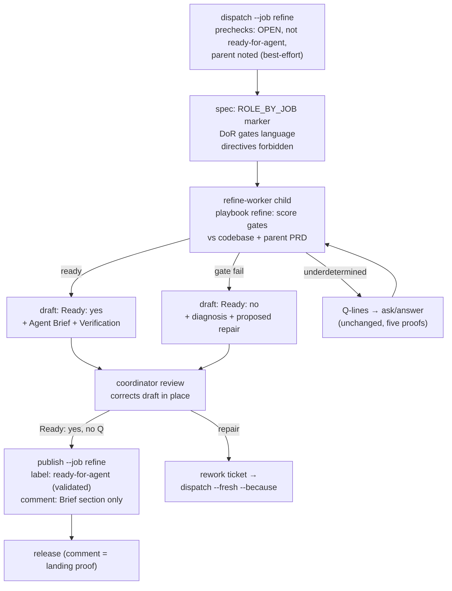

# feat: refine job — Definition-of-Ready pass for spec-born tickets

## Goal Capsule

- **Objective:** add a `refine` job to the triage subsystem — a fresh-context Definition-of-Ready pass over PRD sub-issues that publishes a clean Agent Brief plus `ready-for-agent`, run by a new `refine-worker` role, with the draft/publish output noise eliminated by construction — and land the wave/follow-up orchestration doctrine as role-text convention.
- **Authority:** this plan encodes decisions arbitrated in the 2026-08-25 design session (labeled `session-settled` on their KTDs). Repo invariants in `AGENTS.md` outrank convenience; the session decisions outrank implementer preference; anything else is the implementer's judgment.
- **Stop conditions:** stop and surface rather than decide if (a) a settled KTD proves unbuildable as specified, (b) a change would touch `LABEL_JOBS`, the F-001 record identity, or ADR-0003 exit semantics beyond what a unit names, or (c) the `.scratch` regrouping cannot keep triage/brief/custom paths byte-identical.
- **Execution profile:** test-first throughout — this repo's rule is "a behavior fix starts red" and it applies to new behavior equally; each unit's tests are written against the contract before production code.
- **Tail ownership:** implementer owns commits and the full `pnpm test` release gate; PR/landing strategy follows repo conventions.

---

## Product Contract

### Summary

Triage's machinery (session-per-issue dispatch, draft-only child, coordinator review, guarded publish) is the right shape for verifying PRD sub-issues before implementation workers are launched, but its content is inbound-shaped: it categorizes (labels, priority, severity) what the PRD already decided, frames analysis as "does it reproduce", and publishes comments that triple-state rulings and justify every label. The `refine` job keeps the machinery and replaces the content: a Definition-of-Ready pass (acceptance criteria binarily testable, scope = one worker unit, named surfaces exist, done-state describable, implicit assumptions and blocking edges checked) that ends in exactly two artifacts — an Agent Brief comment and the `ready-for-agent` label — which are precisely the preconditions `omp/roles/orchestrator.md` requires before dispatching an implementation worker.

### Problem Frame

Measured on goodluckagency/ofmchat issues #52–#54 (2026-08-22 wave): the published triage comments restate each ruling up to three times, carry a "Labels applied by this pass" section that re-justifies decisions the PRD made (`priority:P0` because "parent #10 is P0"), and embed `file:line` citations that rot — while the implementation worker must read ticket plus all comments, paying twice for near-identical contract formulations. Separately, the operator's own decision gate (the most expensive failure in `omp/playbooks/implementation.md` is a worker inventing a missing decision) currently executes only *after* a full worker launch. Industry vocabulary places this pass under backlog refinement / Definition of Ready (Microsoft Engineering Playbook; ai-sdlc's `refinement-reviewer` gates), not triage (GitLab, Django, Pocock: intake categorization of inbound reports) — the tool shape should follow.

### Requirements

- R1. A spec-born issue can be dispatched for refinement with `ax triage dispatch --issue N --job refine`: one session per issue, shared checkout, existing cap and pass machinery, write-ahead record unchanged (F-001).
- R2. The refine child runs under a new `refine-worker` role that autoloads a new `refine` playbook, and dispatch-side verification proves exactly that pair (role applied, `refine` skill injected) instead of the triage pair.
- R3. A refine draft contains an Agent Brief section, a Verification section, an explicit readiness signal, and optional `Q<n>:` lines. Label directives (`Labels:`, `Remove labels:`, `Close:`) in a refine draft are a parse refusal, not ignored content.
- R4. `ax triage publish --issue N --job refine` applies exactly one label — `ready-for-agent`, validated against the repository's live label list — and posts a comment containing the Agent Brief section only. The Verification section never reaches the tracker.
- R5. A gate-failed refine draft carries the child's proposed repair, is structurally unpublishable, and creates no new tracker state or label; the coordinator arbitrates manually (correct draft, or rework the ticket and redispatch `--fresh`).
- R6. Open `Q<n>:` lines block publication exactly as today, and the existing `ask`/`answer` channel works for refine passes without modification to its five identity proofs.
- R7. Refine drafts land under a grouped `.scratch` layout (noise fix for the flat triplet directory); triage/brief/custom draft paths stay byte-identical, and `requestFor` identity stays canonical for the global dispatch store.
- R8. `ax triage status` renders refine passes truthfully: a ready draft, a not-ready (repair-carrying) draft, and a malformed draft are three distinguishable states.
- R9. Coordinator and orchestrator role texts carry the arbitrated orchestration doctrine as convention: wave record with `kind` and per-kind closure, wave-end follow-up sweep, PRD-boundary triage wave, wave memory file injected via `--brief`, and the follow-up birth convention seam (`needs-triage` + `source:*` + `Origin:` mandated in the consuming repo's `launch.contract`).

### Key Decisions

- KD1. **Refine is a first-class job for spec-born tickets; `triage` stays the inbound lane.** (session-settled: user-approved — chosen over Pocock's flat "no pass on own tickets" rule and over a risk-proportional conditional pass: the fresh-context DoR verification is what caught missed details on real waves, and AFK workers behind a hard decision gate make an unverified brief cost a full worker round-trip.) Governs R1, R2, R3.
- KD2. **Publication is a comment trimmed to the Brief plus the single `ready-for-agent` label.** (session-settled: user-directed — chosen over amending the issue body: `gh issue edit --body` is read-modify-write with no compare-and-swap, so body amendment stays out of scope until a fenced-section mechanism is verified against the API.) Governs R4.
- KD3. **Gate failure produces a repair proposal in the draft, never a new tracker state.** (session-settled: user-directed — chosen over a `needs-rework` label: promotion of a state is earned by measured fail frequency, not defaulted.) Governs R5.
- KD4. **Doctrine lands as role text only; no `ax wave` verbs in this plan.** (session-settled: user-directed — convention first, verbs earned by friction on a real wave; the wave record carries `kind` and per-kind closure so refine/implementation/triage waves close on different terminals.) Governs R9.

### Scope Boundaries

**Deferred to Follow-Up Work** (each with its named promotion gate):

- `ax wave open/close/sweep` verbs — gate: measured friction running the convention on a real wave.
- Body-fenced Brief publication (single-source ticket body) — gate: API verification of edit preconditions and edit-history visibility.
- `needs-rework` tracker state — gate: measured frequency of scope/staleness gate failures.
- Linear port of the triage/refine layer (Gapila) — gate: doctrine convergence on OFMChat first.
- Trimming the inbound `triage` job's label justifications — deliberate: they carry audit value for genuinely open categorization.
- Migration of existing flat `.scratch/triage/` drafts in consuming repos — transient per-machine state; old paths remain valid for old jobs.

**Outside this plan:**

- All OFMChat-side authoring: `launch.contract` text (follow-up birth convention, TDD doctrine), label creation. This plan defines the ax seam; the consuming repo writes its content.
- Epic-layer verbs, coordinator/orchestrator role fusion, merge-train rebase ownership, peer-transport hardening — open branches of the wider design session, not this plan.

---

## Planning Contract

### Key Technical Decisions

- KTD1. **Job-aware draft grammar with per-job rulesets in `parseDraft`.** `readDraft` threads `identity.job` into `parseDraft`; the refine ruleset refuses any label directive line, requires an Agent Brief section and a readiness directive, and splits Brief from Verification at section boundaries. Rationale: today `parseDraft` unconditionally refuses a draft with zero `Labels:` lines (`src/triage/draft.mjs`), so every refine draft would be `ok:false` (research finding C1); and the settled contract needs the *opposite* refusal (directives present = refusal), which requires a job parameter no current caller passes.
- KTD2. **Readiness is an explicit `Ready: yes|no` directive**, mirroring the existing `Close: yes` grammar. With label directives forbidden, the draft loses its only structured "do X" channel; structural inference (no Q-lines = ready) is wrong because a repair-carrying draft also has no Q-lines. `Ready: no` makes the draft unpublishable by verdict — distinguishable in `status` from malformed (R8) — while an absent `Ready:` directive is a malformed-draft refusal with its own named reason (U1's grammar is authoritative). The directive is draft-internal state, not tracker state; KD3 holds.
- KTD3. **One `ROLE_BY_JOB` map feeds both the spec marker and dispatch verification.** `renderSpec` currently hardcodes `[omp role=triage-worker …]` for every job and `verifyTriageRole` hardcodes `triage-worker`/`triage` (research finding C2). A single map (`triage|brief|custom → triage-worker/triage`, `refine → refine-worker/refine`) is the only way the two cannot disagree — the same one-source rule the marker parser itself follows (`omp/shared/alias.ts` header).
- KTD4. **Refine drafts group by job: `.scratch/refine/<request>.md`, fully derivable from identity alone.** (session-settled: user-approved — chosen over the parent-grouped layout with record-threaded parent: review found the write path unbuildable without extending the F-001 write-ahead record machinery (`src/worker/start.mjs`/`record.mjs`) for a directory segment, its weakest consumer. The "path derived from identity alone, no network" invariant stays fully intact — `job` is already in the identity. Per-PRD grouping is deferred to the future wave record, which owns the tickets→PRD mapping and can reintroduce it without touching the dispatch store.) Triage/brief/custom paths stay byte-identical.
- KTD5. **Refine prechecks: shared checks plus two refine-specific gates; F-030 does not extend.** Refuse (without `--force`) an issue already carrying `ready-for-agent`; note — never refuse — a missing parent (any parent qualifies as PRD; no stricter convention exists in the repo, research Q3). `readIssue` gains `labels`; the parent read is best-effort and advisory only: request `parent` alongside the base fields, and when the installed `gh` reports it as an unsupported JSON field, retry with the base fields, mark parent availability unknown, and continue — a capability gap never blocks a dispatch (review finding: on `gh` < 2.94 the whole view fails, so the naive read would refuse instead of degrading). The F-030 comment-count gate stays triage-only: prior comments on a spec-born issue are normal (rulings folded into bodies).
- KTD6. **`ready-for-agent` is validated against the live repo label list even though hardcoded.** Publish's existing `repoLabels` gate only checks draft-sourced names, which refine forces empty (research finding I5); the hardcoded label joins the same check so a repo without the label refuses before mutation instead of failing mid-batch.
- KTD7. **No new verbs, no new exit alphabets.** `refine` is a `--job` value flowing through existing verbs; `SUBCOMMANDS`/`commands.mjs`/`docs.test.mjs` are untouched by construction (research finding M10); per-verb ADR-0003 exit codes are reused as-is.

### Assumptions

- The parent read in the dispatch precheck is advisory only (mis-routing hint); no layout, path, or record behavior depends on it.
- The `DISCLAIMER` line wording may say "during refinement" for refine comments; nothing parses it back.

### High-Level Technical Design

Draft grammar per job (the two rulesets `parseDraft` selects between):

| Aspect | triage / brief | refine |
|---|---|---|
| `Labels:` / `Remove labels:` / `Close:` | required channel | parse refusal |
| Readiness signal | labels present + body | `Ready: yes\|no` directive |
| Published comment | full body | Agent Brief section only |
| Verification / evidence | in body, published | own section, never published |
| `Q<n>:` lines | block publish | block publish (unchanged) |

---

## Implementation Units

### U1. Job-aware draft grammar and the refine ruleset

- **Goal:** `parseDraft`/`readDraft` select a ruleset by job; the refine ruleset implements KTD1/KTD2 (directive refusal, `Ready:` directive, Brief/Verification section split with named boundaries).
- **Requirements:** R3, R5 (structural unpublishability), R8 (parse-level discrimination; the status-rendering half is owned by U5). Cites KTD1, KTD2.
- **Dependencies:** none — this is the contract every other unit consumes.
- **Files:** `src/triage/draft.mjs`, `tests/triage-draft.test.mjs`.
- **Approach:**
  1. Thread `identity.job` from `readDraft` into `parseDraft`; default ruleset unchanged byte-for-byte for triage/brief/custom.
  2. Refine ruleset: scan for directive lines first (any hit → named refusal quoting the offending line); locate `## Agent Brief` and `## Verification` section headings (absent Brief → refusal; absent Verification → refusal naming it); parse `Ready: yes|no` (absent → refusal distinct from `Ready: no`); keep `questionsIn`/`questionProblem` shared.
  3. Return shape keeps today's full-field contract (callers branch on `ok`/fields, never on shape) plus `ready` and `brief` fields; `body` for refine carries the Brief section text only, so downstream publish rendering needs no second parser.
- **Execution note:** contract-first — pin each refusal of the refine ruleset with a failing test before implementing, matching the existing refusal-ladder tests.
- **Test scenarios:**
  - Ready draft (Brief + Verification + `Ready: yes`) parses `ok:true`, `body` contains Brief text and no Verification text.
  - Draft with `Labels: x` refuses, reason quotes the line; same for `Remove labels:` and `Close: yes`.
  - `Ready: no` with repair prose parses `ok:false` with a not-ready reason distinct from malformed; `Ready:` absent refuses with its own reason.
  - Missing Brief section refuses; missing Verification section refuses; Q-lines still extracted and `questionProblem` rules unchanged.
  - Triage-job drafts: byte-identical behavior to today (regression pin on existing cases).
- **Verification:** `node --test tests/triage-draft.test.mjs` green; existing triage cases untouched.

### U2. Refine role and playbook in the omp bundle

- **Goal:** ship `refine-worker` role and `refine` playbook so a `[omp role=refine-worker …]` marker resolves and injects the DoR procedure before the child's first turn.
- **Requirements:** R2. Cites KD1.
- **Dependencies:** none (parallel with U1).
- **Files:** `omp/roles/refine-worker.md`, `omp/playbooks/refine.md`, `omp/model/roles.test.ts`, `omp/index.test.ts`.
- **Approach:**
  1. Role file mirrors `omp/roles/triage-worker.md`'s shape exactly: front matter (`name: refine-worker`, `autoloadSkills: refine` — name must equal filename per `parseRoleFile`), draft-only contract (one exact draft path, no tracker mutation, no other repository file), ask-rather-than-fill, report-after-draft-exists.
  2. Playbook carries the DoR method: the five gates (acceptance criteria binarily testable; scope fits one ticket/worktree/branch/PR unit; named surfaces exist as the ticket assumes; done-state describable from the ticket alone; implicit assumptions and blocking edges verified against sibling tickets), the ownership signal (probable surfaces declared in the Brief as an estimate to arbitrate — never a gate), the repair-proposal duty on gate failure, the `Ready:` discipline, the Brief durability rules (behaviors and stable interfaces, no line numbers), and the not-a-re-grill boundary (verify decisions against the code; escalate only what is genuinely undecided).
  3. Update `roles.test.ts`: the `listRoles()` exact-equality assertion gains `refine-worker` (it hard-breaks otherwise); the autoloadSkills-coverage loop gains `refine-worker`; add the `omp/index.test.ts` case mirroring the triage-worker one (system prompt contains `# Refine worker`, message contains `<playbook name="refine">`, details skills `['refine']`).
- **Test scenarios:**
  - `listRoles()` equals the five-role set.
  - `loadRole('refine-worker')` resolves with `autoloadSkills: ['refine']`; `loadPlaybook('refine')` returns a fenced body.
  - Marker activation end-to-end: role block appended (never substituted), playbook message attached, refusal path if playbook file were missing (existing shared cases cover the mechanism; the new case pins the pair).
- **Verification:** `pnpm run test:omp` green.

### U3. Dispatch: refine job wiring, prechecks, spec, and role proof

- **Goal:** `ax triage dispatch --issue N --job refine` renders a refine spec under the right marker, applies refine prechecks, and verifies the refine role pair.
- **Requirements:** R1, R2. Cites KTD3, KTD5.
- **Dependencies:** U1 (spec text names the draft contract), U2 (role/playbook names).
- **Files:** `src/triage/dispatch.mjs`, `tests/triage-dispatch.test.mjs`.
- **Approach:**
  1. Add `refine` to the job enum and USAGE; leave `LABEL_JOBS` untouched (no `triage.labels` requirement for refine).
  2. Introduce `ROLE_BY_JOB` and use it in `renderSpec`'s marker line and in `verifyTriageRole` (which gains a `job` parameter at its call site; failure messages name the expected pair).
  3. New spec branch for refine, same section skeleton (marker, redo, playbook line, task statement, draft-format instructions, `nothing`, `asking`, FINAL line): instructs the five gates against codebase and parent PRD, the draft sections and `Ready:` directive, and explicitly forbids label directives (inverse of the triage instruction).
  4. Refine prechecks per KTD5: extend `readIssue` to fetch `labels` plus a best-effort `parent`; refuse already-`ready-for-agent` without `--force`; note a missing parent; on a `gh` that rejects `parent` as an unsupported JSON field, retry with base fields and proceed with parent unknown.
- **Execution note:** start red on the precheck refusals and the marker line; the fake-orca/fake-gh injection pattern in the existing test file is the harness.
- **Test scenarios:**
  - Dry-run spec for refine contains `[omp role=refine-worker model=@default]`, the gates language, the directive prohibition, and the FINAL line; triage/brief specs byte-unchanged (regression).
  - Precheck: issue already `ready-for-agent` refuses with repair line; `--force` overrides; missing parent produces a note and proceeds; closed issue still refuses (shared check).
  - On a `gh` rejecting the `parent` field, dispatch retries with base fields and proceeds (note, not refusal); a genuine auth/repo/issue failure still refuses.
  - `verifyTriageRole` with `job: refine` succeeds only on `refine-worker` + `refine` skills proof; the triage path still expects the old pair.
  - Cap/pass/`--fresh` machinery: one refine-specific case proving pass-2 identity `refine-…-p2` flows through Gate 1/Gate 2 unchanged.
- **Verification:** `node --test tests/triage-dispatch.test.mjs` green.

### U4. Publish: the refine branch

- **Goal:** publish lands exactly `ready-for-agent` plus a Brief-only comment for refine drafts, refusing everything the contract forbids.
- **Requirements:** R4, R5, R6. Cites KD2, KTD6.
- **Dependencies:** U1.
- **Files:** `src/triage/publish.mjs`, `tests/triage-publish.test.mjs`.
- **Approach:**
  1. Add `refine` to the job allow-list (custom stays refused by name).
  2. Per-issue validation for refine: `draft.ok` denotes a `Ready: yes` publishable draft (the `ready` field and its named reason identify the `Ready: no` repair path, per U1); the open-questions gate is shared and unchanged; the unknown-label gate validates the hardcoded `['ready-for-agent']` against `repoLabels` (KTD6).
  3. Mutation for refine: comment FIRST, label AFTER — post the Brief-only comment (rendered from U1's `body`, disclaimer line adapted per job), then apply the `ready-for-agent` label only after the comment succeeded. Inverted from the triage order deliberately (review finding, disclosed implementer fix): the label is the automation trigger — a label-then-failed-comment leaves a `ready-for-agent` issue with no Brief, launching exactly the unbriefed worker this plan exists to prevent, and a readiness signal already consumed by an AFK launcher cannot be retracted by a repair hint. On label failure the repair line is a label-only `gh issue edit --add-label` retry, never a publication rerun that would duplicate the comment.
  4. Releasable precompute and the release hint are job-agnostic — untouched.
- **Test scenarios:**
  - Ready refine draft: one comment whose body is Brief text + disclaimer and contains no Verification text, THEN one `gh issue edit --add-label ready-for-agent` (no removes); comment-failure branch applies no label; label-failure branch names the label-only repair and does not repost the comment.
  - `Ready: no` draft blocks the issue with a not-ready message naming the repair path (`--fresh`), not a malformed-draft message.
  - Repo without `ready-for-agent` label: batch refuses before any mutation.
  - Open Q-lines block exactly as for triage; batch all-or-nothing validation ordering preserved (all drafts read before first mutation).
  - Triage-job publication byte-unchanged (regression).
- **Verification:** `node --test tests/triage-publish.test.mjs` green.

### U5. Grouped `.scratch` layout for refine drafts

- **Goal:** refine drafts land at `.scratch/refine/<request>.md`, all consumers resolve the same path from identity alone, other jobs' paths byte-identical.
- **Requirements:** R7, R8 (status rendering: the three-state surface lives in `src/triage/index.mjs`). Cites KTD4 (resolved: job-only grouping).
- **Dependencies:** U1.
- **Files:** `src/triage/draft.mjs` (path resolver), `src/triage/dispatch.mjs`, `src/triage/publish.mjs`, `src/triage/index.mjs`, `src/triage/ask.mjs`, `src/triage/answer.mjs`, `src/triage/release.mjs`, `tests/triage-draft.test.mjs`, `tests/triage-index.test.mjs` plus touched verb tests.
- **Approach:**
  1. Replace direct `DRAFT_DIR` joins with a job-keyed `draftDirFor(root, identity)` resolver: triage/brief/custom return the flat legacy dir; refine returns `.scratch/refine/`. Pure derivation from identity — no record read, no network.
  2. Route the dispatch-written `.spec.txt` (and publish's `.body.md` sibling, which already derives from the draft path) through the same resolver so a pass's artifacts land beside its draft; `passesIn`/`passesOf` already take explicit dirs and need only the resolved dir.
  3. Spec text (U3) names the exact draft path, so the child never derives it — unchanged property.
- **Test scenarios:**
  - A refine identity resolves `.scratch/refine/<request>.md` in every verb (dispatch names it in the spec and writes the `.spec.txt` beside it; publish/status/ask/answer/release read the same file).
  - `ax triage status` renders three distinct shapes for refine passes: a `Ready: yes` draft, a repair-carrying `Ready: no` draft, and a malformed draft (missing section or forbidden directive) — parse-reason distinguishability alone does not satisfy R8.
  - Triage identity → byte-identical legacy path (regression pins).
  - Pass suffixes (`-p2`) resolve within the same group.
- **Verification:** `pnpm run test:node` green (cross-verb path agreement is exercised by the per-verb suites).

### U6. Doctrine in role texts and repo docs

- **Goal:** coordinator/orchestrator role texts teach the refine pair and carry the arbitrated wave/follow-up doctrine as convention; AGENTS.md rows stay truthful.
- **Requirements:** R9. Cites KD4.
- **Dependencies:** U2 (names the role/playbook), U3/U4 (names the commands as they will exist).
- **Files:** `omp/roles/coordinator.md`, `omp/roles/orchestrator.md`, `AGENTS.md`.
- **Approach:**
  1. Coordinator text: the job table gains `refine` (spec-born provenance decides the job, comment count decides triage vs brief for inbound); review duty covers the `Ready:` verdict and repair arbitration (KD3); publication section names the Brief-only comment.
  2. Orchestrator text: wave record convention (open a wave file naming `{prd, ordinal, kind, membres, startedAt}`; closure per kind — refine closes at publication, implementation at merged PRs, triage at published verdicts); wave-end ritual (sweep `needs-triage` follow-ups born of member tickets via `Origin:`, classify PRD-debt → refine vs parked; promote wave-memory findings); wave memory file injected through the existing `--brief` seam; PRD-boundary triage wave over the parked pile.
  3. AGENTS.md: the omp table row descriptions widen to name the new role/playbook; any copyable command added must exist (`docs.test.mjs` gate).
- **Test scenarios:** `Test expectation: none — role texts are prose contracts; the shipped-set and playbook-resolution assertions live in U2's tests, and docs.test.mjs pins AGENTS.md commands/paths.`
- **Verification:** `pnpm test` green (docs test included); manual read-through of both role files against the session's arbitration record.

---

## Verification Contract

| Gate | Command | Proves |
|---|---|---|
| CLI + repo behavior | `pnpm run test:node` | U1, U3, U4, U5 contracts, all regressions on triage/brief/custom |
| omp bundle | `pnpm run test:omp` | U2 role/playbook shipping and activation |
| Release gate | `pnpm test` | both suites plus `docs.test.mjs` (AGENTS.md truthfulness) |
| Smoke | `node bin/ax.mjs triage dispatch --issue <N> --job refine --dry-run` in a consuming checkout | rendered spec carries the refine marker, gates language, and directive prohibition end-to-end |

## Definition of Done

- Every R1–R8 requirement is exercised by a test or the named smoke, R9 by U6's named manual read-through against the session's arbitration record, and `pnpm test` is green.
- Triage/brief/custom behavior is pinned byte-identical by regression tests that existed or were added before the change (start-red discipline).
- KTD4 is resolved as job-only grouping; the rationale (invariant preserved, parent grouping deferred to the wave record) lands in the touched module headers (this repo's knowledge home), with this plan updated accordingly.
- No stray scaffolding: the plan's transit artifacts (`docs/plans/`) are absorbed or removed at ship time per repo convention; abandoned experiments are not left in the diff.
- Deferred items remain deferred: no `ax wave` verb, no body amendment, no `needs-rework` label entered the diff.
