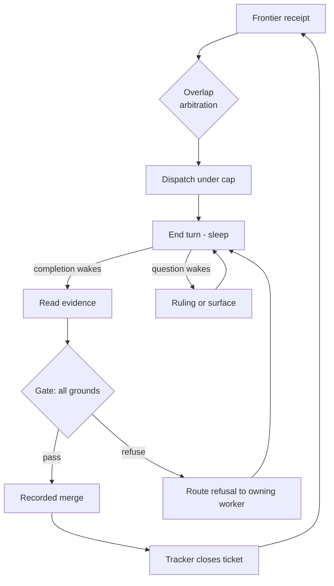
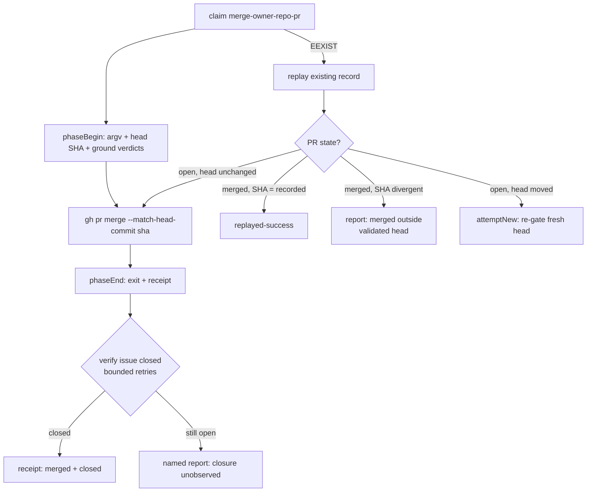
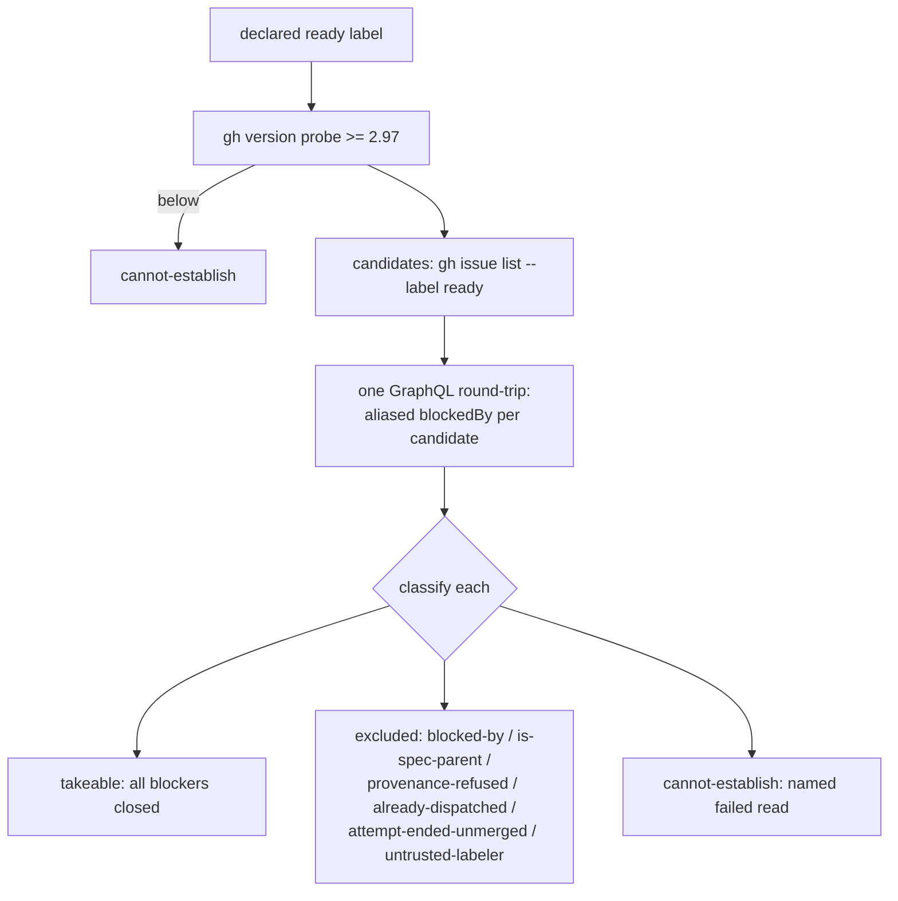
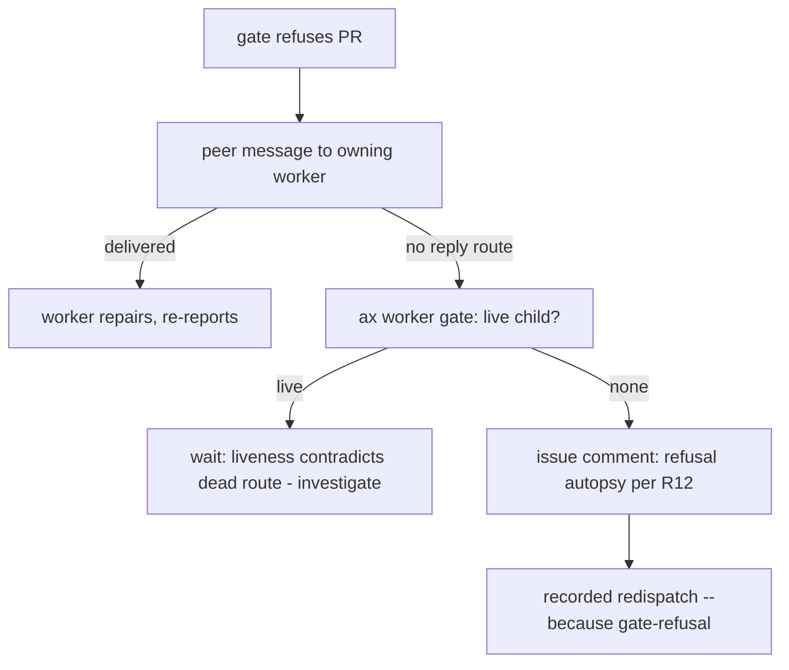

# Autonomous Frontier Orchestration - Plan

## Goal Capsule

- **Objective:** make the ax orchestrator role able to drive a spec's ticket graph continuously from frontier to merged, AFK — the LLM orchestrator judges and dispatches, workers implement through the engine each repository declares, and deterministic verbs carry every mechanical step.
- **Product authority:** this document. Product behavior is owned by the R-IDs; implementation mechanism by the KTDs; a unit overrides neither. Upstream conventions (`ready-for-agent` label, blocking edges, ticket-as-assignment) come from the Matt Pocock skills methodology and enter ax only as repository configuration.
- **Execution profile:** a behavior fix starts red — update or add the smallest failing test, observe the failure, then change production. Prefer real temp git repos and injected runners over mocks (repo convention).
- **Stop conditions:** surface, never guess, when implementation evidence invalidates a session-settled KTD; never add a merge path that mutates before its record is written; never weaken a cannot-establish into an empty result.

---

## Product Contract

### Summary

Give the orchestrator the tooling and doctrine to run a full execution loop unattended: a frontier receipt it can read in one call, dispatches whose assignment is the ticket itself, gate-sovereign merges recorded before they act, tracker-native ticket closure, and a three-channel learnings flow between workers. Reference consumer: OFMChat (already declares its engine); gapila gets initialized.

### Problem Frame

The Pocock methodology deliberately stops at the artifact: `to-tickets` publishes tracer-bullet tickets with blocking edges and says running them — one session at a time or a fleet — is your job. ax owns the machinery a fleet needs (recorded dispatch, isolated worktrees, liveness verdicts, a fail-closed merge gate, proof-by-artifact release), but the loop between those verbs is manual and lossy.

Three frictions surfaced. The orchestrator derives the frontier by hand from raw tracker queries and burns judgment on mechanics. Dispatches drift from the ticket-is-the-assignment doctrine: gapila runs with no ax configuration at all, and `--task` is accepted unconditionally, so orchestrators end up re-authoring assignments the ticket already carries. And nothing says how one worker's discoveries reach the next worker — today it happens by accident or not at all.

Meanwhile the wave barrier ("never open the next dependency wave before the previous one has merged") serializes work the blocking edges already prove independent, and `pr gate --merge` mutates without the write-ahead record every other live mutation in ax is held to.

### Key Decisions

- KD1. **The brain stays; scripts are its tools.** The orchestrator LLM session drives the loop event-driven (dispatch, end turn, wake on completion or question); deterministic verbs replace its mechanical gestures, never its judgment. No scheduler daemon, no self-polling loop — a session looping on itself accumulates context and degrades. Governs R1, R13.
- KD2. **Gate-sovereign merge.** When every declared ground passes, the merge happens with no human in the nominal path; refusals and escalations are where the human returns. Governs R6, R7.
- KD3. **Continuous frontier over wave barrier.** A ticket whose blockers merged is takeable immediately; overlap protection moves to ticket quality and dispatch-time arbitration. Governs R2.
- KD4. **The issue is the assignment.** The orchestrator never re-authors it; it only appends learnings as operator notes. Governs R3, R4.
- KD5. **Learnings route by scope** — repo commits for durable, wave notes for ephemeral cross-ticket, issue comments for ticket-scoped only. Governs R9, R10, R11, R12.
- KD6. **Tickets close through the tracker's native closing keywords**, so the orchestrator's never-close-an-issue authority survives autonomous operation. Governs R8.

### Requirements

**Frontier and dispatch**

- R1. A read-only frontier verb returns the takeable set in one receipt: tickets carrying the declared ready label whose blocking edges are all closed, with the parent spec issue, provenance-refused tickets, and tickets whose ready label was applied by an actor without repository write permission excluded. Tracker data it cannot obtain is cannot-establish, never an empty frontier.
- R2. Orchestrator doctrine changes to continuous frontier: a ticket becomes takeable the moment its blockers merge; before each dispatch the orchestrator arbitrates undeclared overlap (declared blocking edges are the hard constraint, probable-surface estimates a signal). The wave record remains as grouping and closure proof, not a dispatch barrier.
- R3. A dispatch without `--task` composes the child's instruction from the repository's declared entry; the ticket stays canonical and operator notes append verbatim, last.
- R4. `--task` on a ticket whose body already carries a complete assignment is refused with a named repair; an explicit `--because` overrides, and the reason is recorded with the dispatch.
- R5. gapila is initialized as an ax consumer — configuration declaring its entry (per the OFMChat reference shape), merge grounds, and tracker vocabulary. OFMChat's existing declaration is the reference and stays untouched.

**Merge and closure**

- R6. A repository with no declared merge grounds is not measured: autonomous merge refuses there rather than assuming a default.
- R7. The merge verb records its mutation plan write-ahead — PR, bound head SHA, method, per-ground verdicts — before mutating, and recovery replays the record. `worker release` keeps its current contract: it never touches git or the tracker.
- R8. Ticket closure rides the tracker's native closing keywords; a PR that lacks closing intent toward its ticket fails the gate. The orchestrator never closes an issue by hand.

**Learnings**

- R9. A worker's final report ends with a bounded learnings block, each item classified by scope: durable, wave, or ticket.
- R10. Durable learnings are committed inside the worker's own slice — a repo-doc line, a solutions entry, a helper — and propagate to later workers by merge.
- R11. The orchestrator distills wave-scoped learnings from each report into the wave-memory file passed via `--notes` at every subsequent dispatch. The file dies with the wave; a wave-end step promotes what earned permanence into the repository's own stores.
- R12. Ticket-scoped facts — an attempt autopsy before redispatch, a deviation from acceptance criteria — land as comments on that issue, where the next worker's mandated read (ticket plus all comments) finds them. Cross-ticket learnings never land on issues.

**Brain continuity**

- R13. The orchestrator role gains a get-bearings entry procedure: a fresh session re-derives in-flight wave state from the tracker, dispatch records, board, and wave file, and resumes without duplicating a live child — re-dispatch safety answered by the existing gate verb, never from memory.

### Key Flows

- F1. The AFK cycle
  - **Trigger:** a spec's tickets are published `ready-for-agent` with blocking edges.
  - **Steps:** orchestrator reads the frontier receipt; arbitrates overlap; dispatches takeable tickets under the live-pane cap; ends its turn. A completion wakes it: it reads the evidence, runs the merge through the gate, the tracker closes the ticket, the frontier re-derives, newly unblocked tickets dispatch. The cycle terminates only when `takeable`, `attempt-ended-unmerged`, and `cannot-establish` are all empty and no pane is live — a dead attempt never silently ends the loop.
  - **Covers:** R1, R2, R6, R8.
- F2. Escalation
  - **Trigger:** a child posts a question.
  - **Steps:** the wake delivers it; the orchestrator rules reversible technical questions itself, surfaces only what meets the product bar, and answers through the verb so the child is released.
  - **Covers:** R13 (the cycle survives the pause).
- F3. Brain renewal
  - **Trigger:** the orchestrator session ends mid-wave (window full, restart).
  - **Steps:** a fresh session activates the role, runs get-bearings, and resumes the wave — dispatching only where the gate proves no live child exists.
  - **Covers:** R13.

### Acceptance Examples

- AE1. **Covers R2.** Given tickets A and B running and C blocked only by A; when A's PR merges through the gate; then C is takeable immediately and dispatches while B still runs, with no human step between.
- AE2. **Covers R4.** Given a ticket whose body carries a complete assignment; when the orchestrator dispatches with `--task`; then the dispatch refuses and names the declared entry as the repair — and with `--because` it proceeds, the reason recorded.
- AE3. **Covers R7.** Given a crash between the merge record and the merge call; when recovery runs; then it replays the recorded merge exactly and mints no second mutation.
- AE4. **Covers R13.** Given a wave with one live child and one newly unblocked ticket; when a fresh orchestrator session runs get-bearings; then it dispatches the unblocked ticket and refuses to re-dispatch the live one.
- AE5. **Covers R9, R11, R12.** Given a worker report with a wave-scoped learning; when the orchestrator dispatches the next ticket; then the distilled item is in that dispatch's notes and appears on no issue.
- AE6. **Covers R8.** Given a PR with no closing intent toward its ticket; when the gate runs; then it refuses, naming the missing intent, and nothing merges.

### Scope Boundaries

- The upstream flow (grilling → spec → tickets) stays human-in-the-loop by doctrine; ax consumes its output and never automates it.
- The triage lane is unchanged; this work is the implementation lane's loop.
- No daemon or scheduler runtime, and no orchestrator self-polling loop — eliminated by KD1.
- Success criteria as a QA session: deferred for later at the operator's request.
- Cross-host anti-duplicate guarantees for worktree/terminal creation: pre-existing bound, unchanged here.
- No methodology-specific coupling in `src/` or the playbooks: labels, entry, contract, and grounds arrive as repository configuration — the repository is input.

### Deferred to Follow-Up Work

- Linear frontier adapter. U1 ships the GitHub adapter behind the same two-tracker seam `readTicket` already uses; the Linear side (GraphQL `Issue.inverseRelations` blocked-by reads, third-party CLI pinning) is a named follow-up that must land before a Linear-tracked repository goes AFK.
- LEARNINGS machine-parsing (schema validation, structured extraction) — ruled out by KTD7, not merely deferred; recorded here so an implementer does not add a parser in good faith.

### Dependencies / Assumptions

- The peer, report, and checkpoint extensions deliver the wake events the cycle rests on (existing behavior).
- The orchestrator's event-driven doctrine — dispatch, end turn, wake — holds as written in the role today.
- `gh` ≥ 2.97 on dispatching hosts — 2.94 added the `blockedBy`/`blocking` fields, 2.97 the `--json parent,subIssues` read the frontier verb also needs, so 2.97 is the effective floor. Older `gh` is cannot-establish for the frontier verb, never a silent fallback.
- Consumer repositories keep GitHub's "auto-close issues with merged linked pull requests" setting on; U3's post-merge closure verification catches the off case rather than assuming.
- Workers own their PR through decided CI before reporting (existing worker role contract).
- The implementation engine (`/lfg` or equivalent) exists on consumer hosts and arrives only via the repository's declared entry; ax playbooks stay generic.
- The live-pane cap under continuous frontier remains the operator's declared concurrency limit, read from `ax worker ls` (existing role doctrine); this plan adds no new cap mechanism.

<!-- ce-section: work-relationships -->
### How This Work Fits Together

This plan owns one area of the broader ambition — ax as the autonomous orchestration layer above the methodology: the implementation lane's execution loop. The breakdown below is the current understanding, not a committed roadmap.

- QA success-criteria loop — Still to decide; enabled by this plan (a merged wave is what a QA session would grade).
- Triage-lane refinements — Can proceed independently of this plan.
- Upstream flow — remains permanently manual by doctrine; see Scope Boundaries.

### Sources / Research

- Methodology corpus: aihero.dev (Ralph posts, the skill posts for `to-spec`/`to-tickets`/`implement`/`triage`/`wayfinder`/`setup`), `mattpocock/skills` v1.2.3, Anthropic's long-running-agent harness article. The methodology's own gaps this plan fills: no frontier runner, no ticket completion step, no supported parallelism.
- Repo grounding: `src/worker/brief.mjs` (brief composition order; operator notes verbatim and last), `omp/roles/orchestrator.md` (wave barrier, escalation bar, authority), `omp/roles/worker.md` (ticket-plus-comments read), `ax.schema.json` (`dispatch.entry`/`contract` semantics).
- Verified this session: OFMChat's `ax.config.json` already declares entry ("Ship this ticket end-to-end with skill://lfg…") and a pilot contract; gapila has no `ax.config.json`; `src/pr-gate.mjs` merges with no prior store write (server-side `--match-head-commit` only); `src/worker/ticket.mjs` short-circuits all body checks when `--task` is non-empty.
- Tracker APIs (planning research, URL-cited in session): GitHub issue dependencies GA — REST `GET /repos/{o}/{r}/issues/{n}/dependencies/blocked_by` returns blocker issues with `state`; GraphQL `Issue.blockedBy` batchable via aliases in one round-trip; `gh` v2.94.0 exposes `--json blockedBy,blocking`. Closing keywords fire only on default-branch merges and closure is eventually consistent — verify, never assume. Linear has no first-party CLI; blocked-by lives on `Issue.inverseRelations`.

---

## Planning Contract

Product Contract preservation: restructured, no scope change at write; Outstanding Questions were all planning-owned and are resolved into the KTDs below; Scope Boundaries gained a `Deferred to Follow-Up Work` subsection. Post-review (user-approved fixes): R1 gained the `untrusted-labeler` exclusion and F1's termination condition gained `attempt-ended-unmerged`; no other R changed meaning.

### Key Technical Decisions

- KTD1. **`ax frontier` is a new ungated top-level command** (section ORCHESTRATION, ADR 0001 flat shape) whose receipt is a three-list triad: `takeable` (ref, title, blockers-merged proof), `excluded` (each with one named reason: `blocked-by:<refs>`, `is-spec-parent`, `provenance-refused`, `already-dispatched`, `attempt-ended-unmerged`, `untrusted-labeler`), and `cannot-establish` (each naming the read that failed). Mirrors the gate's notes/unknowns/refusals grammar so the orchestrator holds one vocabulary across the two verbs it reads every wake. Exit codes: 0 receipt produced, 2 usage, 3 cannot-establish at the declaration level. Governs R1.
- KTD2. **Frontier reads GitHub's native dependency graph, batched.** `gh` ≥ 2.97 is probed first — 2.94 added `blockedBy`/`blocking`, 2.97 the `parent`/`subIssues` read this verb also needs; below the floor → cannot-establish naming the version. Candidate set from the declared ready label; blockers via one GraphQL round-trip aliasing `blockedBy(first:50){nodes{number state} pageInfo{hasNextPage}}` per candidate — a truncated blocker page classifies that candidate cannot-establish, naming the truncated read, never silently complete. `already-dispatched` keys on an UNSETTLED dispatch record only; a settled record with the ticket still open classifies `attempt-ended-unmerged`, so a dead or abandoned attempt stays visible instead of vanishing from the loop. `untrusted-labeler` resolves the actor who applied the ready label (timeline `labeled` event) and excludes a candidate whose labeler lacks repository write permission — an outsider-labeled issue never enters the unattended loop. Spec-parent exclusion via the existing `parent`/`subIssues` read (`src/triage/dispatch.mjs` provenance pattern). Liveness stays with `ax worker ls`; the frontier verb stays read-only. Governs R1.
- KTD3. **The `--task` refusal predicate is the `ready-for-agent` label** (session-settled: user-approved — chosen over body inspection: the label is the tracker's completeness assertion, and a non-empty but underdetermined body stays the child's decision gate, unchanged). A sibling pure function beside `emptyBodyRefusal` in `src/worker/ticket.mjs`; refusal through the existing `refuse()` bad+fix idiom, naming the declared entry verbatim and printing a copy-pasteable `--because '<reason>'` line; the accepted `--because` reason lands in the write-ahead dispatch record. Governs R4; instantiates KD4.
- KTD4. **The merge record reuses `record.mjs` under a `merge/` namespace** — the release-namespace precedent, not a second write-ahead mechanism. Request id `merge-<owner>-<repo>-<pr>` (fits the `REQUEST_ID` grammar); claim → `phaseBegin` (argv including `--match-head-commit <sha>`, plus per-ground verdicts in the record) → `gh pr merge` → `phaseEnd`. Three replay classes on recovery: (a) PR merged at the recorded SHA → replayed-success; (b) PR merged at a DIVERGENT SHA → named report "merged outside this gate's validated head", never a success receipt — the record must not become false proof of validation; (c) PR open with the head moved past the recorded SHA → settle the attempt and open a new one via `record.mjs`'s `attemptNew()` with a freshly gate-validated head, because reissuing the recorded `--match-head-commit` can only fail forever. Byte-for-byte reissue applies only while the current head still equals the recorded SHA. Rejected alternative: GitHub auto-merge and merge queues — the gate must own the merge decision locally; its grounds (unresolved threads, closure intent, the declaration guard) are not expressible as branch protection. Governs R7; covers AE3.
- KTD5. **Post-merge closure verification lives in the merge verb.** After a recorded merge, re-read the linked issue's state with bounded retries (closure is event-driven on GitHub's side); an unclosed issue after the bound escalates to the operator and halts frontier derivation for the affected subgraph — its blocker state is known-stale, and continuing to re-derive from it would silently stall every downstream ticket. This is the entry point of KD2's escalation path for closure failures. The keyword ground hardens: for a gate run on an implementation PR, absent closing intent toward the ticket becomes a refusal (today a note), and a PR whose base is not the repository's default branch refuses with the reason that closing keywords are inert there. **Declaration guard:** a PR whose diff touches the repository's `prGate` declaration refuses autonomous merge with a named repair requiring an explicit human merge — a declaration change is never landed by the gate it redefines. Governs R6, R8; covers AE6.
- KTD6. **`omp/roles/orchestrator.md` is rewritten for continuous frontier** — the Authority line "You never open the next dependency wave before the previous one has merged" is removed (a live contradiction an LLM reads literally), and the dispatch procedure gains: read the frontier receipt; arbitrate overlap against every live pane (`ax worker ls`), not only the current wave; dispatch under the cap; drain the whole inbox on each wake — process every queued completion and question before ending the turn. A gate refusal routes to the owning worker as a peer message with the refusal reasons (session-settled: user-approved — chosen over undefined parking: owning the PR through decided CI extends to reacting to its refusal). **Staleness exception:** when base-ancestor staleness is the only refusing ground, the merge verb updates the branch from base and re-runs the gate itself; only a second staleness refusal on the same PR routes to the worker — without this, every merge invalidates every sibling PR and N concurrent PRs cost O(N²) repair round-trips. **Repair budget:** the merge record counts gate refusals per PR; the second non-staleness refusal of the same PR stops dispatching that ticket and escalates to the operator — the missing entry point of KD2's escalation path for unimplementable tickets. **Undeliverable-route fallback:** a settled-failed Dispatch can be unreplyable (`omp/peer/receive.ts`); when the notification cannot reach the owning session, the repair is a recorded redispatch of the same ticket — `ax worker gate` proves no live child first, then dispatch with `--because` naming the gate refusal (the triage `--fresh --because` precedent) under a fresh request identity, never a bare re-dispatch that would collide with the settled record; the refusal autopsy lands as an issue comment per R12 so the fresh worker's mandated read finds it. Governs R2, R13.
- KTD7. **LEARNINGS stays prose, parsed by the orchestrator LLM — no parser in `src/`.** The grammar is a fixed `## LEARNINGS` heading closing the worker's report, bullets prefixed `durable:` / `wave:` / `ticket:`; it lives in `omp/playbooks/implementation.md`'s report stage and `omp/roles/worker.md`. Durable learnings prefer additive files (a new `docs/solutions/` entry, a single appended line) to bound the undeclared-overlap risk of concurrent doc edits. The wave is the parent spec's ticket set: the wave-memory file is keyed by the spec issue, every ticket under that spec inherits it at dispatch, and the wave-end promotion runs when the spec's last ticket closes — continuous frontier dissolves generation boundaries, so the spec is the only lifecycle edge left. Governs R9, R10, R11, R12.
- KTD8. **The stall watcher must WAKE the orchestrator, fail-open** (session-settled: user-approved — chosen over operator-only alerts: a child dying between PR-open and report otherwise freezes the loop until the operator returns). The existing alerts in `stall.mjs` already address the dispatching Run (`orchestration send --to run:<run>`), so the gap is delivery semantics, not addressing: the alert must be issued in the form that wakes an idle session, and U5's red test asserts the wake, not a second message. ADR 0025 posture unchanged — a notification failure never alters the watcher's verdict, and the watcher still mutates nothing.
- KTD9. **Get-bearings derives authority from the record store, the tracker, and `ax worker ls`; the wave file is a cache** (session-settled: user-approved — chosen over a new wave verb: dispatch records already carry request ids and ticket argv, so membership and re-dispatch safety are derivable without inventing a concurrency-safe file format). Ordered procedure: tracker state for the wave's ticket set first (a closed ticket needs no pane check), then dispatch records for request ids, then `ax worker gate` per undecided member. Governs R13; covers AE4.
- KTD10. **gapila initialization is an operational unit against the gapila checkout** — `ax init` plus a config declaring entry (OFMChat's shape), `prGate` grounds, and tracker vocabulary; no ax source change. OFMChat is the untouched reference. Governs R5.

### High-Level Technical Design

Merge-record lifecycle (KTD4/KTD5) — the state each recovery classifies against:

Frontier receipt derivation (KTD1/KTD2):

Gate-refusal repair route (KTD6):

### Sequencing

U1 first (the doctrine units cite the verb it creates). U2, U3+U4, U5 are independent of U1 and of each other. U6+U7 after U1 (one doctrine review). U8 last, after an ax version carrying U1–U7 is linked or pinned in gapila.

### Operational Notes — Rollout

- Doctrine and verbs ship together in the package: a consumer adopting the release gets `omp/roles/*.md`, the playbook, and the new verbs atomically via `ax pin` — no window where doctrine cites an absent verb.
- An orchestrator session live during an upgrade continues under old doctrine until renewal; get-bearings (U6) is the designed re-entry — renew the session after pinning.
- Consumer AGENTS.md command blocks regenerate through `ax init`/`ax doctor`; `tests/docs.test.mjs` guards this repo's own docs, `ax doctor` guards each consumer.

---

## Implementation Units

### U1. Frontier receipt verb

- **Goal:** `ax frontier` produces the three-list receipt from GitHub's native dependency graph.
- **Requirements:** R1 (KTD1, KTD2).
- **Dependencies:** none.
- **Files:** `src/frontier.mjs` (new), `src/commands.mjs`, `bin/ax.mjs` wiring, `docs/ownership.md` (new row), `tests/frontier.test.mjs` (new).
- **Approach:**
  1. Registry entry: top-level `frontier`, section ORCHESTRATION, ungated (pure `gh` reads, like `pr`), with an `agentLine`.
  2. Declaration gate first, `pr-gate` `declarationOf`/`readDeclaration` shape: resolve the ready label (canonical `ready-for-agent`; `triage.labels` mapping when declared) — an unreadable declared mapping is cannot-establish.
  3. Version probe, then candidate list, then one batched GraphQL call per KTD2; classify per candidate; `already-dispatched` from the record store (per KTD2, read-only cross-reference).
  4. Injected `{exec, env, cwd}` options with real defaults, matching every other verb.
- **Patterns to follow:** `src/pr-gate.mjs` (declaration gate, exit codes, all-grounds-run reporting), `src/worker/ticket.mjs` (`readTicket` normalization), `src/triage/dispatch.mjs` (`provenanceVerdict` parent/subIssues read).
- **Test scenarios:**
  - Happy path: two candidates with closed blockers → both in `takeable`; a third blocked by an open issue → `excluded` with `blocked-by:#N`.
  - Covers AE1 precondition: a candidate whose last blocker's issue reads closed becomes takeable on the next receipt.
  - Spec parent carrying the ready label → `excluded: is-spec-parent`.
  - Declared provenance refusing a candidate → `excluded: provenance-refused`.
  - A candidate with an UNSETTLED dispatch record in the store → `excluded: already-dispatched`; a settled record with the ticket still open → `excluded: attempt-ended-unmerged` — the two are structurally distinct.
  - Ready label applied by an actor without repository write permission → `excluded: untrusted-labeler`.
  - A candidate whose blocker page reports `hasNextPage: true` → `cannot-establish` naming the truncated read.
  - `gh` below 2.97 → exit 3, message names the version and the repair.
  - Tracker unreachable → exit 3, never an empty `takeable`.
  - One candidate's blocker read fails, others succeed → that candidate in `cannot-establish`, others classified; the two lists are structurally distinct.
- **Verification:** `node --test tests/frontier.test.mjs` green; `tests/commands.test.mjs` and `tests/docs.test.mjs` green (registry, AGENTS.md block, ownership row).

### U2. `--task` refusal with `--because` override

- **Goal:** dispatch refuses `--task` on a `ready-for-agent` ticket unless `--because` names why; the reason is recorded.
- **Requirements:** R4 (KTD3); covers AE2.
- **Dependencies:** none.
- **Files:** `src/worker/ticket.mjs`, `src/worker/dispatch.mjs`, `tests/worker-dispatch.test.mjs`.
- **Approach:** sibling pure function beside `emptyBodyRefusal` (labels + task + because in, refusal text out, no I/O); dispatch wires it after the ticket read, before any mutation; `--because` parsed as a named flag and written into the dispatch record's argv (already recorded verbatim by `phaseBegin`).
- **Execution note:** start red — the refusal test fails against today's unconditional accept.
- **Test scenarios:**
  - `ready-for-agent` ticket + `--task` → exit 1; refusal text contains the declared entry string and a literal `--because '` fragment.
  - Same + `--because 'reason'` → dispatch proceeds; the recorded argv contains the reason.
  - Ticket without the ready label + `--task` → unchanged behavior, no refusal.
  - Empty body + `--task` → unchanged behavior (existing bypass preserved).
  - No declared entry and no `--task` → existing refusal path unchanged.
- **Verification:** `node --test tests/worker-dispatch.test.mjs` green.

### U3. Write-ahead merge record and closure verification

- **Goal:** `pr gate --merge` records before mutating, replays on recovery, and verifies the ticket closed.
- **Requirements:** R6, R7, R8 (KTD4, KTD5); covers AE3.
- **Dependencies:** none.
- **Files:** `src/pr-gate.mjs`, `tests/pr-gate.test.mjs` (extend or add).
- **Approach:**
  1. Import the `record.mjs` protocol (claim, init, phaseBegin, phaseEnd, phaseVerdict); store under `<store>/merge/`, request id per KTD4.
  2. Record carries the resolved head SHA, method, and per-ground verdicts before `gh pr merge` is issued.
  3. Recovery path: an existing record replays by KTD4's three classes — merged at the recorded SHA → replayed-success; merged at a divergent SHA → named "merged outside this gate's validated head" report; open with a moved head → `attemptNew()` and a fresh gate validation; open with an unchanged head → reissue the recorded argv byte-for-byte.
  4. Staleness self-repair (KTD6): when base-ancestor staleness is the only refusing ground, update the branch from base and re-run the gate once; only a second staleness refusal routes to the owning worker.
  5. Declaration guard (KTD5): the PR diff touching the repository's `prGate` declaration → refusal naming the explicit-human-merge repair.
  6. Post-merge: bounded re-reads of the linked issue state; unclosed after the bound → operator escalation naming the repair (check repo auto-close setting) and a halt marker for the affected subgraph, never a silent exit-0 note.
- **Execution note:** start red — a test asserting a record exists before the injected `gh pr merge` runs fails today.
- **Test scenarios:**
  - Merge pass writes `<store>/merge/<request>.json` before the injected merge call executes (ordering asserted via the fake runner).
  - Covers AE3: crash simulated between record and merge (fake runner throws) → recovery replays recorded argv exactly; no second record minted.
  - Replay against a PR merged at the recorded SHA → replayed-success, zero merge calls; merged at a DIVERGENT SHA → named report, never a success receipt.
  - Replay against an open PR whose head moved → a new attempt via `attemptNew()`, fresh gate run recorded; head unchanged → byte-for-byte reissue.
  - Staleness as the only refusing ground → branch updated from base and gate re-run; a second staleness refusal → routed report, no further self-repair.
  - PR diff touching the `prGate` block → refusal naming the explicit-human-merge repair.
  - Closure verification: issue reads closed on second poll → receipt says merged + closed.
  - Issue never closes within the bound → operator escalation and subgraph halt marker, naming the repair.
  - No `prGate` declared → exit 3 unchanged (R6).
- **Verification:** `node --test tests/pr-gate.test.mjs` green.

### U4. Keyword-ground hardening

- **Goal:** absent closing intent and non-default base branch become gate refusals.
- **Requirements:** R8 (KTD5); covers AE6.
- **Dependencies:** none.
- **Files:** `src/pr-grounds.mjs`, `tests/pr-grounds.test.mjs` (extend).
- **Approach:** `keywordGround` gains two refusal branches: no closing keyword and no declared-tracker ref → refusal with the existing `gh pr edit` repair (today a note); PR base ≠ repository default branch → refusal naming keyword inertness. Wrong-verb-form refusal unchanged.
- **Execution note:** start red.
- **Test scenarios:**
  - Covers AE6: body with no keyword and no tracker ref → refusal, repair names `gh pr edit`.
  - Base branch `develop` on a repo whose default is `main` → refusal names the base-branch rule.
  - Valid `Closes #N` on default base → pass unchanged.
  - Declared non-GitHub tracker ref present, no GitHub keyword → unchanged current semantics.
- **Verification:** `node --test tests/pr-grounds.test.mjs` green.

### U5. Stall-watcher orchestrator wake

- **Goal:** a stalled or dead child WAKES the idle orchestrator session, not only the operator.
- **Requirements:** KTD8 (closes flow gap: child dies between PR-open and report).
- **Dependencies:** none.
- **Files:** `src/worker/stall.mjs`, `tests/worker-stall.test.mjs`.
- **Approach:** the existing alerts already address the dispatching Run (`orchestration send --to run:<run>`); change the delivery form so the alert wakes an idle session (KTD8 — delivery semantics, not addressing; do not add a second message to the same address). Failure to deliver is logged and changes nothing else — fail-open preserved (ADR 0025).
- **Execution note:** start red — the red test asserts the WAKE (delivery form), which today's `--type status` send does not guarantee; a test asserting merely that a message was sent would pass against current behavior.
- **Test scenarios:**
  - Stall detected → the alert is issued in the wake-delivery form (asserted via the injected runner's argv), operator-visible content unchanged.
  - Delivery fails → watcher exit and verdict identical to today; failure noted.
  - No stall → no send.
- **Verification:** `node --test tests/worker-stall.test.mjs` green.

### U6. Orchestrator doctrine rewrite

- **Goal:** the role text matches the continuous-frontier machine and carries get-bearings.
- **Requirements:** R2, R11, R13 (KTD6, KTD7, KTD9); covers AE4 and AE5's orchestrator half.
- **Dependencies:** U1 (cites `ax frontier`).
- **Files:** `omp/roles/orchestrator.md`, `omp/index.test.ts`.
- **Approach:**
  1. Remove the wave-barrier Authority line; "Before an implementation dispatch" and "Run the implementation pair" rewritten around the frontier receipt, all-live-pane overlap arbitration, wake-drain, gate-refusal routing to the owning worker (with the staleness exception and repair budget), and the undeliverable-route fallback (KTD6: gate-proof, issue-comment autopsy, recorded `--because` redispatch under a fresh identity).
  2. The rewrite keeps the wave-memory `--notes` paragraph and adds: distill each report's `wave:` LEARNINGS into the spec-keyed wave file before the next dispatch (R11, KTD7 lifecycle — promotion when the spec's last ticket closes).
  3. New `## Get bearings` section with KTD9's ordered procedure; wave file named as cache, never authority.
  4. Update `omp/index.test.ts` substring assertions; add assertions that the new doctrine strings are present and the barrier phrase is absent.
- **Test scenarios:**
  - Role activation test still injects the role; assertions cover `ax frontier` and the get-bearings heading.
  - A negative assertion: the string "never open the next dependency wave" no longer appears in the rendered role.
- **Verification:** `bun test omp` green.

### U7. Worker report contract: LEARNINGS and refusal duty

- **Goal:** workers close reports with the scoped LEARNINGS block and own gate-refusal reactions.
- **Requirements:** R9, R10, R12 (KTD7); covers AE5's worker half.
- **Dependencies:** none (sequenced with U6 for one doctrine review).
- **Files:** `omp/roles/worker.md`, `omp/playbooks/implementation.md`, `omp/index.test.ts`.
- **Approach:** the playbook's report stage gains the `## LEARNINGS` grammar (`durable:` / `wave:` / `ticket:` bullets, additive-file preference for durable); the role gains: a gate-refusal message on your PR is your work — repair and re-report. Package-generic wording only (no skill or provider names).
- **Test scenarios:**
  - Playbook load test asserts the LEARNINGS heading and the three scope prefixes are present in the injected pipeline.
  - Role test asserts the refusal-duty sentence is present.
- **Verification:** `bun test omp` green.

### U8. gapila initialization

- **Goal:** gapila becomes a configured ax consumer.
- **Requirements:** R5 (KTD10).
- **Dependencies:** U1–U7 (a linked or pinned ax carrying them).
- **Target repo:** the gapila checkout (operational unit; no ax source change).
- **Files (in gapila):** `ax.config.json` (new), tracker labels created once (`gh label create` for the canonical five when absent).
- **Approach:** `ax init`, then declare: `dispatch.entry` on OFMChat's shape (`skill://lfg` engine), `prGate` grounds matching gapila's CI, `triage.provenance` and label vocabulary. `ax doctor` closes the loop.
- **Test expectation:** none — configuration in a consumer repo; `ax doctor` exit 0 is the proof.
- **Verification:** `ax doctor` exit 0 in gapila; one dry `ax frontier` run returns a receipt (possibly empty-takeable with named exclusions, never cannot-establish from missing declaration).

---

## Verification Contract

| Command | Proves |
|---|---|
| `pnpm run test:node` | CLI and repository behavior — U1–U5 units, registry/docs/ownership sync (`tests/docs.test.mjs` fails on an unregistered verb or missing ownership row) |
| `pnpm run test:omp` | Role/playbook doctrine — U6, U7 substring and activation assertions |
| `ax doctor` + one `ax frontier` run in the gapila checkout | U8 — external to `pnpm test`; the only proof for the consumer configuration |
| `pnpm test` | The release gate: both suites, the order CI runs them |

Quality gates: every new refusal carries a `fix()` repair (repo law: a `bad` without a `fix` is unactionable); no new module-level env/clock resolution (solutions learning: module-load freezes); `cannot-establish` never collapses into refusal or empty.

---

## Definition of Done

- All eight units landed; `pnpm test` green.
- `docs/ownership.md` carries `src/frontier.mjs`; AGENTS.md command block regenerated and in sync (docs test green).
- The wave-barrier sentence is absent from `omp/roles/orchestrator.md`; the frontier verb, get-bearings procedure, and the gate-refusal repair route (peer message, then recorded redispatch on a dead route) are present and asserted.
- AE1–AE6 each traceable to at least one passing test scenario (AE1 → U1 precondition + U6 doctrine, AE2 → U2, AE3 → U3, AE4 → U6 doctrine + existing `worker gate` behavior, AE5 → U7 grammar + U6 distillation bullet, AE6 → U4).
- gapila: `ax doctor` exit 0 and one real `ax frontier` receipt.
- No abandoned-attempt code in the diff; conventional commits feed release-please (no hand-edited version).
