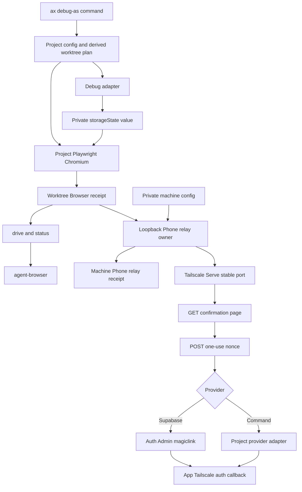

# AX Project-Adapted Debug Sessions - Plan

## Goal Capsule

- **Objective:** Move the reusable `debug-as` browser, co-drive and phone-handoff mechanics from OFMChat and Gapila into AX while each project retains only its identity catalog and authentication adapter.
- **Authority:** The Product Contract in this plan governs behavior. [ADR 0004](../adr/0004-ax-owns-project-adapted-debug-sessions.md) governs the architectural and security boundary. Existing module headers and repository rules govern implementation detail.
- **Execution profile:** Behavior changes start with the smallest failing test. Implement AX first, prove it through linked checkouts, release it, migrate OFMChat, then migrate Gapila.
- **Stop conditions:** Stop rather than infer an identity, authentication artifact, app address, process owner, Tailscale user, provider response or secret.
- **Tail ownership:** The work includes active documentation cleanup, AX release pinning in both consumers, physical-phone proof in Gapila and removal of every superseded project implementation.

---

## Product Contract

### Summary

`ax debug-as` opens one visible Chromium session in the current checkout as a project-declared Debug identity, on that checkout's own loopback application address. The operator and an agent share that session through a loopback CDP port. Projects may also adopt a Phone handoff that publishes the current identity and destination through one machine-global, Tailscale-private Phone relay owned by the live session.

AX owns orchestration and lifecycle. Each project owns its identities, landing paths, Playwright authentication artifact and Debug adapter. No project retains a `debug-as` launcher, CDP wrapper, handoff route, Phone relay route or notification implementation after migration.

### Problem Frame

OFMChat and Gapila independently carry large, diverging launchers for the same browser and CDP behavior. Gapila additionally carries privileged Next.js routes and machine-specific phone delivery code. AX already establishes worktree identity and addresses, but its `debugAs` schema section is dead: it validates two fields that no command consumes. This leaves generic mechanics duplicated, project instructions divergent and the most security-sensitive behavior implemented as application routes.

### Actors

- A1. **Operator:** Opens and closes Role browsers and confirms Phone handoffs.
- A2. **Agent:** Drives the operator's existing browser through `ax debug-as drive`.
- A3. **Project:** Declares Debug identities and supplies authentication behavior.
- A4. **AX:** Establishes addresses, runs adapters, owns Chromium, receipts and relay lifecycle.
- A5. **Phone user:** A Tailscale-identifiable user allowed by private machine configuration.

### Requirements

**Role browser**

- R1. `ax debug-as --as <identity>` opens a headful, non-persistent Chromium context for one explicitly declared Debug identity and its declared default path.
- R2. Every application path AX consumes — `--path`, a declared `defaultPath` and the path serialized into a phone callback — is validated as an absolute same-origin path that rejects schemes, protocol-relative forms and backslashes. Declared paths are validated at configuration load, and callback paths again before URL construction.
- R3. `--device` uses the declared project's Playwright device catalog, while `--viewport <width>x<height>` creates desktop viewport dimensions from 200 through 10000 and the two flags are mutually exclusive.
- R4. AX uses Playwright and Chromium from the project package declared by `debugAs.browser.playwrightDir`; it never installs or carries a browser dependency.
- R5. The Role browser origin is the checkout's own loopback application address: an AX worktree's recorded `AX_DIRECT_URL`, or the project's own declared port in the primary checkout. AX refuses when no such address is recorded and requires the application to answer there before preparing authentication, naming the configured start command as the repair without executing it. Proxy, Portless and Tailscale addresses are never the browser origin.
- R6. One Role browser may exist per worktree. A matching identity, origin, device and viewport reuses it and may change its path; any other live combination refuses.
- R7. A fresh authenticated identity requires a configured `storageState` and Debug adapter. An unauthenticated identity declares neither.
- R8. The Debug adapter owns authentication freshness and artifact regeneration, and leaves the artifact readable only by the invoking user. AX never interprets provider tokens or writes interactive browser state back to the artifact.
- R9. Before launch, AX resolves and reads the configured authentication artifact once, and Chromium receives the parsed value rather than a re-resolved path. The artifact must be a regular file inside the worktree, ignored by Git and private to the invoking user; a group- or other-readable artifact refuses with an explicit mode repair. Its `origins` entries must include the Role browser origin — a missing origin is an adapter refresh, not a refusal — and every cookie domain and every `origins` entry must belong to the checkout's local address set (browser origin host, recorded direct host, loopback). Any entry outside that set, such as a production cookie or a production `localStorage` token, refuses before Chromium starts.
- R10. AX publishes the Browser receipt only after the first navigation and a CDP connection succeed, within a declared navigation deadline whose default exceeds a cold first compile; exceeding it refuses with the start-and-compile repair and leaves no receipt. The receipt path must be ignored by Git before publication. Closing Chromium or stopping its owner removes only state owned by that generation and reports that cleanup outcome. Launch, reuse and Phone relay publication are interactive operator gestures whose foreground command remains alive until Chromium closes; `drive`, `status` and `doctor` are the agent-safe surfaces.

**Agent co-drive**

- R11. `ax debug-as drive [--as <identity>] -- <argv>` drives the current worktree's live Role browser through `agent-browser`, injecting the owned session name and the receipt's loopback CDP port as `--session <owned name> --cdp <port>`. An identity assertion, worktree mismatch, origin mismatch or failed CDP probe refuses before delegation.
- R12. `drive` passes caller arguments without a shell, keeps child stdout byte-identical, refuses caller-supplied `--session` or `--cdp`, never installs `agent-browser` and propagates its exit code. It inherits stdio but not the ambient environment's `agent-browser` controls: every documented `AGENT_BROWSER_*` variable is dropped or overridden so no ambient value can redirect the driven session. AX owns help only before `--`; later arguments belong to `agent-browser`.
- R13. CDP listens only on loopback through a dynamic port and is never exposed through Tailscale, Portless or LAN interfaces; a request carrying a foreign `Host` is not served. Chromium receives only the CDP-port and declared window-sizing launch arguments, never remote-allow-origin, debugging-address, disabled-security or disabled-isolation flags.

- R32. `ax debug-as status` emits one bounded JSON object for the current worktree through AX's payload channel: Debug identity, browser origin, path, device or viewport, generation, loopback CDP port, whether the machine Phone relay's current target is this worktree, that relay's URL when it is, and the liveness Verdict. `VIVANT` means a same-generation owner proven live, `MORT` means proven dead or stale, `INCONNU` means ambiguous or unverifiable. It emits no authentication material, and refusals remain on stderr.

**Phone handoff**

- R14. Phone handoff is independently optional per project and per Debug identity. An explicitly requested unsupported capability refuses with a repair.
- R15. Automatic handoff runs only when the configured opt-in resolves to true, where `1`, `true` and `yes` are true, absence and `0`, `false`, `no` are false, an assigned empty value is false at the layer that assigns it, and any other value refuses. `--no-phone` suppresses handoff, `--phone` requires it to succeed before Chromium opens, and the two flags together refuse.
- R16. Phone handoff is allowed only for an AX worktree whose recorded direct and Tailscale address keys both exist. The Role browser stays on the loopback browser origin of R5; only the phone callback uses the recorded Tailscale address. Phone handoff never targets the primary checkout, production or an arbitrary origin.
- R17. One machine-global Phone relay uses a stable port and exists only while a live Role browser session owns it. The last completed publication wins, and only its process generation may change or withdraw it. The owner withdraws its own Serve mapping before releasing its listener, and every `ax debug-as` launch and `doctor` run withdraws a mapping whose owner is proven dead before anything else binds: a surviving mapping otherwise forwards the tailnet to whatever local process next binds that released ephemeral port. Relay, Serve target and receipt use one host spelling end to end so an IPv4/IPv6 mismatch cannot make a live mapping look unowned. An unowned or Funnel-mapped collision refuses while naming the exact `tailscale serve --https=<port> off` withdrawal as its repair.
- R18. The relay listens only on loopback and reaches the phone only through Tailscale Serve. Every request, on every interface, must carry exactly one `Tailscale-User-Login` present in the machine-private allowlist; anything else returns `404`. It also returns that same `404` when `Host` is neither the bound loopback authority nor the mapped Serve hostname, or when `Origin` or `Sec-Fetch-Site` indicate a cross-site submission. Local processes are inside the machine trust boundary and may supply this header directly; the allowlist does not protect against local project or agent code.
- R19. `GET /go` displays escaped project, worktree, Debug identity, path and publication time without creating authentication authority, and renders legibly on a phone through a viewport declaration and a labeled confirmation control. A notification link carries its publication generation: a superseded generation renders a non-mutating superseded page instead of another target's screen. `POST /go` accepts at most 4 KiB of form-urlencoded data and requires a 256-bit, two-minute, target-bound, user-bound, generation-bound, single-use nonce compared in constant time; outstanding nonces are capped per generation with oldest-first eviction and expiry sweeping. A well-formed but rejected `POST` redirects to a fresh `GET` rather than a dead end, while every other path or method returns the same `404` without mutation. Request headers, bodies and idle time are bounded.
- R20. The relay never persists or notifies a magic link, token, credential, storage state or adapter output. Its escaped HTML has no JavaScript or external resource. Every response has a restrictive CSP, `Referrer-Policy: no-referrer`, `Cache-Control: no-store`, `X-Content-Type-Options: nosniff` and no CORS header; safe failures expose only a category and diagnostic identifier.
- R21. The built-in Supabase provider posts `{ type: "magiclink", email }` to `<urlEnv>/auth/v1/admin/generate_link` with the service-role key as `apikey` and bearer authorization, and accepts only a `hashed_token` string — at the response root, or under `properties` when the host wraps it. `action_link` is never used. The provider host must be a loopback literal (`127.0.0.0/8`, `::1`) or exactly `localhost`; any other host must match a machine-private allowlist entry verbatim by host and port and use `https`, and a suffix match is never a match. Fetch uses a fifteen-second deadline, `redirect: "error"` and a bounded response body, and the structured callback is built with validated parameter names and `URLSearchParams` on the worktree's app Tailscale origin.
- R22. A command provider may prepare the handoff through the bounded Debug adapter protocol but must return the final application URL on the same Tailscale origin.
- R23. Automatic handoff failure leaves a successful Role browser usable and reports an actionable finding. Explicit `--phone` failure returns non-zero without opening Chromium.
- R24. A machine-private notifier is optional. It receives intent metadata and the generation-addressed Phone relay URL, never determines handoff success, and a later matching invocation retries a failed notification against the live browser and relay without relaunching Chromium. AX prints that relay URL in the launching command's own output so delivery never depends on a notifier existing.

**Configuration, diagnosis and migration**

- R25. `debugAs` becomes an explicitly adopted project contract with separate browser, phone and closed identity sections and no defaults at any level. Presence of the raw root key adopts the contract. Unknown fields and incomplete capability combinations refuse with an exact repair.
- R26. Project commands are argv arrays. Adapters receive versioned JSON on standard input, return one bounded JSON object on standard output, run from the worktree root without a shell, and inherit only the ambient worktree environment: AX passes no value it resolved from an environment file, so an adapter that needs project credentials reads its own project configuration. Browser preparation's deadline is a declared project value whose default exceeds the consumer's own authentication-setup budget, and a deadline refusal carries a bounded tail of the adapter's standard error.
- R27. AX resolves configured variable names from the process environment, `${apps.web}/.env.local`, then root `.env.local`; resolved file values stay inside AX and are never added to an adapter or notifier environment. Values never appear in tracked configuration, receipts or output.
- R28. `ax debug-as doctor` diagnoses the project contract, local GUI, resolved Playwright version and Chromium, `agent-browser`, live application, adapter, authentication artifacts, receipt ignore status and optional machine Phone relay without opening a browser. Every finding names its repair, including the resolved provider host and any unowned Serve mapping.
- R29. `ax doctor` grades adopted tracked configuration and declared paths but does not fail a machine that has not enabled Phone handoff.
- R30. The historical `{ route, optInEnv }` shape is detected from raw configuration before ordinary schema validation and receives a migration finding. It has no automatic conversion or compatibility path and does not prevent a consumer from pinning the release before its cutover.
- R31. Migration removes OFMChat and Gapila launchers, wrappers and active stale instructions. Gapila also removes its application handoff and Phone relay routes, phone-delivery code and redundant skill after physical-phone proof.
- R33. The machine-private Phone relay contract is absent-by-default and lives at a named path under the user's config directory. AX opens it once, proves on that descriptor that the file and its parents are owned by the invoking user, are not symlinks and are not group- or other-writable, and uses the parsed value for the process lifetime so a later swap cannot change the effective allowlist, port or notifier argv. The exact-login allowlist is non-empty after lowercase normalization and rejects duplicates, empty values, wildcards and comma-joined headers; the relay port must be a non-privileged, non-ephemeral port.
- R34. Ordinary maintenance never signals a live Role browser. `ax worktree clean`, `ax worktree reclaim` and `ax worker sweep` may remove only proven-dead debug receipts, locks and Serve mappings, and leave a Chromium root claimed by a live Browser receipt — matched on host, process-start identity and recorded process id — untouched.
- R35. Every `src/debug-as/` emission passes one module-local emitter boundary that redacts resolved secret values and token or magic-link shapes before reaching `src/log.mjs`; no module in that directory emits through `src/log.mjs` directly, and the existing `src/redact.mjs` vocabulary is extended rather than duplicated.
- R36. The generated agent instruction for `debug-as` renders only where the configuration adopts the contract, so the release reaches an unadopted consumer without changing its managed block or teaching a command that refuses there.

### Key Flows

- F1. **Open a fresh authenticated Role browser**
  - **Trigger:** The operator invokes `ax debug-as --as owner` in a worktree with no live receipt.
  - **Steps:** AX establishes config and the loopback browser origin, checks the app, invokes the identity adapter, verifies its artifact, launches Chromium, navigates, probes CDP, then atomically publishes the receipt. Each step reports progress so a legitimate wait is never mistaken for a hang.
  - **Outcome:** The visible authenticated window remains owned by the foreground AX process.
  - **Covered by:** R1-R10, R25-R29, R34-R35

- F2. **Reuse and co-drive**
  - **Trigger:** A matching browser exists and an operator changes the path, or an agent invokes `drive`.
  - **Steps:** AX verifies process identity, generation and CDP. A compatible debug invocation navigates the existing context; `drive` injects the receipt's session name and CDP port into `agent-browser` with the ambient `AGENT_BROWSER_*` controls removed.
  - **Outcome:** Human and agent operate the same window without a rival context.
  - **Covered by:** R6, R10-R13

- F3. **Publish and confirm a Phone handoff**
  - **Trigger:** An adopted identity enables phone delivery automatically or with `--phone`.
  - **Steps:** AX serializes relay ownership, points Tailscale Serve at the owner's loopback server and notifies intent with a generation-addressed URL it also prints. The allowed phone user opens `/go`, reviews the target, posts the one-use nonce, and AX creates then redirects to the app callback.
  - **Outcome:** The phone reaches the declared local screen as the same Debug identity; no authentication URL existed before confirmation.
  - **Covered by:** R14-R24, R27, R33

- F4. **Recover stale or conflicting state**
  - **Trigger:** Any debug command observes receipts or locks from an earlier process.
  - **Steps:** AX proves whether the recorded OS process and generation are still the same. Proven stale state is cleaned atomically; a live or ambiguous owner causes refusal and is never killed.
  - **Outcome:** Recovery cannot create rival browsers, overwrite an unrelated relay or act on a recycled PID.
  - **Covered by:** R6, R10, R17, R23, R28

### Acceptance Examples

- AE1. **Covers R6:** Given an `owner` browser on an iPhone device descriptor, requesting `owner` with a new path reuses and navigates it; requesting `pro`, another origin or another viewport refuses and preserves the first window.
- AE2. **Covers R7-R9:** Given an artifact whose `origins` lack the browser origin, the project adapter refreshes it and the launch proceeds. Given an artifact outside the worktree, tracked by Git, readable by another user, or carrying a cookie or `localStorage` entry for a non-local origin, AX refuses before Chromium starts and names its repair.
- AE3. **Covers R15-R16:** Given phone configuration but an absent opt-in, ordinary debug opens only the Role browser without warning; explicit `--phone` refuses, and `--phone --no-phone` refuses as a conflict. Given the primary checkout, all Phone handoffs refuse even when the opt-in is true.
- AE4. **Covers R17-R20:** Given two completed publications, the second owns the relay and the first generation's link renders a non-mutating superseded page. Stopping the first cannot withdraw the second. An unauthorized, duplicate, headerless, foreign-`Host` or cross-site request receives the same `404`, and a preview GET creates no magic link.
- AE5. **Covers R19-R23:** Given an allowed user, one confirmation creates one provider request and redirects with `303`. Reuse, expiry, target change or provider failure consumes the nonce and returns the user to a fresh `GET` without revealing provider details.
- AE6. **Covers R23-R24:** Given an automatic notification failure, the browser and relay publication remain usable, the printed relay URL still works, and a later identical invocation retries only the notification against the live session. Given explicit `--phone` and relay failure, no browser opens.
- AE7. **Covers R11-R12, R32:** Given that the operator replaces a `guest` browser with `super-admin`, an agent's `drive --as guest` refuses before acting, and an ambient `AGENT_BROWSER_SESSION` or `AGENT_BROWSER_PROVIDER` cannot redirect it. `status` reports the new identity, its CDP port and a `VIVANT` Verdict without exposing authentication state.

### Scope Boundaries

- Firefox, WebKit, headless proof, persistent browser profiles and simultaneous Debug identities in one worktree are outside this feature.
- AX does not start Next.js, Supabase or any project server and does not install Playwright, Chromium, Tailscale or `agent-browser`.
- Phone handoff does not support the primary checkout, tagged-device requests without a Tailscale user identity, public Funnel exposure or URL bearer-token fallbacks.
- The Phone relay is session-scoped by decision: with no live Role browser on the machine, the phone URL answers nothing. A permanently live bookmark would require a detached machine service, which this feature does not build, so Gapila's "one permanently correct icon" promise is rewritten during its cutover.
- The confirmed callback necessarily carries a single-use `token_hash` in the phone's URL. AX never persists or notifies it; scrubbing that history entry belongs to the application's own callback, not to AX.
- AX does not infer identities from Playwright files, fixtures, package shape or MakerKit conventions.
- The machine allowlist protects the tailnet boundary only. Debug adapters, development servers and other same-user local processes are trusted code and can reach the same local secrets and relay. Tracked `debugAs` argv and `playwrightDir` are equally trusted project code: AX bounds and observes them, and does not sandbox them.
- Remote content rendered inside a Role browser is untrusted, and the loopback CDP port's defenses are Chromium's own `Host` and origin restrictions plus the dynamic port and non-persistent context. Hardening beyond that, including a CDP authorization proxy, is outside this feature.
- Historical plans remain historical. Only active procedures and commands migrate.

### Success Criteria

- OFMChat's `test`, `owner`, `super-admin` and unauthenticated `guest` identities run through AX with authentication refresh, reuse, device emulation and co-drive, with no project `debug-as` launcher or wrapper.
- Gapila's `test`, `owner`, `super-admin`, `free`, `starter`, `pro` and `enterprise` identities run through AX, and a real phone completes the protected handoff to the requested path.
- Gapila contains no application `/debug-as` or `/api/go` compatibility route, no project phone-delivery implementation, and no active instruction that still promises an always-live phone bookmark.
- The AX release gate and both consumer merge gates pass after their release pins and documentation cutovers.

---

## Planning Contract

### Key Technical Decisions

- KTD1. **One command, two capabilities.** `(session-settled: user-approved — chosen over an indivisible Gapila clone: OFMChat needs browser co-drive without phone authority.)` `ax debug-as` owns Role browser and optional Phone handoff as independently adopted capabilities. Governs R1, R14-R15, R25.
- KTD2. **Local relay, no generated application bypass route.** `(session-settled: user-approved — chosen over generated or adapter-backed application routes: removing privileged debug routes from projects creates one lifecycle and security boundary.)` AX serves confirmation locally and redirects only to the app's normal callback. Governs R16-R23, R31.
- KTD3. **Explicit closed identities.** `(session-settled: user-approved — chosen over fixture discovery: filenames cannot establish identity intent, capability or landing path.)` `ax.schema.json` models identities as a keyed map with object-form `additionalProperties`; `src/debug-as/config.mjs` validates identity names and capability closure so every refusal can name its repair. Governs R1, R7, R14, R25.
- KTD4. **Project-owned authentication adapter.** `(session-settled: user-approved — chosen over AX understanding MakerKit login, TOTP or Supabase storage tokens: freshness is project knowledge.)` The adapter prepares the configured artifact through a versioned JSON protocol; AX verifies its filesystem and origin envelope. Governs R7-R9, R22, R26.
- KTD5. **Project-supplied Playwright.** `(session-settled: user-approved — chosen over a runtime dependency in AX: both consumers already pin Playwright in their E2E package.)` Resolve `@playwright/test` or `playwright` from `browser.playwrightDir` and use Chromium plus that version's device catalog. Governs R3-R4.
- KTD6. **Owned generational receipts.** `(session-settled: user-approved — chosen over PID-only or in-memory ownership: persisted state must survive crashes without authorizing mutations against recycled processes.)` Use separate operator config, worktree Browser receipt and machine Phone relay receipt. Atomic private writes carry host, process-start identity and random generation; transitions serialize at worktree and machine scopes. Governs R6, R10, R17, R28.
- KTD7. **Confirmation before authentication.** `(session-settled: user-approved — chosen over a GET redirect or automatic JavaScript: link previews and crawlers must not mint privileged sessions.)` GET renders intent; a user-bound single-use POST nonce creates authority. Governs R18-R20.
- KTD8. **Structured Supabase convention plus command escape hatch.** `(session-settled: user-approved — chosen over SDK loading or a free-form callback template: AX stays dependency-free and callback encoding remains verifiable.)` Isolate the documented Auth Admin wire contract and require a structured callback; other providers implement the command protocol. Governs R21-R22, R26-R27.
- KTD9. **Tailscale identity is mandatory.** `(session-settled: user-approved — chosen over persistent URL tokens: Serve already authenticates identifiable tailnet users and strips spoofed identity headers.)` The loopback relay trusts local OS processes, while its phone path requires a machine allowlist. Governs R18-R20.
- KTD10. **Clean consumer cutover.** `(session-settled: user-approved — chosen over permanent `pnpm` aliases and compatibility routes: two command surfaces would recreate the drift this work removes.)` Prove linked AX first, publish, pin and delete the old implementation per consumer. Governs R30-R31.
- KTD11. **Loopback browser origin.** `(review-settled — chosen over the worktree's published proxy origin: the artifact every consumer already mints records `http://localhost:<port>`, and a proxy origin would re-mint it on every alternation with the E2E suite, including TOTP identities.)` The Role browser always opens on the checkout's own loopback address, and the Tailscale address is used only for the phone callback. This also gives the primary checkout a derivable origin without inventing a recorded key. Governs R5, R6, R9, R16.
- KTD12. **Session-scoped Phone relay.** `(review-settled — chosen over a detached machine service: an always-live bookmark is worth less than one ownership model, and a detached authority-minting listener is the larger security surface.)` The relay lives and dies with the Role browser session that published it, and Gapila's always-live-icon documentation is rewritten in its cutover. Governs R17, R19, R31.
- KTD13. **Adoption-gated agent instruction.** `(review-settled — chosen over an unconditional registry line: `publish.yml` dispatches `ax-release` to every consumer, so an unadopted repo would take the managed-block change and advertise a command that refuses there.)` The generated instruction renders only where the configuration adopts the contract. Governs R36.

### High-Level Technical Design



The project contract is directional, not final implementation syntax:

```jsonc
{
  "debugAs": {
    "browser": {
      "playwrightDir": "apps/e2e",
      "start": ["pnpm", "--filter", "web", "dev"],
      "navigationTimeoutSeconds": 120,
      "prepare": { "command": ["node", "scripts/debug-auth-adapter.mjs"], "timeoutSeconds": 300 }
    },
    "phone": {
      "optInEnv": "AX_DEBUG_AS_PHONE",
      "provider": {
        "type": "supabase",
        "urlEnv": "NEXT_PUBLIC_SUPABASE_URL",
        "serviceRoleKeyEnv": "SUPABASE_SERVICE_ROLE_KEY",
        "confirm": {
          "path": "/auth/confirm",
          "tokenParam": "token_hash",
          "typeParam": "type",
          "typeValue": "magiclink",
          "nextParam": "next"
        }
      }
    },
    "identities": {
      "pro": {
        "defaultPath": "/home/gapila-pro",
        "browser": { "storageState": "apps/e2e/.auth/pro@makerkit.dev.json" },
        "phone": { "email": "pro@makerkit.dev" }
      },
      "guest": { "defaultPath": "/" }
    }
  }
}
```

The private machine contract at `~/.config/ax/debug-as.json` is also directional:

```jsonc
{
  "relayPort": 1300,
  "allowedTailscaleLogins": ["operator@example.com"],
  "allowedSupabaseHosts": [],
  "notifier": { "command": ["private-notifier"] }
}
```

Provider and preparation adapters use one request per process, JSON UTF-8 on standard input and one JSON object on standard output. Browser preparation's deadline is the declared `prepare.timeoutSeconds`, defaulting to 300 seconds because OFMChat's own authentication setup test already budgets 120 seconds before pnpm resolution, Playwright startup and a cold sign-in compile. Phone creation has a fixed fifteen-second deadline. Each adapter output and each provider response body is capped at 64 KiB. The exact v1 request and response schemas live beside their validator and fixtures, not only in prose.

### State and precedence

- Project configuration is tracked at `ax.config.json`; it has no `debugAs` defaults. Raw root-key presence adopts the contract through `src/plan.mjs` `CONTRACTS`; secrets are referenced by environment-variable name only.
- Variable lookup precedence is process environment, `${apps.web}/.env.local`, then root `.env.local`. A recognized true value is `1`, `true` or `yes`; false is absence, `0`, `false` or `no`; another non-empty value is invalid. An assigned empty value is false at its own layer and does not fall through, so `src/debug-as/config.mjs` resolves the opt-in with the layer-preserving `readKey`/`parseValue` primitives rather than `readConfigured`, and changes no public `src/dotenv.mjs` behavior.
- The browser origin is read, never probed: `AX_DIRECT_URL` for an AX worktree, and the project's own `PORT` or `BASE_URL` for the primary checkout, both through the same env-file precedence. `AX_TAILNET_URL` is read the same way and used only for the phone callback. `planWorktree` is not invoked, because deriving a plan touches the machine.
- Operator configuration is `~/.config/ax/debug-as.json`. Browser state is `<worktree>/.agent/debug-as.local.json`; Phone relay ownership is the distinct `~/.config/ax/debug-as-relay.json`. Lock and receipt writes use exclusive destination-directory temp files, atomic replacement and private POSIX permissions.
- A worktree Browser receipt records generation, host and process-start identity, project, worktree, Debug identity, browser origin, path, device or viewport, the loopback CDP port and publication time. The `http://127.0.0.1:<port>` form is derived only where AX itself connects; `agent-browser` receives the port. The receipt contains no Phone relay or authentication material.
- The machine Phone relay receipt records the current generation and worktree target reference. The server rereads and validates the Browser receipt for each GET and POST, so a dead session serves nothing.
- Nonces exist only in the relay owner's memory, bind generation, target, Tailscale login and expiry, are capped per generation with oldest-first eviction, and are compared in constant time.

### Sequencing

1. Establish the AX schema, command registry, pure plans, diagnostics and process-safe state primitives.
2. Implement and prove Role browser plus co-drive against isolated fakes, then a throwaway local app using a real project Playwright installation.
3. Once co-drive is proven, OFMChat's linked proof may begin in parallel with the Phone work: it adopts no phone requirement.
4. Implement and prove the Phone relay, Tailscale ownership and both providers without exposing credentials.
5. Release one AX version carrying both capabilities, then pin it in OFMChat and delete that project's launcher and wrapper.
6. Link the same release into Gapila, add every identity and Phone handoff configuration, and prove the real browser first. Gapila's launcher and wrapper may go as soon as that browser proof matches OFMChat's bar; its application routes, Phone relay route and delivery module wait for physical-phone proof.
7. Run each repository's gate after its own cutover. Do not mix unrelated consumer changes into the AX release commit.

### External authorities

- [Tailscale Serve](https://tailscale.com/docs/features/tailscale-serve) establishes that Serve is tailnet-private, applies tailnet access rules, supplies `Tailscale-User-Login` and strips caller-supplied copies. It recommends that a backend trusting those headers listen only on localhost.
- [Supabase self-hosted Auth (GoTrue) REST](https://supabase.com/docs/reference/self-hosting-auth/introduction) owns the wire contract the dependency-free provider implements: `POST /auth/v1/admin/generate_link` with `apikey` and bearer authorization, and a response whose `hashed_token` is a root field. The JavaScript SDK's `properties` wrapper is a client-side construction, which is why R21 accepts the root field and tolerates the wrapper. One fixture must be a byte-captured response from a real local stack before Gapila's SDK-backed route is removed.
- `docs/adr/0004-ax-owns-project-adapted-debug-sessions.md` owns the accepted architectural and security boundary.

### Risks and mitigations

- **Auth Admin wire drift and credential exfiltration:** Isolate one module, pin `magiclink`, require loopback literals or an allowlisted `https` host, refuse redirects, bound the response body, and cover malformed or hostile responses with a local HTTP server. One fixture is a captured real response, not a hand-written shape.
- **Tailscale CLI version drift and durable mappings:** Treat command receipts as data, never parse human prose when JSON/status data exists, and test Funnel collision, stale ownership, withdrawal-before-listener-close and owned cleanup through injected command runners. Because `serve --bg` survives process exit and reboot, the owner withdraws on ordinary exit and every unowned-collision refusal names the withdrawal command.
- **Authority leakage:** Route every `src/debug-as/` emission through one module-local emitter boundary that redacts resolved values and token or magic-link shapes before `src/log.mjs`, extending `src/redact.mjs`'s vocabulary; keep env-file values away from child environments; require private filesystem modes; never persist magic links; snapshot every relay response.
- **Process races and hostile maintenance:** Serialize worktree and machine transitions; require host, process-start identity and generation before cleanup; never kill from a receipt. `ax worker sweep` reaps Playwright Chromium roots by age on every dispatch and `ax worktree clean` signals them by cwd, so both must skip a root claimed by a live Browser receipt or an unrelated dispatch kills an authenticated session mid-review.
- **Agent contract drift:** Keep `status` machine-readable, preserve `drive` stdout, strip ambient `AGENT_BROWSER_*`, and pin the injected argv (`--session <name> --cdp <port>`) against a fake binary; `doctor` reports the resolved Playwright version so a lost CDP endpoint is diagnosable.
- **Artifact mode loop:** Playwright writes `storageState` world-readable by default, and every existing consumer artifact is `0644`. The adapter contract owns normalizing the mode, and AX's privacy refusal names the repair, so a refusal cannot become an unwinnable loop that tempts weakening the check.
- **Consumer migration regression:** Characterize existing identities and paths before deletion, prove against a linked checkout, and migrate one consumer at a time. `ax pin` refuses a `link:` declaration by name, so each cutover removes the link by hand first and then pins the release.
- **Cross-repository release propagation:** `publish.yml` dispatches `ax-release` to every consumer, and each consumer's bump workflow moves its own pin. The release must therefore be inert in an unadopted repo: no managed-block change and no advertised command that refuses there.

---

## Implementation Units

### U1. Project contract and command surface

- **Goal:** Replace the dead schema shape with the adopted debug-session contract and make every operator and agent action discoverable from one registry.
- **Requirements:** R25, R27, R29-R30, R36
- **Files:** `ax.schema.json`, `bin/ax.mjs`, `src/config.mjs`, `src/plan.mjs`, `src/commands.mjs`, `src/cli.mjs`, `src/debug-as/index.mjs`, `src/debug-as/config.mjs`, `tests/schema.test.mjs`, `tests/commands.test.mjs`, `tests/debug-as-config.test.mjs`, `docs/ownership.md`
- **Approach:** Remove every historical `debugAs` default and delete the test assertions that pin them, because `applyDefaults` materializes any object holding a nested default at any depth. Raw root-key presence adds the `debugAs` row to `src/plan.mjs` `CONTRACTS`; `ax init` never infers identities. The contract uses only the keywords `src/schema.mjs` already implements — object-form `additionalProperties` for the identity map, `const`/`oneOf` for provider type — because an unsupported keyword throws for every config, not just a debug one; identity-name safety, capability closure and argv non-emptiness are refused in `src/debug-as/config.mjs` with a repair. Detect the historical two-field shape before ordinary validation. Register `debug-as` as a WORKTREE noun with launch flags plus `doctor`, `status` and `drive`; its router treats a leading flag as launch, and registry help ownership stops at `--` for `drive`. Make `runCli` possibly asynchronous and await both self and delegated execution in `bin/ax.mjs`. The generated `agentLine` renders only where the configuration adopts the contract, steers agents to `status`, `doctor` and `drive`, and labels launch as an interactive operator gesture.
- **Test scenarios:** An absent root key never adopts or materializes debug sessions and leaves the managed block byte-identical; valid browser-only and browser-plus-phone declarations load; unknown fields, unsafe identity names, unsafe declared paths and incomplete capability combinations fail with repairs; the schema loads with no unsupported keyword; historical fields produce a migration repair without blocking version pinning; the executable awaits an async runner's numeric result; launch, verb and `--`-bounded child help route correctly; registry, runner, generated agent line and ownership map stay equal.
- **Verification:** `node --test tests/schema.test.mjs tests/commands.test.mjs tests/debug-as-config.test.mjs`

### U2. Addresses, adapters and authentication artifacts

- **Goal:** Establish the target and authentication artifact before any browser process can start.
- **Requirements:** R2, R5, R7-R9, R16, R26-R27
- **Files:** `src/debug-as/config.mjs`, `src/debug-as/address.mjs`, `src/debug-as/adapter.mjs`, `src/debug-as/auth-state.mjs`, `tests/debug-as-adapter.test.mjs`, `tests/debug-as-address.test.mjs`, `tests/debug-as-auth-state.test.mjs`, `docs/ownership.md`
- **Approach:** Read the browser origin rather than deriving it: `AX_DIRECT_URL` for a worktree and the project's own `PORT`/`BASE_URL` for the primary checkout, through `${config.apps.web}/.env.local` then root `.env.local`; `AX_TAILNET_URL` the same way for the phone path only. `planWorktree` is never invoked and no address probe runs. Resolve the opt-in with `readKey`/`parseValue` so an assigned empty value cannot fall through to a stale lower layer. Spawn adapters locally with an injected runner because AX's shared `run` deliberately has no stdin contract, and bound them by the declared `prepare.timeoutSeconds`. Resolve and parse the authentication artifact once, then verify containment, symlink safety, Git ignore status, owner-only mode, inclusion of the browser origin in `origins`, and that every cookie domain and `origins` entry stays inside the checkout's local address set.
- **Test scenarios:** A worktree reads its recorded direct address and the primary checkout falls back to the project's own port, both without probing; a missing address refuses with a repair; process env beats both env files and an assigned empty opt-in beats a true value in root `.env.local`; an invalid opt-in refuses; a missing app gives the declared start repair before adapter invocation; adapter deadline, oversized output, extra stdout, wrong protocol version and non-zero exit refuse, and a deadline refusal carries the adapter's stderr tail; artifacts outside the worktree, symlinked, tracked or group-readable refuse with the mode repair; an artifact missing the browser origin refreshes instead of refusing; a production cookie or a production `localStorage` entry refuses; an artifact swap after validation cannot change the value Chromium receives.
- **Verification:** `node --test tests/debug-as-adapter.test.mjs tests/debug-as-address.test.mjs tests/debug-as-auth-state.test.mjs`

### U3. Role browser lifecycle and receipts

- **Goal:** Launch or reuse one real, visible and co-drivable Chromium session per worktree without ambiguous ownership.
- **Requirements:** R1, R3-R6, R10, R13, R34
- **Files:** `src/debug-as/browser.mjs`, `src/debug-as/receipt.mjs`, `src/debug-as/lock.mjs`, `src/debug-as/args.mjs`, `src/debug-as/index.mjs`, `src/worktree/clean.mjs`, `src/worker/sweep.mjs`, `tests/debug-as-browser.test.mjs`, `tests/debug-as-receipt.test.mjs`, `tests/worktree-reclaim.test.mjs`, `tests/worker-sweep.test.mjs`, `docs/ownership.md`
- **Approach:** Resolve Playwright from `playwrightDir`, apply its own device descriptor or bounded desktop viewport, launch a non-persistent headful Chromium with the exact allowed argument set and wait for `domcontentloaded` within the declared navigation deadline. Publish only after navigation and an independent CDP probe, reporting each step's progress and refusing a deadline hit with the start-and-compile repair. Encode host, process-start identity, generation and CDP port in exclusive, atomic private Browser receipts and locks, and prove the receipt path is ignored before publishing. Treat browser close as normal owner termination and print its cleanup outcome. Teach `src/worktree/clean.mjs` and `src/worker/sweep.mjs` to skip a Chromium root claimed by a live Browser receipt, so neither an unrelated dispatch nor a tree cleanup kills an authenticated session.
- **Test scenarios:** A missing GUI refuses before auth preparation; unknown devices name close matches; device and viewport conflict; forbidden Chromium flags never appear; a navigation deadline hit leaves no receipt, closes Chromium and names its repair; successful launch publishes after CDP proof and records the port; a tracked receipt path refuses publication; compatible reuse changes path only; every incompatible refusal identifies the live owner and operator repair; dead owner and SIGKILL state recover; recycled or ambiguous live PID refuses; two concurrent launches yield one owner; planted receipt symlinks refuse; the age sweep and worktree clean leave a live claimed Chromium root running and still reap proven-dead debug state.
- **Verification:** `node --test tests/debug-as-browser.test.mjs tests/debug-as-receipt.test.mjs tests/worktree-reclaim.test.mjs`, followed by a throwaway local page exercised with the project's Playwright Chromium.

### U4. Agent status and co-drive

- **Goal:** Give an agent safe, machine-readable context and replace each project's `ab.sh` delegation.
- **Requirements:** R11-R13, R32
- **Files:** `src/debug-as/drive.mjs`, `src/debug-as/status.mjs`, `src/debug-as/index.mjs`, `src/commands.mjs`, `tests/debug-as-drive.test.mjs`, `tests/debug-as-status.test.mjs`, `docs/ownership.md`
- **Approach:** `status` validates the Browser receipt, then reads the machine relay receipt to report relay presence only when its generation and target match this worktree, and emits one JSON payload whose Verdict is `VIVANT`, `MORT` or `INCONNU`. `drive` validates the receipt, optional identity assertion and live CDP before resolving `agent-browser`, prepends `--session <owned name> --cdp <port>`, builds the child environment explicitly so no ambient `AGENT_BROWSER_*` value survives, and inherits stdio so child output remains unchanged.
- **Test scenarios:** Status reports each Verdict without sensitive fields and keeps refusals off stdout; relay presence is false for a superseded or other-worktree publication and true with its URL for this one; missing, stale, ambiguous or CDP-dead receipts refuse with operator repairs; an asserted identity mismatch refuses before delegation; caller `--session` or `--cdp` refuses; ambient `AGENT_BROWSER_SESSION`, `AGENT_BROWSER_PROVIDER` and `AGENT_BROWSER_ARGS` cannot redirect the driven session; spaces, metacharacters and post-`--` help stay literal; stdout bytes and child exit status propagate unchanged.
- **Verification:** `node --test tests/debug-as-drive.test.mjs tests/debug-as-status.test.mjs`, then run `ax debug-as status` and `ax debug-as drive -- snapshot` against U3's real smoke session.

### U5. Machine Phone relay and Tailscale ownership

- **Goal:** Publish one private, confirmed handoff target across projects without persisting authentication authority.
- **Requirements:** R14, R17-R20, R23-R24, R33-R35
- **Files:** `src/debug-as/machine-config.mjs`, `src/debug-as/relay.mjs`, `src/debug-as/tailscale.mjs`, `src/debug-as/notifier.mjs`, `src/debug-as/relay-receipt.mjs`, `src/debug-as/emit.mjs`, `tests/debug-as-relay.test.mjs`, `tests/debug-as-tailscale.test.mjs`, `tests/debug-as-notifier.test.mjs`, `tests/worktree-reclaim.test.mjs`, `docs/ownership.md`
- **Approach:** Open and prove the machine contract once on one descriptor, then use the parsed value for the process lifetime. Bind the relay, its Tailscale target and its receipt to one host spelling, serialize machine publication and keep operator config separate from relay ownership. Require one allowlisted identity header on every request and refuse a foreign `Host` or cross-site submission with the same `404`. Render escaped static GET confirmation with a viewport declaration, a labeled control and the required response headers; authorize bounded POST by generation, target and login with a capped, constant-time nonce store, and send a rejected POST back to a fresh GET. Withdraw the mapping before releasing the listener, sweep a proven-dead owner's mapping at every launch and `doctor` start, and name the withdrawal command in every unowned-collision refusal. Print the generation-addressed URL, then deduplicate successful notifications by project, worktree, identity and path while keeping failed delivery retryable against a live session.
- **Test scenarios:** Unsafe, absent, wildcard, empty or bad-port machine config refuses, and a post-validation swap changes neither allowlist nor notifier argv; missing, duplicate, comma-joined and unauthorized identity headers, a foreign `Host` and a cross-site `Origin` all return an indistinguishable `404` without mutation; injected HTML renders escaped with exact security headers and no CORS; oversized bodies, oversized headers and idle connections are bounded; GET creates no provider call; nonce success, expiry, reuse, mismatch, cap eviction and supersession hold, and a superseded generation's link renders a non-mutating page; a rejected POST returns to a fresh GET; old owners cannot withdraw new mappings; the fake Tailscale binary records withdrawal strictly before listener release, and a crashed generation's mapping is withdrawn at the next launch and by `doctor` before any bind; a mapping written as `localhost` is still recognized as owned when the receipt records the same spelling; Funnel and unowned collisions refuse with the withdrawal repair; worktree reclaim leaves no proven-dead owned state; notification failure preserves the relay and retries against the live session without relaunching Chromium.
- **Verification:** `node --test tests/debug-as-relay.test.mjs tests/debug-as-tailscale.test.mjs tests/debug-as-notifier.test.mjs tests/worktree-reclaim.test.mjs`, then a tailnet smoke request from an allowed user and a refused identity.

### U6. Phone providers and launch integration

- **Goal:** Create authentication only after confirmation and land exclusively on the declared local application origin.
- **Requirements:** R15-R16, R19-R24, R26-R27, R35
- **Files:** `src/debug-as/provider.mjs`, `src/debug-as/supabase.mjs`, `src/debug-as/emit.mjs`, `src/redact.mjs`, `src/debug-as/index.mjs`, `tests/debug-as-provider.test.mjs`, `tests/debug-as-supabase.test.mjs`, `tests/debug-as-redact.test.mjs`, `tests/debug-as-launch.test.mjs`, `docs/ownership.md`
- **Approach:** Implement the command provider through the shared adapter envelope. Isolate the documented Auth Admin wire call with injected fetch: loopback literals by default, an allowlisted `https` host otherwise, redirects disabled, fixed `magiclink`, a bounded response body and a root `hashed_token` with the SDK's `properties` wrapper merely tolerated. Validate the final URL against the recorded app Tailscale origin and the already-validated path. Keep env-file secrets in AX only, extend `src/redact.mjs`'s vocabulary with the new token and link shapes, and route every emission through `src/debug-as/emit.mjs` rather than `src/log.mjs` directly. Order explicit `--phone` before browser launch; treat automatic failures as actionable and non-fatal after browser success.
- **Test scenarios:** Success posts `magiclink` to the documented admin path, accepts a root `hashed_token` from a captured real fixture, tolerates the wrapped form and issues one `303`; a hostname that resolves to loopback, a suffix-matched allowlist entry and an `http` allowlisted host each refuse with zero requests; a local `302` refuses without a credential-bearing follow-up; unsafe parameter names, timeout, oversized body, malformed response, duplicate or missing token hash and provider errors expose no secret; `action_link` is never used; a command provider's cross-origin response refuses; adapters receive no env-file value AX added; no `src/debug-as/` module imports `src/log.mjs` emitters directly; `--no-phone` touches no provider or credential; explicit phone failure opens no browser; automatic failure keeps it alive and prints the relay URL.
- **Verification:** `node --test tests/debug-as-provider.test.mjs tests/debug-as-supabase.test.mjs tests/debug-as-redact.test.mjs tests/debug-as-launch.test.mjs`

### U7. AX diagnostics, documentation and release proof

- **Goal:** Make the new contract self-diagnosing and release-ready before any consumer deletes working code.
- **Requirements:** R28-R31, R36
- **Files:** `src/debug-as/doctor.mjs`, `src/doctor.mjs`, `src/init.mjs`, `src/commands.mjs`, `AGENTS.md`, `README.md`, `tests/debug-as-doctor.test.mjs`, `tests/init-doctor.test.mjs`, `tests/commands.test.mjs`, `tests/docs.test.mjs`, `docs/ownership.md`
- **Approach:** Keep tracked-plan findings in `ax doctor` and machine/runtime findings in `ax debug-as doctor`, including the resolved Playwright version, the resolved provider host, receipt ignore status and any unowned Serve mapping. Every refusal flows through the module emitter to `src/log.mjs` with an exact repair. Render the generated instruction only where the configuration adopts the contract, so a published release leaves an unadopted consumer's managed block byte-identical. Release metadata remains owned by Release Please, so do not hand-edit the version or changelog.
- **Test scenarios:** Browser-only adoption passes without machine phone config; phone-enabled doctor distinguishes disabled, unavailable, stale, Funnel-mapped and malformed states and names `tailscale serve --https=<port> off` where it applies; missing GUI, Playwright and `agent-browser` have exact repairs; no diagnostic prints secret values or adapter output; a checkout with no `debugAs` key keeps a byte-identical managed block across the release; every new module is routed in `docs/ownership.md`; generated help and managed docs name only runnable commands.
- **Verification:** `node --test tests/debug-as-doctor.test.mjs tests/init-doctor.test.mjs tests/commands.test.mjs tests/docs.test.mjs`, `pnpm test`, `node bin/ax.mjs debug-as --help`, and `node bin/ax.mjs debug-as doctor` in a fixture checkout.

### U8. OFMChat adapter and clean cutover

- **Goal:** Replace OFMChat's project launcher with the released AX Role browser and co-drive capability.
- **Requirements:** R1-R13, R25-R30, R32, R34-R36
- **Files in OFMChat:** `ax.config.json`, `package.json`, `scripts/debug-auth-adapter.mjs`, `scripts/debug-as.ts`, `scripts/ab.sh`, `.gitignore`, `docs/worktrees.md`, `apps/e2e/tests/auth.setup.ts`, `apps/e2e/tests/utils/auth-state.ts`, `scripts/debug-auth-adapter.test.mjs`
- **Approach:** Characterize `guest`, `test`, `owner` and `super-admin` paths and refresh behavior against the loopback origin the E2E suite already uses. Add the protocol adapter by delegating to OFMChat's existing Playwright setup project, and make it normalize the artifact to owner-only mode after Playwright writes it. Declare `prepare.timeoutSeconds` above the suite's own 120-second setup budget. Link the AX checkout for proof; then remove the `link:` declaration by hand, `ax pin <version>`, and confirm with `ax --version` that the project install answers. Remove the launcher, wrapper and package alias in the same cutover; retain only project-specific authentication knowledge. Rerun `ax init` so the generated block advertises only the released surface.
- **Test scenarios:** Each identity reaches its default screen; an artifact missing the browser origin refreshes and comes back owner-only; `super-admin` retains its project TOTP flow; guest performs no adapter call; a debug run and a `pnpm test:e2e` run do not invalidate each other's artifact; reuse, conflict, device, viewport, status and co-drive match the AX contract; active docs contain no `pnpm debug-as` or `scripts/ab.sh` instruction, and no dependency declaration points at a local checkout.
- **Verification:** Run OFMChat's focused adapter test and existing E2E auth setup, exercise every identity with `ax debug-as`, inspect `ax debug-as status`, drive the same window with `ax debug-as drive --as <identity> -- snapshot`, then run OFMChat's declared merge gate.

### U9. Gapila adapter, Phone handoff and clean cutover

- **Goal:** Replace Gapila's full project implementation and prove the physical-phone path before removing its application routes.
- **Requirements:** R1-R36
- **Files in Gapila:** `ax.config.json`, `package.json`, `scripts/debug-auth-adapter.mjs`, `scripts/debug-as.ts`, `scripts/ab.sh`, `scripts/lib/phone-delivery.ts`, `scripts/__tests__/debug-as-auth-state.test.ts`, `scripts/__tests__/phone-delivery.test.ts`, `apps/web/app/[locale]/debug-as/[role]/route.ts`, `apps/web/app/[locale]/debug-as/[role]/__tests__/route.test.ts`, `apps/web/app/api/go/route.ts`, `apps/web/__tests__/middleware/legacy-team-root-redirect.test.ts`, `apps/e2e/tests/upgrades/makerkit-v4-route-manifest.ts`, `apps/e2e/AGENTS.md`, `apps/e2e/tests/utils/auth-state.ts`, `.agents/skills/debug-as/SKILL.md`, `.agents/skills/verify-gapila/SKILL.md`, `.gitignore`, `docs/devx/tailscale.md`, `docs/devx/testing-map.md`, `scripts/debug-auth-adapter.test.mjs`
- **Approach:** Lift all seven authenticated identities plus guest from `ROLE_TO_EMAIL`, `ROLE_TO_ACCOUNT_SLUG` and `ROLE_TO_DEFAULT_PATH`; absorb each slug into its literal `defaultPath`. Add the protocol adapter around the existing Playwright setup, including owner-only artifact mode. Configure the built-in Supabase provider and private machine relay without moving secret values into tracked files. During linked proof, treat the legacy Tailscale port-1300 mapping as an unowned collision and remove it through the old implementation's own cleanup. Replace the link with a real pin exactly as U8 does, then rerun `ax init`. Delete the launcher and wrapper as soon as the browser proof matches OFMChat's bar; the application routes, delivery module, redundant skill and superseded tests wait for real phone confirmation. Rewrite every active instruction that promises an always-live phone bookmark, including `docs/devx/tailscale.md`, and stop treating `/debug-as` and `/api/go` as live application surfaces in tests and route manifests.
- **Test scenarios:** Every identity reaches its declared default path; auth refresh, reuse, conflicts, status and co-drive match OFMChat; phone opt-in states, allowlist refusal, confirmation nonce, Supabase callback and final same-origin path behave end to end; a superseded generation's link refuses without mutation; notifier absence and failure leave the printed relay URL usable; production and primary-checkout attempts refuse; the phone URL with no live session answers nothing, and the docs say so; source search finds no live project-owned bypass route, no `pnpm debug-as` instruction and no local-checkout dependency.
- **Verification:** Run Gapila's focused script and route tests during characterization, exercise each identity with linked then released AX, complete one physical iPhone handoff including supersession and the idle-URL case, run the updated focused tests, then run Gapila's declared merge gate.

---

## Verification Contract

| Gate | Command or observation | Covers |
|---|---|---|
| AX focused behavior | `node --test "tests/debug-as-*.test.mjs" tests/schema.test.mjs tests/commands.test.mjs tests/init-doctor.test.mjs tests/docs.test.mjs` | U1-U7 |
| AX maintenance safety | `node --test tests/worktree-reclaim.test.mjs tests/worker-sweep.test.mjs` | U3, R34 |
| AX release gate | `pnpm test` | U1-U7 and module ownership |
| AX command smoke | Real local app: open identity, inspect status, navigate, reuse, conflict, device and viewport; then `ax debug-as drive --as <identity> -- snapshot` | U2-U4, U7 |
| Agent payload contract | `status` emits one JSON object with its Verdict and relay ownership; `drive` preserves child stdout and refuses identity drift | U4 |
| Tailnet security smoke | Allowed user sees confirmation; absent, unauthorized, foreign-`Host` and cross-site requests receive `404`; GET emits zero provider calls | U5-U6 |
| OFMChat proof | Focused adapter/auth setup, all declared identities, reuse/conflict/device/status/co-drive, then its configured merge gate | U8 |
| Gapila browser proof | Focused adapter tests plus all declared identities, status and co-drive | U9 |
| Gapila physical-phone proof | Real iPhone from an allowed Tailscale login: confirmation, Supabase callback, final path, supersession, idle URL, opt-in off, unauthorized login and notifier unavailable | U9 |
| Gapila merge gate | The aggregate declared by Gapila's `ax.config.json` on the exact consumer head | U9 |
| Cleanup audit | Active docs and runnable surfaces contain only `ax debug-as`; deleted project routes and scripts are absent; neither consumer declares a local-checkout dependency; no machine holds an unowned Serve mapping | R30-R31, R36, U8-U9 |

Tests use temporary Git repositories, local HTTP servers, injected process/fetch runners and fake Tailscale binaries. They never require Docker, bound production ports, a real tailnet, Supabase, Orca or an interactive browser. Runtime smoke checks supply the integration evidence that isolated tests cannot.

---

## Definition of Done

- [ ] Every R1-R36 requirement is implemented and traced to passing unit and runtime evidence.
- [ ] `ax debug-as`, `ax debug-as doctor`, `ax debug-as status` and `ax debug-as drive` are declared once, runnable and accurately rendered by registry help, and the generated instruction appears only where the contract is adopted.
- [ ] AX retains zero runtime dependencies and loads Playwright only from the configured project package.
- [ ] Browser and relay receipts are atomic, private, generation-owned and recover safely after ordinary exit and proven crashes.
- [ ] No tested output, page, receipt or notifier payload contains secrets, storage state, magic links or raw adapter/provider diagnostics.
- [ ] Ordinary `ax worktree clean`, `ax worktree reclaim` and `ax worker sweep` runs leave a live Role browser running.
- [ ] OFMChat pins the released AX version and no longer owns its debug launcher, co-drive wrapper or stale active instructions.
- [ ] Gapila pins the released AX version and no longer owns its launcher, wrapper, Phone handoff routes, Phone relay route, delivery module or redundant skill.
- [ ] A real physical-phone run reaches the requested Gapila worktree path through confirmation and the normal app callback.
- [ ] AX, OFMChat and Gapila pass their respective gates after the clean cutovers.
- [ ] Experimental adapters, temporary link dependencies, obsolete tests, dead documentation and abandoned implementation attempts are removed.