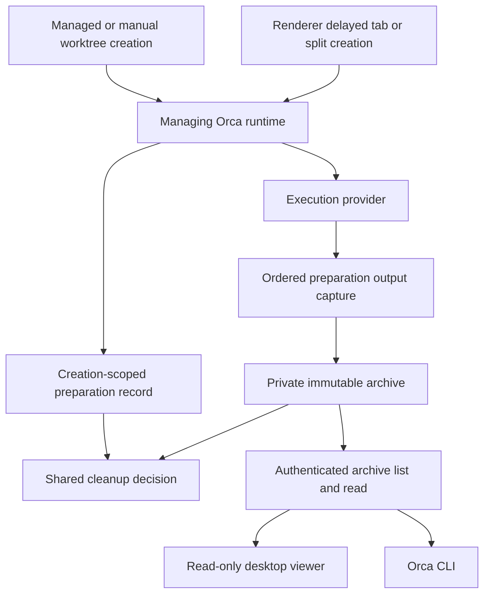
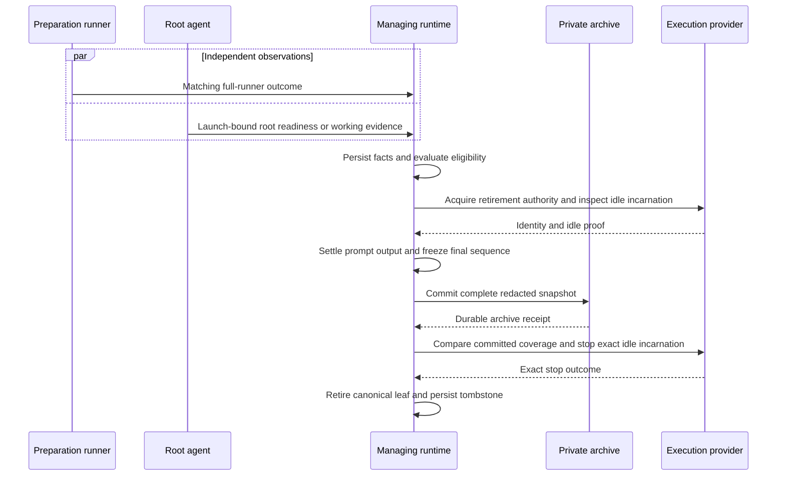
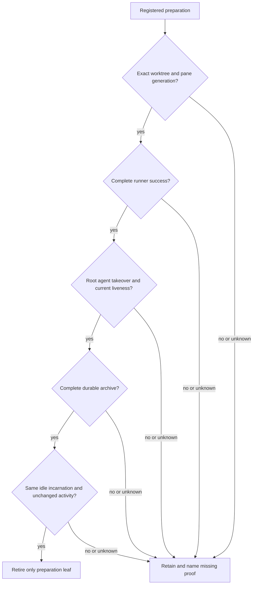

# Orca preparation terminal cleanup - Plan

**Target repository:** `flosrn/orca`, researched at deployed commit `867d38397893`.
Implementation paths below are relative to that repository; AX source references are explicitly identified.

## Goal Capsule

- **Objective:** After preparation succeeds and an agent takes over a new Orca worktree, the operator no longer has to close its obsolete preparation terminals manually.
- **Product authority:** Flo approved preparation-only closure with retained logs, including multi-step preparation and preparation sharing a tab with OMP.
- **Means:** An Orca-owned, creation-scoped preparation lifecycle with immutable output and identity-fenced pane retirement (KTD1–KTD6).
- **Authority:** Product requirements govern behavior; KTDs govern mechanism; units override neither.
- **Execution profile:** Implement in the Orca fork, test behavior before changing production, then exercise desktop and remote creation.
- **Stop conditions:** A missing proof retains the candidate; a discovered contradiction with the Product Contract requires a ruling before changing scope.
- **Landing:** The implementer owns verification and documentation; publishing, merging and deployment require separate operator authorization.
- **Ownership boundary:** Orca owns worktree terminal creation and closure; AX consumes the resulting inventory without weakening its capacity checks.

---

## Product Contract

### Summary

Automatically close obsolete preparation terminals after a new Orca worktree is ready for agent work.
Their output remains available after closure.
Agent terminals and continuing work remain outside the cleanup set.

### Problem Frame

The operator sees separate terminals for preparing a worktree and for running OMP.
Preparation can include dependency installation and several successive steps.
A completed preparation command can leave its interactive terminal open.

A captured AX 0.29.2 refusal names a released worker's worktree still occupied by two unrecorded live handles.
The refusal is about unknown occupancy, not an exhausted `dispatch.cap`.
The capture does not establish both handles' purposes; a later read identifies one as `Setup` and both as closed.
This incident motivates cleanup of proven preparation terminals, not automatic closure of every terminal at that path.

### Vocabulary

A **Preparation terminal** is created for the finite work required to make a new Orca worktree ready for an agent.
A server, watcher, manually opened shell or agent terminal is not a Preparation terminal merely because it shares the worktree.
A tab may contain several terminal panes; cleanup targets the preparation pane rather than assuming the whole tab is disposable.

### Key Decisions

- **Preparation-only cleanup.** Governs R1, R4, R5, R6. (session-settled: user-directed — chosen over closing every non-OMP terminal: continuing services and manually opened terminals must remain.)
- **Retained output after closure.** Governs R3. (session-settled: user-directed — chosen over discarding output or merely hiding terminals: remove obsolete terminals while keeping evidence accessible.)
- **Successful handoff is the cleanup boundary.** Governs R2, R7. (session-settled: user-approved — chosen over closure on first-step completion: the complete preparation and the agent handoff must be established.)

### Requirements

**Eligibility and timing**

- R1. Apply automatic cleanup to Preparation terminals created for new Orca worktrees, including manual creation and worker dispatch, locally and remotely.
- R2. Close eligible Preparation terminals only after the complete preparation succeeds and the worktree's agent has taken over, regardless of the number of preparatory steps.
- R3. Preserve the preparation output before closure and keep it consultable afterward without reopening or rerunning the preparation.

**Preservation boundaries**

- R4. Preserve the agent terminal throughout cleanup.
- R5. Preserve development servers, watchers and terminals opened manually by the operator.
- R6. When a Preparation terminal shares a tab with other panes, remove only its pane; remove the tab only when no retained pane remains.
- R7. Keep preparation visible when it fails, is interrupted, is unfinished or has an unestablished outcome, or when the agent has not taken over.
- R8. Automatic cleanup must not interrupt an operation still running in a candidate terminal or erase output before R3 is satisfied.

### Key Flows

- F1. Successful worktree preparation. **Covers R1–R6, R8.**
  - **Trigger:** Orca creates a new worktree with preparation and an agent.
  - **Steps:** Run the complete preparation; establish success and agent handoff; preserve the output; close the eligible preparation panes.
  - **Outcome:** The operator retains the agent and any continuing services without obsolete preparation panes.
- F2. Preparation cannot establish success. **Covers R2, R7, R8.**
  - **Trigger:** A preparation step fails, is interrupted or remains unfinished, or the agent does not take over.
  - **Outcome:** No cleanup is authorized by that incomplete handoff; preparation remains visible for inspection.

### Acceptance Examples

- AE1. **Covers R1–R4.** A new worktree has one preparation terminal and one OMP terminal. After preparation succeeds and OMP takes over, preparation disappears, its logs remain accessible and OMP keeps working.
- AE2. **Covers R2, R7, R8.** A preparation has three steps. Finishing the first or second does not trigger cleanup while another required step remains.
- AE3. **Covers R2, R7.** Preparation fails or is cancelled. Its terminal remains visible and the successful-handoff cleanup does not run.
- AE4. **Covers R2, R7.** Preparation succeeds but OMP fails to start. Preparation remains visible rather than treating process creation as a completed handoff.
- AE5. **Covers R4–R6.** Preparation and OMP occupy separate panes in one tab. Cleanup removes preparation without closing the tab or OMP's pane.
- AE6. **Covers R5, R8.** The worktree also has a development server, a watcher and a manually opened shell. Cleanup leaves all three intact.
- AE7. **Covers R1–R3.** The same successful-handoff behavior occurs on a remote execution host and for a worktree created manually rather than through AX.
- AE8. **Covers R3, R8.** Output preservation cannot be established. The candidate terminal is not closed, so its output remains available.
- AE9. **Covers R1, R5, R8.** An old terminal has the title `Setup` but no established preparation identity for this creation. Its title alone does not authorize closure.

### Scope Boundaries

- No worktree deletion, worker completion or worker Release is implied by preparation cleanup.
- No blanket closure of historical occupants is authorized; R1 concerns new worktree creation.
- No change to AX's fail-closed occupancy or capacity arithmetic is included.
- No remote transcript transport repair is included in this feature.

<!-- ce-section: work-relationships -->
### How This Work Fits Together

This plan covers preparation-terminal cleanup only.
The broader incident contains independent concerns, not a committed roadmap:

- **Can proceed independently:** AX's remote proof reader invokes bare `ax worker transcript` over non-interactive SSH and collapses command/read failures into `null`, displayed as a missing transcript. Repair its remote executable resolution and retain the failure reason. A login shell is an existing host-probe precedent, but project-only installations require their real checkout/entrypoint; `bash -lc` alone does not establish that contract.
- **Can proceed independently:** AX's generic transcript reader resolves remote worktree paths against the Mac's session root and HOME. Repair host-local path/root resolution for remote transcript needles instead of deriving their directory from the Mac.
- **Shares inventory evidence:** Preparation cleanup prevents its own obsolete panes from lingering; AX still decides capacity from the inventory it can establish.

### Dependencies and Assumptions

Orca defaults to concurrent `start-immediately`; the HarnessOS checkout that produced this incident explicitly declares `setupAgentStartupPolicy: wait-for-setup` in its project `orca.yaml`.
That incident uses the sequenced runner and gated agent startup, not the default concurrent order.
R2 requires success and takeover under either policy without changing the chosen startup order; U2 observes both writers rather than inferring success from process creation.

Worker creation receipts already distinguish agent/setup roles and exact handles; the concurrent monitor persists setup outcome, while the sequenced arm records it through the startup gate.
Manual IPC, non-awaited provisioning and renderer fallback need the additional bindings/observations specified in U1 and U2.
Names and matching worktree paths are not ownership evidence.

### Planning Questions Resolved

- Preparation identity and recovery are decided by KTD1 and KTD6.
- Full-runner outcome and agent handoff are decided by KTD2 and KTD3.
- Preserved-output storage and access are decided by KTD4 and KTD7.

### Sources and Research

- AX `src/worker/slots.mjs:220-269` and `src/worker/capacity.mjs:317-336`: residual live occupancy prevents establishing capacity before comparison with the cap.
- AX `tests/worker-slots.test.mjs:398-441`: the existing contract covers residual Setup/shell panes without counting them as workers.
- AX `src/worker/verify.mjs:210-243`: the separate remote verification transport and its null-on-failure behavior.
- Orca source at deployed commit `867d38397893`, paths relative to the Orca repository:
  - `src/main/runtime/runtime-worktree-terminal-provisioning.ts:79-154`: setup can occupy a separate tab or a split pane; its handle is available during creation.
  - `src/main/runtime/runtime-local-worktree-terminal-startup.ts:79-93,130-168`: setup sequencing and terminal provisioning paths.
  - `src/shared/setup-agent-startup-policy.ts:3-10`: default concurrent startup and optional `wait-for-setup`.
  - `src/shared/setup-agent-sequencing.ts:90-144`: completion marker and startup gate for sequenced preparation.
  - `src/main/runtime/orchestration/setup-completion-signal.ts:11-75`: observed setup completion and exit status.
  - `src/main/runtime/rpc/methods/orchestration/worker/worker-topology.ts` and `src/main/runtime/rpc/methods/orchestration/worker/worker-setup-gate.ts`: concurrent setup monitoring and sequenced setup evidence are separate writers at this baseline.
  - `src/main/runtime/orca-runtime-stop-explicitly-closed-tab-ptys.ts:107-145`: terminal closure accounts for sibling panes.
  - `src/main/daemon/daemon-pty-session-control.ts:188-198`: explicit closure normally removes history; preserving output needs an established retention path before cleanup.

---

## Planning Contract

### Key Technical Decisions

- KTD1. **Register preparation before terminal creation.** The managing Orca runtime creates a preparation ID tied to the worktree's canonical host, locator and `instanceId`, not its path or title (R1, R5, R8). A spawn acknowledgement binds the preparation pane and associated agent pane independently to their handle, tab, leaf, PTY and provider incarnation. Deferred renderer commands carry that preparation ID through the same registration path; a replay may reattach the same incarnation but may not adopt a replacement. This extends worktree identity and provisioning instead of inventing worker ownership for manual creation.
- KTD2. **Observe the entire runner under both startup policies.** One nonce-specific completion observation records the complete runner's exit status under concurrent startup and `wait-for-setup` (R2, R7). Extend the existing observed setup marker to the sequenced wrapper while preserving its agent gate. Only the matching marker with status zero proves success; shell exit, a consumed `.done` file, a step's exit or elapsed time does not. Persist the observation before evaluating cleanup.
- KTD3. **Use root-agent evidence with launch identity.** Persist a positive root-agent startup/working observation only when its ingest-time pane and provider incarnation match the associated agent from KTD1 (R2, R4, R7). OMP needs an explicit root `session_start` readiness receipt for a fresh initialized session, including an idle session without an initial prompt. Use the public `ctx.agent.kind === 'main'` identity, not the internal/nonexistent `ctx.agentKind` field, plus a session manager and session ID; a transcript filename is optional and is not startup readiness. Older contexts without positive root identity provide no cleanup authority. Retain launch authentication, and carry the readiness fact in subsequent status snapshots until acknowledged so latest-only posting cannot erase it. Reloads and nested task sessions cannot mint this receipt. Outstanding approval, lost liveness or incarnation replacement blocks cleanup. Other agents use their existing authoritative startup/working evidence; unsupported evidence retains preparation. Neither title-derived status, generic child-process detection nor worker `ready` is authority.
- KTD4. **Capture output from creation, then commit a separate archive.** Capture normalized preparation output from the first provider byte, including the final partial line, rather than exporting `terminal.read`'s preview (R3, R8). Use a bounded per-preparation buffer of 16 MiB; reaching the limit, missing the beginning or observing a sequence gap makes preservation incomplete and prohibits automatic closure. Apply the general secret redactor and dispatch-capability redactor to the joined capture before persistence. Write one immutable archive under the managing runtime's private profile storage, outside daemon restoration history and outside the worktree. Commit by private temporary write, file sync, atomic rename and supported directory sync; an unestablished durable commit authorizes no destruction. Logs are redacted diagnostic output, not a promise to retain secrets verbatim. (session-settled: user-directed — chosen over discarded output or hidden live terminals: retain consultable evidence while removing obsolete preparation terminals.)
- KTD5. **Retire exactly one proven-idle preparation leaf.** Add an internal compare-and-retire operation carrying the identities from KTD1, archive coverage, output sequence and input revision (R4–R6, R8). Acquire retirement authority before freezing output, excluding competing input, rebind, spawn and layout mutations affecting that leaf. At the execution provider, positively establish the same shell-only foreground with no continuing descendants, then commit output through the snapshot's final sequence. Require 250 ms of output quiescence before the snapshot, within a 5 s settlement window; quiet time is never runner-success or agent evidence. Output-only changes during commit permit at most three new snapshot/commit attempts while identity, input revision and shell-only inspection remain unchanged. New input, continuing processes, identity/layout change, exhausted settlement or unknown inspection retains the leaf. Stop requests enforce the expected incarnation and, on remote providers, the recorded creator's `expectedOwnerClientInstanceId` at the provider. No attested creator or unsupported enforcement means retain. Remove the leaf explicitly from canonical runtime layout and persistence, including hidden/split tabs; renderer exit is not authority. Remove the tab only when no retained leaf remains.
- KTD6. **Recover recorded facts without reconstructing ownership.** Keep mutable lifecycle facts separate from immutable archive snapshots (R1, R3, R7, R8). On restart, reconcile only the recorded host, worktree generation and provider incarnations. Reattach the same live incarnation when coverage is available; missing pre-crash capture makes preservation incomplete. A committed archive survives a failed close; later output invalidates that snapshot's closure authority but may be recaptured under KTD5. Later input or changed ownership cannot be recaptured into new closure permission. A pending close reconciles the exact old incarnation before settling; ambiguity retains the pane. Retired preparations remain tombstoned and may never enqueue their setup command on activation or remount. Archives and records live until successful deletion of their canonical worktree generation, then the existing worktree-removal lifecycle purges that exact host/generation. Failed deletion does not purge them; failed purge records a recoverable deletion obligation and revokes archive reads for the deleted generation without affecting a same-path replacement.
- KTD7. **Expose one read-only archive contract to UI and CLI.** Add `preparation.output.list` and `preparation.output.read` to the existing authenticated runtime RPC, with matching `orca preparation output list/read` commands and a worktree-menu `Preparation output` viewer (R3). List by canonical worktree identity and host; read by opaque archive ID with bounded paging and explicit unavailable/incomplete/redaction information. Reads address the archive, never a live PTY, and never recreate preparation. Reuse normal runtime transport for remote managing runtimes and paired clients; no SSH filesystem-path fallback. Archived output is inert text in both surfaces.

### High-Level Technical Design

**Ownership and data flow — KTD1, KTD4, KTD7.** The managing runtime can control local PTYs or SSH/WSL providers; the archive stays with that runtime.

**Handoff protocol — KTD2–KTD5.** Completion and agent evidence may arrive in either order; startup policy is unchanged.

**Lifecycle and recovery — KTD6.** These are internal facts, not new AX worker states.

```mermaid
stateDiagram-v2
  [*] --> Registered
  Registered --> Observing: Exact spawn binding
  Observing --> Eligible: Success and positive agent evidence
  Observing --> Retained: Failure or unknown proof
  Eligible --> Retiring: Acquire exact retirement authority
  Eligible --> Retained: Incomplete proof
  Retiring --> Archived: Settle output and commit durable snapshot
  Archived --> Retiring: Output-only change within KTD5 bound
  Archived --> Retired: Exact stop and leaf retirement settled
  Retiring --> Retained: Reuse, failed commit or exhausted bound
  Archived --> Retained: Input, process or identity change; uncertain stop
  Retired --> [*]
```

**Closure gates — KTD1–KTD6.** A refusal names its failed proof; none rounds unknown toward closure.

### Integration Constraints

- Existing identity is `WorktreeMeta.instanceId` plus canonical host/locator; preparation lifecycle storage and archive APIs are new.
- Worker setup receipts consume the shared runner observation. They retain their existing orchestration semantics; preparation retirement is not a worker Release.
- Renderer fallback must register and attach capture before issuing its queued setup command, not publish a handle after the command has already run.
- A universal spawn-commit callback is not a first-byte barrier: daemon/SSH stream events and spawn replies can race. Preallocate or reserve the provider session key before spawning, arm capture against that pending registration, then bind the acknowledged incarnation. Unknown early data is buffered under that registration, never joined by title or path.
- The 64 KiB recent-output replay and daemon restoration files do not establish full-run capture. A collector that attaches late must prove an untrimmed complete prefix or retain the pane.
- General `redactString` supports multiline PEM; redaction must precede archive persistence and must not split secrets at PTY chunk boundaries. Archive metadata excludes environment values, launch tokens and setup command contents.
- Legacy provider generations and unsupported exact inspection/stop capability disable automatic retirement for that candidate; they do not weaken KTD5.
- Orca's shell wrapper converts `ORCA_OMP_STATUS_EXTENSION` into an explicit `--extension` argument. OMP loads ambient extensions before explicit paths and deduplicates only resolved path strings, so the owned file and differently located fallback both bind. Their PID guards prevent another process from taking ownership, not two copies in the same process. KTD8 owns the required single-emitter cutover.

### Research That Shapes the Design

- `src/shared/worktree/meta-types.ts` and `src/main/persistence/loading-store/worktree-identity-metadata.ts`: canonical worktree generation rather than path equality (KTD1).
- `src/main/ipc/worktrees/create/register-worktree-create-handlers.ts`, `src/main/ipc/worktree-remote.ts` and `src/renderer/src/lib/worktree-initial-terminal-seeding.ts`: manual and renderer creation bypass managed-worker provisioning (U1).
- `src/main/runtime/runtime-worktree-terminal-provisioning.ts`: awaited provisioning has a setup handle, while wrapped commands suppress the completion token (U1, U2).
- `src/main/runtime/orca-runtime-start-tui-idle-visible-read-probe.ts` and `src/shared/setup-agent-sequencing.ts`: replay and token parsing exist; PTY exit and consumed gate files are not universal runner proof (KTD2).
- `src/main/pi/agent-status-handler-source.ts`, `src/main/pi/omp-session-status-owner-source.ts` and `src/main/runtime/agent-status-observed-pane-identity.ts`: root-session events and ingest-time identity exist, but idle OMP has no startup post (KTD3).
- `src/main/runtime/terminal-tail-read.ts`: default reads are 120-line, character-bounded previews and omit partial lines from cursor paging (KTD4).
- `src/main/runtime/orchestration/worker-output-archive.ts` and `src/main/runtime/rpc/methods/orchestration/worker/worker-release-completion.ts`: archive-before-close precedent; storage ownership remains worker-specific (KTD4).
- `src/main/runtime/orca-runtime-stop-explicitly-closed-tab-ptys.ts`: current multi-pane close relies on renderer exit, requiring explicit canonical leaf retirement (KTD5).
- `src/main/daemon/daemon-pty-session-control.ts` and `src/renderer/src/store/slices/recently-closed-tabs.ts`: explicit close deletes restoration history; recently closed recreates a shell rather than reading output (KTD4, KTD7).
- AX `docs/solutions/bugs/a-run-with-no-pane-is-a-queue-not-a-dead-letter.md`: stopping a pane while preserving wake authority can revive it later (KTD6).
- AX `docs/solutions/bugs/unknown-liveness-is-not-permission-to-redispatch.md`: host-covering evidence is required before treating absence as death (KTD5, KTD6).
- `src/main/ipc/pty/runtime/spawn-execute.ts`, `src/main/daemon/daemon-pty-adapter.ts` and `src/main/providers/ssh-pty-notification-routing.ts`: provider streams do not universally wait for the spawn acknowledgement (U1, U3).
- `src/main/providers/pty-provider-contract.ts`: shutdown already carries optional expected-incarnation/owner fields; the runtime stop adapter and local implementations need to enforce them for automatic retirement (U4).
- `src/main/pi/titlebar-extension-service.ts`: user-owned status files receive a managed fallback rather than an overwrite; `src/main/pi/agent-status-post-queue-source.ts` uses latest-only posting (U2).
- `docs/reference/omp-runtime-session-provenance.md` and `docs/reference/remote-wire-compatibility.md`: respect root-provenance limits and negotiated mixed-version remote behavior (U2, U4, U5).
- External OMP `src/extensibility/extensions/loader.ts`, `runner.ts` and `types.ts`: ambient-before-explicit loading, path-only deduplication and public `ctx.agent.kind` provenance. Runtime CLI reports `18.4.3`; the inspected reference declares `18.4.3-fork.da0f4b4`, not a byte-equivalence attestation.
- The actual CLI, using isolated instrumented copies of both current status files and no prompt, binds both factories in one process. Root `session_start` reports `agent.kind: main`, a manager and session ID even under `--no-session`, with no transcript filename.

### System-Wide Impact and Rollout

The runtime becomes the single owner of preparation identity, outcome, archive and retirement across desktop and worker entry points.
Provider changes must preserve manual close and daemon wake behavior; automatic retirement uses its own exact-identity authority.
Archive list/read must have desktop/CLI parity and pass the existing authenticated remote transport boundaries.

Existing worktrees are not backfilled from titles or paths.
Enable retirement only for creations carrying the complete new registration and provider capability; older records remain untouched.
The KTD8 owned-extension port is an external rollout prerequisite, not an Orca production edit authorized by this plan.
Its acceptance condition is one status owner providing KTD3 evidence on each exercised host; establish it before the idle-manual handoff smoke.
Rollback disables new retirement decisions while keeping committed archives readable; it must not recreate retired preparations.

### OMP Activation and Owned-Extension Prerequisite

- KTD8. **One complete status owner per process and pane launch.** Upgrade Orca's template and the separately owned OMP copy to share a process-global ownership registration keyed by pane and launch identity, recording the winning implementation's resolved module identity. A different status copy binds nothing only after both implementations satisfy the capability-preservation port below. Later factories from the winning copy bind normally for new session runners and reloads; deduplicate handlers, commands and shortcuts within one runner, not across all sessions in the process. Preserve the separate KTD3 root/session-manager guard so child status cannot mint takeover. Keep the owned file unmarked and preserve its managed timers, endpoint cache, redaction and settlement behavior. Ownership applies to this status implementation, not the separate titlebar or prefill extensions.

**External repository:** `flosrn/omp`.
Paths in this subsection alone are relative to that repository.

**Files:** `agent/extensions/orca-agent-status.ts` and behavior tests under `agent/extensions/managed-timers/`; preserve the extension's existing ownership doctrine.
The sync script `agent/scripts/sync/sync-orca-extensions.ts` targets stable upstream templates and cannot deliver this fork-only receipt.
Do not change that script's upstream source as part of this port.

**Port:** After the Orca template's U2 contract exists, reconcile the full required status behavior into both possible winning implementations, not only the new receipt.
Preserve approval-request/resolution reporting, `model_select`, `session_switch`, the `orca-model` command, subagent lifecycle reporting, root settlement, endpoint handling and tool-input sanitization alongside KTD3 readiness.
Preserve the existing `ORCA_OMP_PREFILL` behavior without changing the separate owned `orca-prefill.ts`; consuming a draft must remain exactly-once when both startup handlers are present.
Establish the winning module identity from module/loader provenance, not a presumed public ExtensionAPI self-path.
Enable the exclusive binding rule only after the owned copy and managed template both implement this contract; an unported copy cannot silently win and remove required capabilities.
Apply the same port to the effective owned copy on each deployment host through its established configuration distribution, with no automatic global overwrite.
Ordinary Orca installation must preserve unrelated user-owned extensions.

**Behavioral proof:**
- Ambient owned copy plus explicit managed fallback in one process yields one owner and one root readiness receipt.
- Reverse load order yields one owner. A reload and a child-session rebind of the winning copy keep required status reporting without duplicating handlers on a runner, enabling the losing copy or minting a new handoff.
- Either winning implementation preserves approval blocking/unblocking, model updates, session switching, subagent lifecycle and root settlement. The model-switch command and existing shortcuts register once per runner.
- An initial OMP draft reaches the composer once with the separate prefill extension still loaded; ownership does not suppress titlebar or prefill capabilities.
- A nested task session reporting `ctx.agent.kind: sub`, including a depth-zero child, never supplies takeover evidence.
- An ephemeral root session with a manager and ID but no transcript filename still supplies startup evidence.
- Existing managed timer, endpoint/redaction and root-settlement scenarios remain intact.
- Each rollout host exercises its actual binary's loader/rebind behavior; the local version string and reference manifest do not establish remote compatibility.

The actual CLI smoke establishes activation and public context shape, not delivery of the future receipt.
No owned extension, production source or remote host was changed during planning.
Implementation and cross-host rollout still need explicit authorization.

### Deferred Implementation Details

Final helper names, archive paging representation and supported platform directory-sync mechanics are implementation details.
Their contracts are fixed by KTD4–KTD7; failure to establish those contracts retains the pane rather than silently reducing R3 or R8.

---

## Implementation Units

### U1. Bind preparation identity across all creation paths

**Goal:** Every new finite preparation has one runtime-owned creation identity before its command can run.

**Requirements:** R1, R5, R8; F1, F2; AE7, AE9; KTD1, KTD6.

**Dependencies:** None.

**Files:**
- Create `src/shared/preparation-contracts.ts` and `src/main/runtime/preparation/preparation-record-store.ts`.
- Modify `src/main/runtime/runtime-worktree-terminal-provisioning.ts`, `src/main/runtime/runtime-local-worktree-terminal-startup.ts` and `src/main/runtime/runtime-remote-managed-worktree-create.ts`.
- Modify `src/main/ipc/worktrees/create/register-worktree-create-handlers.ts`, `src/main/ipc/worktree-remote.ts`, `src/renderer/src/lib/worktree-initial-terminal-seeding.ts` and `src/renderer/src/lib/worktree-setup-issue-command-queue.ts`.
- Extend existing terminal-spawn contracts to carry the opaque registration, including configured default-tab and renderer fallback paths.
- Create `src/main/runtime/preparation/preparation-registration.test.ts`; extend `src/renderer/src/lib/worktree-activation-setup-script.test.ts`.

**Approach:**
1. Extend canonical worktree identity into the preparation record under KTD1.
2. Carry registration through managed provisioning, manual IPC and deferred tab/split creation.
3. Bind preparation and associated agent independently at spawn acknowledgement; arm output observation before command delivery.
4. Keep non-awaited provisioning observable internally without requiring callers to wait for preparation success.

**Patterns to follow:** Worktree identity metadata and exact setup-handle receipts in `workers-new-worktree.test.ts`.

**Test scenarios:**
- Covers AE7. Manual and worker creation, local and SSH, bind the actual preparation incarnation without selecting a title.
- Covers AE9. A same-path shell titled `Setup` without registration remains outside the candidate set.
- Deferred renderer spawn, configured default tabs and setup splits attach the first correct binding; missing acknowledgement establishes no ownership.
- Recovery remount of the same incarnation does not duplicate preparation; a replacement cannot inherit closure authority.

**Verification:** All creation paths produce one canonical preparation record, and look-alike/default/service terminals remain unowned by cleanup.

### U2. Establish complete runner success and root-agent takeover

**Goal:** Cleanup receives independently persisted outcome and agent facts under both startup policies.

**Requirements:** R2, R4, R7; F1, F2; AE1–AE4; KTD2, KTD3.

**Dependencies:** U1.

**Files:**
- Modify `src/shared/setup-agent-sequencing.ts`, `src/main/runtime/orchestration/setup-completion-signal.ts` and `src/main/runtime/orca-runtime-start-tui-idle-visible-read-probe.ts`.
- Modify `src/main/pi/agent-status-handler-source.ts`, `src/main/pi/omp-session-status-owner-source.ts` and `src/main/runtime/agent-status-observed-pane-identity.ts`.
- Modify `src/main/pi/agent-status-extension-source.ts` and `src/main/pi/agent-status-post-queue-source.ts` for startup provenance and snapshot persistence; KTD8 status ownership belongs with the listed status/session-owner source, not the titlebar lifetime module.
- Update the setup-observation consumers in `src/main/runtime/rpc/methods/orchestration/worker/worker-topology.ts` and `src/main/runtime/rpc/methods/orchestration/worker/worker-setup-gate.ts`.
- Create `src/main/runtime/preparation/preparation-observation.ts` and `src/main/runtime/preparation/preparation-observation.test.ts`.
- Extend `src/main/runtime/orchestration/setup-completion-signal.test.ts`, `src/main/pi/agent-status-extension-source.test.ts` and `src/main/runtime/orca-runtime-tests/terminal-creation-and-readiness-part-06.spec.ts`.
- Extend behavior coverage in `src/main/pi/agent-status-extension-omp-lifecycle.test.ts` and `src/main/pi/titlebar-extension-service.test.ts` for owned-plus-fallback loading.
- Verify KTD8 capability parity for both winning status implementations, including approval/model/session events and existing prefill behavior.

**Approach:**
1. Add KTD2 observation to the sequenced full runner without changing concurrent/default ordering or the gate's fail-fast behavior.
2. Add the public root startup receipt under KTD3 and capability-preserving ownership under KTD8; persist observations directly at authenticated ingest before bounded identity caches can evict them.
3. Evaluate the shared preparation facts whenever either side changes; permission/liveness changes invalidate current eligibility.
4. Let worker setup evidence consume the same full-runner fact without turning orchestration `ready` into cleanup authority.

**Execution note:** Start with a behavior test where the wrapped runner succeeds and returns to an interactive prompt; the current tokenless path must not satisfy the new contract.

**Test scenarios:**
- Covers AE2. Three finite commands produce success only after the third; a failure in the second leaves preparation visible.
- Covers AE3. Interrupted runner, stale nonce and shell exit zero without the marker do not authorize cleanup.
- Covers AE1. Fresh root OMP startup without an initial prompt provides the same handoff fact as an active root session.
- Covers AE4. Spawn-only, failed startup, blocked approval, unknown provider identity and nested child events provide no takeover authority.
- A child event arriving before the root or a missing session manager never mints takeover; unavailable provenance retains preparation.
- Owned and fallback copies in one process register one status owner; root `ctx.agent.kind` proves main, while depth-zero subagents cannot claim it.
- Whichever status copy wins still reports approval, model and session transitions and exposes model switching; the initial draft is applied once and separate prefill/titlebar behavior remains intact.
- Root startup without a persistent transcript filename is eligible when manager/session ID and launch identity are established.
- A later status snapshot replacing an undelivered startup post still carries the same launch-bound readiness fact; lost transport never becomes positive proof.
- Preparation-before-agent and agent-before-preparation reach the same decision; reload/replacement cannot reuse a previous positive fact.

**Verification:** Matching full-runner success and exact root takeover are visible as separate facts; every incomplete/blocked case retains preparation.

### U3. Preserve complete output and recover lifecycle facts

**Goal:** Eligible preparation has a durable, redacted archive independent of terminal restoration.

**Requirements:** R3, R7, R8; AE8; KTD4, KTD6.

**Dependencies:** U1, U2.

**Files:**
- Create `src/main/runtime/preparation/preparation-output-capture.ts`, `src/main/runtime/preparation/preparation-output-store.ts` and `src/main/runtime/preparation/preparation-recovery.ts`.
- Modify `src/main/runtime/orca-runtime-on-pty-data.ts` and the provider intake/attachment owners so local and SSH capture starts before command output.
- Reuse `src/main/observability/redactor.ts`, `src/main/runtime/orchestration/worker-transcript-payload.ts` and private-file primitives from `src/main/daemon/daemon-private-file-modes.ts`.
- Create `src/main/runtime/preparation/preparation-output.test.ts` and `src/main/runtime/preparation/preparation-recovery.test.ts`.
- Modify the shared successful worktree-removal integration in `src/main/ipc/worktrees/removal/worktree-removal-ownership.ts`; cover local and remote removal without path-only archive matching.

**Approach:**
1. Capture provider-ordered output under the pending registration before spawn/command delivery, then bind its acknowledged incarnation under KTD4.
2. Keep capturing after the runner marker; freeze the complete prefix and final partial output only inside KTD5 retirement authority after outcome and takeover are established.
3. Commit archive and lifecycle reference with crash-consistent recovery; orphan committed archives remain readable rather than being mistaken for close permission.
4. Reconcile KTD6 facts and exact-generation deletion obligations at restart without replaying setup or importing daemon wake authority.

**Patterns to follow:** Worker archive ordering, private file modes and atomic history writes; add the durability operations those existing writes do not provide.

**Test scenarios:**
- More than 120 lines and output beyond the recent replay buffer preserve the actual beginning and final partial line.
- Daemon/SSH data arriving before the spawn reply preserves its prefix exactly once; replay frames cannot duplicate captured output.
- Covers AE8. Cap exhaustion, missing prefix, output gap, write/sync/rename failure or unavailable source leaves the pane visible.
- Chunk-split labeled secrets and multiline PEM are redacted before durable storage; archive metadata never contains launch credentials.
- Restart before archive commit retains preparation when capture was lost; restart after commit reads logs without spawning a PTY.
- A committed archive plus failed stop remains readable; post-commit output-only prompt/OSC bytes produce a new complete snapshot under KTD5, while new input cannot authorize a retry.
- Successful local/remote worktree deletion purges only the removed host/generation's archives; failed deletion keeps them, and failed purge revokes reads until recovery removes the files.

**Verification:** The operator can recover the complete redacted captured run after explicit close; every known gap prevents that close.

### U4. Retire only the unchanged idle preparation leaf

**Goal:** Automatic cleanup cannot stop a retained agent/service or leave a wakeable ghost preparation pane.

**Requirements:** R4–R8; AE5, AE6, AE8, AE9; KTD5, KTD6.

**Dependencies:** U1, U2, U3.

**Files:**
- Create `src/main/runtime/preparation/preparation-retirement.ts` and `src/main/runtime/preparation/preparation-retirement.test.ts`.
- Modify `src/main/runtime/orca-runtime-stop-explicitly-closed-tab-ptys.ts`, `src/main/runtime/runtime-pty-controller-contract.ts`, `src/main/runtime/runtime-terminal-writer.ts` and canonical terminal layout/persistence mutation owners.
- Modify `src/main/ipc/pty/runtime/kill.ts`, `src/main/ipc/pty/provider/shutdown-detect.ts`, `src/main/providers/pty-provider-contract.ts`, `src/main/providers/local-pty-termination.ts` and `src/main/daemon/daemon-pty-session-control.ts`.
- Extend `src/relay/pty-handler.ts` automatic-retirement inspection/stop under the same expected-incarnation and activity authority.
- Extend renderer retirement event handling to consume canonical leaf removal, not infer removal from exit status.

**Approach:**
1. Derive one eligibility result from KTD1–KTD6, naming every failed proof.
2. Serialize KTD5 retirement with competing leaf input/rebind/layout changes, including direct IPC/provider routes.
3. Enforce provider idle inspection, expected-incarnation stop and remote creator attestation; unsupported enforcement retains the candidate.
4. Persist exact leaf retirement and tombstone, then notify renderer consumers. Preserve every sibling and avoid newly-closed-shell restoration entries.

**Execution note:** Exercise hidden/background mixed tabs; a mounted renderer is not part of the retirement proof.

**Test scenarios:**
- Covers AE5. Setup and OMP share one tab; cleanup removes only Setup's leaf and OMP continues receiving input/output.
- Covers AE6. A foreground server, background watcher or manual input after runner completion blocks retirement; unrelated service/shell panes remain untouched.
- Replacement during archive commit or provider inspection never stops the new incarnation.
- Prompt and OSC output after the marker or during archive commit is included in a superseding snapshot, then the leaf retires exactly once within KTD5's bound.
- Input revision, canonical layout or foreground/descendant changes during an awaited operation retain the pane; continuously changing output exhausts settlement without closure.
- Duplicate completion/cleanup events retire once; uncertain stop does not mark an occupied pane absent.
- Background activation, remount and restart never rerun retired preparation or restore its empty ghost leaf.

**Verification:** Exact stop and canonical leaf removal agree in runtime inventory, persisted layout and visible UI; retained siblings remain operational.

### U5. Make archived preparation output consultable in UI and CLI

**Goal:** Humans and agents read the same preserved output after the preparation terminal disappears.

**Requirements:** R3; AE1, AE7, AE8; KTD7.

**Dependencies:** U3.

**Files:**
- Create `src/main/runtime/rpc/methods/preparation-output.ts` and `src/main/runtime/rpc/methods/preparation-output.test.ts`; register with `src/main/runtime/rpc/methods/index.ts`.
- Create `src/cli/specs/preparation.ts` and `src/cli/handlers/preparation.ts`; register with `src/cli/specs/index.ts`, `src/cli/handler-group-manifest.ts` and `src/main/startup/cli-command-names.ts`.
- Create `src/cli/preparation-output.test.ts`; extend existing CLI registry/name parity coverage.
- Modify `src/renderer/src/components/sidebar/use-worktree-context-menu-model.tsx`.
- Create `src/renderer/src/components/preparation-output/preparation-output-dialog.tsx` and its behavior test.
- Add params to `src/shared/rpc-contract/` and update the generated params catalog through its existing generator.
- Extend `src/main/runtime/runtime-rpc/runtime-rpc-mobile-method-allowlist.ts` and authenticated desktop/paired capability declarations only for these read operations.

**Approach:**
1. Implement KTD7 list/read over archive storage, with stable bounded paging and host/worktree identity.
2. Keep the worktree menu entry discoverable. Open one archive directly or show a newest-first selector with creation time, host and completeness; show a distinct no-archive state when none exist.
3. Render loading, unavailable/error and successful-empty states separately; show incomplete/redaction and retention reasons above output, with CLI equivalents.
4. Render escaped inert text with keyboard-accessible selection and paging; never link archive selection to terminal creation.

**Test scenarios:**
- Covers AE1. After retirement, UI and CLI return the same redacted output including final partial text.
- Covers AE7. An authenticated remote managing-runtime read works after closure without remote filesystem access or a new setup command.
- Invalid/traversal archive IDs, unauthorized calls and omitted/unavailable host scope return explicit errors rather than reading another profile or reporting empty output.
- Paging large archives does not lose/duplicate lines; empty successful output is distinguishable from an unavailable archive.
- No-archive, loading, read failure and successful-empty output are visibly distinct; multiple archives select by host/time/completeness without guessing ownership.
- Log content containing HTML or terminal escape sequences remains inert; opening/closing the viewer creates no PTY.

**Verification:** Both surfaces read committed archives after restart, preserve host qualification and never invoke setup.

### U6. Prove end-to-end behavior and document the cutover

**Goal:** The complete feature satisfies the approved examples on real local and remote surfaces.

**Requirements:** R1–R8; F1, F2; AE1–AE9.

**Dependencies:** U1–U5.

**Files:**
- Create `src/main/runtime/preparation/preparation-lifecycle.integration.test.ts`.
- Extend `src/main/runtime/rpc/methods/orchestration/worker/workers-new-worktree.test.ts` and the existing manual-worktree/renderer creation integration suites.
- Update `skills/orca-cli/SKILL.md`, `docs/reference/omp-runtime-session-provenance.md` and `docs/reference/remote-wire-compatibility.md` where the new contract changes their guidance; regenerate bundled skill/catalog artifacts through existing package scripts.
- No in-repo release-note file exists at the baseline; the updater reads an upstream-hosted changelog. Documentation cutover uses the named in-repo guides, not that external site.

**Approach:**
1. Prove the full handoff matrix using deterministic provider/time/filesystem seams, not source-string or title assertions.
2. Run desktop creation and CLI worker creation on local and remote hosts, including configured tabs and split/background surfaces.
3. Verify the separately authorized effective OMP extension port before the idle manual scenario; record a missing external port as a rollout blocker, not a passing smoke.
4. Document archive access, retain-on-unknown behavior, legacy non-adoption and rollout requirements. Remove experimental scaffolding before delivery.

**Test scenarios:**
- Covers AE1–AE7. Exercise complete success/failure/cancellation/no-agent and mixed-pane scenarios across manual/worker, local/remote and both startup policies.
- Covers AE8, AE9. Archive failure and historical title-only candidates remain visible without forged ownership.
- Restart between spawn binding, outcome persistence, archive commit and exact stop cannot close a replacement or rerun preparation.
- AX consumes the resulting host-covering inventory unchanged; a refused cleanup remains occupancy, not an invented free slot.

**Verification:** All approved examples have observed proof on the actual CLI/desktop surfaces; no AX capacity/transcript workaround is required.

---

## Verification Contract

### Behavioral Proof

Production behavior changes start with the smallest failing consumer-visible test at the owning seam.
Focused unit/integration coverage exercises the scenarios attached to U1–U6; mock forwarding and generated-source wording are not proof.

| Native gate in the Orca checkout | Purpose |
|---|---|
| `pnpm test` | Node-native Vitest gate, including the affected preparation/provider/renderer suites. |
| `pnpm typecheck` | Node, CLI, web and e2e project contracts. |
| `pnpm lint` | Code-quality/reliability ratchets, RPC catalog, skill guides and localization checks. |
| `pnpm verify:cli-bin` | Packaged command surface remains runnable. |
| `pnpm build:cli` and affected relay/desktop packaging scripts | Exercise the built CLI and changed providers in the real-surface matrix. |

Run the affected suites first during implementation, then native quality gates after integration.
Generate RPC catalog and bundled skill-guide changes with the existing `generate:*` scripts before their verification gates; do not hand-edit generated contracts.

### Real-Surface Matrix

| Scenario | Observation required |
|---|---|
| Manual local OMP, idle startup | Preparation retires after the full runner; archive opens; OMP remains usable. |
| Worker local, both startup policies | Outcome and takeover may arrive in either order; retirement occurs only with both. |
| Manual and worker remote | The execution host confirms exact stop; authenticated archive read survives closure. |
| Setup split with OMP, including background tab | Only the preparation leaf disappears from canonical inventory/layout and UI. |
| Failed/cancelled runner or blocked/missing agent | No automatic retirement; preparation remains inspectable. |
| Watcher/server/manual shell and post-run input | Continuing work and retained siblings stay live. |
| Failed archive, over-limit output or replaced incarnation | The candidate remains; the missing proof is named. |
| Restart before/after archive and retirement | Logs stay readable, replacements stay live and preparation never reruns. |

Do not create a second AX receiver or redispatch an existing worker to test cleanup.
Tests alone do not satisfy this contract: capture actual desktop/CLI observations and read back the committed archive.
No test, build or runtime result is claimed by this planning document.

---

## Definition of Done

- R1–R8 hold, and AE1–AE9 have the unit/integration and real-surface evidence prescribed above.
- U1–U6 are implemented against Orca's owning module conventions; all creation callers use the shared preparation record and proof path.
- Every automatic stop is archive-backed, identity-fenced and leaf-specific; unknown proof retains its candidate.
- UI and CLI read the same committed preparation output without restoring a PTY.
- Effective OMP extension and execution-provider capabilities are verified for the exercised local/remote paths, including the separate owned-extension rollout prerequisite when applicable.
- Old terminals are not adopted from names or paths, and AX's refusal/capacity arithmetic is unchanged.
- Documentation and command help match the new read surfaces; abandoned experiments and dead cutover paths are removed.
- Native quality gates and the real-surface matrix pass; publishing/merge/deployment remain outside authority until separately granted.
