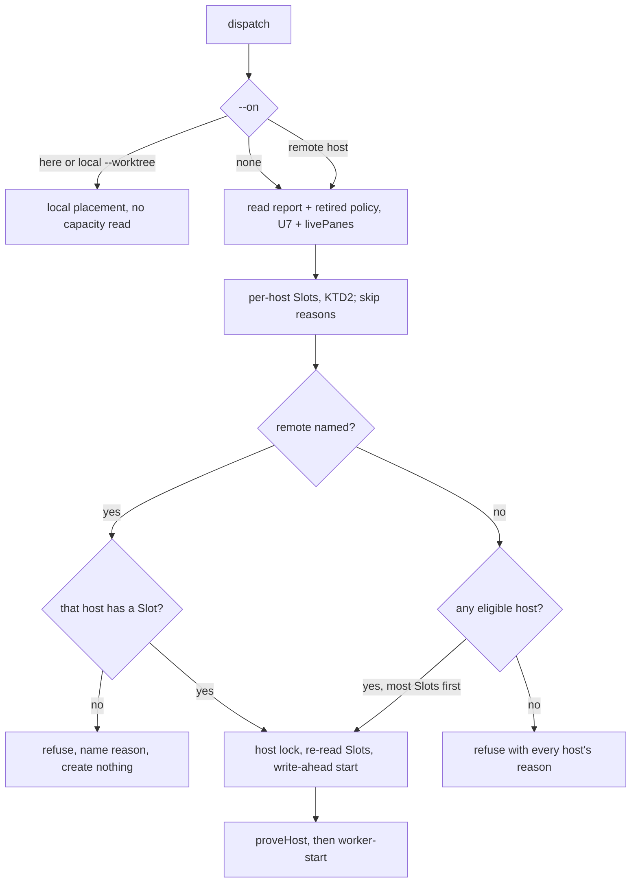
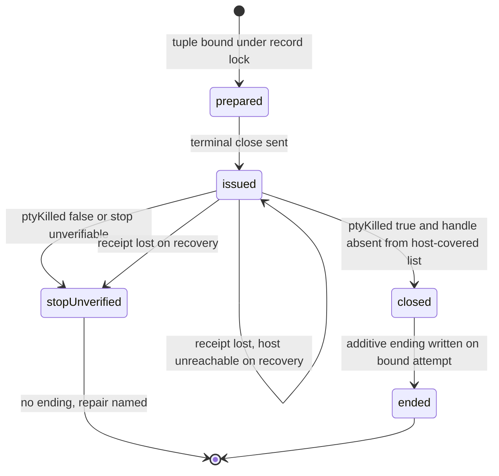
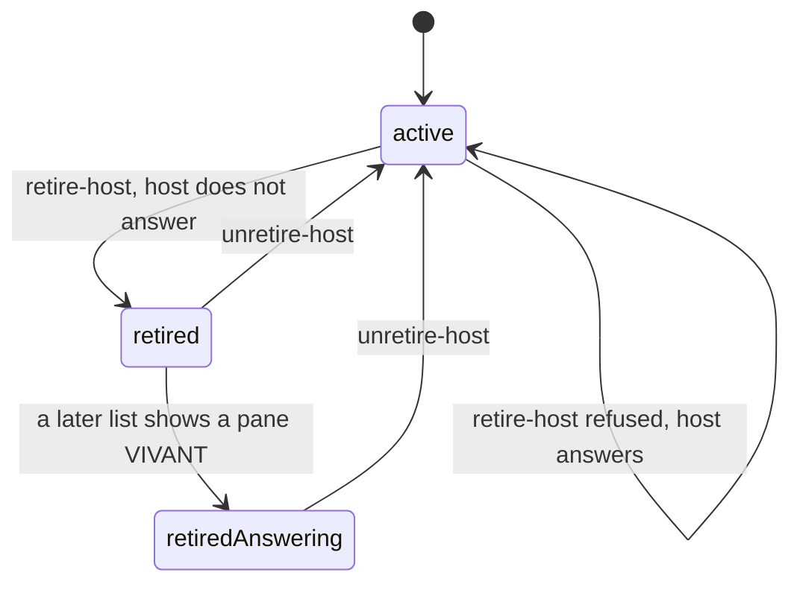

# Slots-only admission, pane Close and host retirement - Plan

**Target repos:** ax (this repository) and HarnessOS (`flosrn/harnessos`). Paths are repo-relative to the repository each unit names.

---

## Goal Capsule

- **Objective:** an operator can always dispatch a worker onto any machine that has room for it, see each machine's real memory headroom and OOM history before choosing, and end or write off panes the system cannot otherwise retire — without one unreachable machine freezing work anywhere else, and without admitting a worker a host cannot hold.
- **Means:** admission by per-host Slots only (KTD1, KTD2), OOM-blocked hosts from HarnessOS (KTD5), `ax worker close` (KTD7) and host retirement as policy (KTD8). Decision record: `docs/adr/0005-slots-are-the-only-admission.md`.
- **Authority:** the R-IDs below win on behavior; KTDs win on mechanism within them; ADR 0005 and `CONTEXT.md` (Slot, Close, Verdict) bind vocabulary. Owning module headers stay the doctrine authority per `AGENTS.md`, and each touched header is rewritten to the new rule.
- **Stop conditions:** stop and ask if a settled decision proves infeasible in code (for example Orca cannot close a remote pane by `--environment`), or if a change would require writing MORT without a covering inventory.
- **Execution profile:** behavior fixes start red (`AGENTS.md`), offline tests with injected machine answers; no test spawns a mutating CLI against real defaults.
- **Who ships:** this session's operator. HarnessOS ships first (R14), ax releases through Release Please with a breaking-change commit, then consumers re-pin.

---

## Product Contract

### Summary

Remove ax's repository and machine dispatch caps and admit workers by per-host Slots computed from HarnessOS cgroup measurements, with OOM kills blocking a host until acknowledged. Extend `ax worker hosts` to show each host's memory and OOM state, and add two operator verbs: `ax worker close` to end one named pane, and `ax worker retire-host` / `unretire-host` to write off a host that will never answer again.

### Problem Frame

`dispatch.cap` counts this repository's panes on every host and refuses when any of them cannot be measured. On 2026-10-03, seven records pointing at the deliberately stopped `netcup-dev` slot froze every dispatch of `flosrn/harnessos`, `--on here` included, and blocked five ready tickets (flosrn/ax#292). The only repair offered — make the host answer — required restarting a stopped service on a production host, and `ax worker settle` still could not end those records because it refuses to write a death it cannot prove.

Meanwhile the actual resource limit lives elsewhere: each compute host's harness slice is capped at 16384 MB, a worker's measured footprint is 12500 MB, and gapicore's slice has already OOM-killed twice (`memory.events` oom_kill 2, measured 2026-10-04). The cap protected nothing the slice did not, and the operator cannot see the OOM history at all. There is also no ax verb to end a running pane on the operator's word: `release` requires landed proof and only names `orca terminal close` as a manual step.

### Requirements

**Admission**

- R1. A dispatch is admitted by Slots only: no repository cap, no machine cap, no count of panes outside the target host gates it.
- R2. A dispatch with no `--on` lands on the eligible compute host with the most Slots, never on the operator Mac.
- R3. `--on <host>` for a remote host is refused, with nothing created, when that host has no Slot or cannot be measured; it never falls back to another host or to the Mac.
- R4. `--on here` and triage passes run on the operator Mac without any capacity read or ceiling; their anti-rival, provenance and write-ahead rules are unchanged.
- R5. A host that cannot be measured, or holds a pane whose liveness is INCONNU, offers no Slot and blocks no other host.

**Memory safety**

- R6. Slots never admit a worker unless the host can hold its footprint beside the footprints its live and starting workers reserve, bounded by both the slice and the host's available memory.
- R7. A rise of the harness slice's `oom_kill` counter since the operator's last acknowledgement makes the host ineligible until the operator acknowledges it again.
- R8. A capacity report missing the slice OOM counter makes the host unverified; it is never read as zero.

**Visibility**

- R9. `ax worker hosts [<host>]` shows, per compute host or for one named host: Slots and their terms; slice max, held, free and peak memory; host available memory; `oom_kill` against the acknowledged value; and the named reason when the host offers no Slot. An unknown host name is refused.
- R10. `hos host capacity` shows the same slice peak and OOM fields, and `hos host ack-oom <host>` records the current counter after a fresh measurement.

**Ending panes**

- R11. `ax worker close <handle|request>` ends exactly one named pane that its recorded host still lists, whether or not its agent is working, and records an operator ending on the attempt that owns it — never a landing. A pane the host no longer lists is refused with `ax worker settle` as the repair.
- R12. `ax worker retire-host <host>` records that a host was retired on purpose, only when that host does not answer; its records leave the frontier and its Slots, while every pane on it stays INCONNU. `ax worker unretire-host <host>` reverses it.

**Migration**

- R13. A configuration still declaring `dispatch.cap` or `dispatch.machineCap`, whatever its value, is refused by name with the deletion repair by every verb that reads that configuration; `ax init` reports it without refusing, as it does for other retired keys.
- R14. HarnessOS emits the new fields from the checkout the operator Mac reads before an ax release that requires them is pinned anywhere.

### Key Decisions

- **Slots are the only admission; both caps are removed.** (session-settled: user-directed — chosen over per-host caps and over a global cap with a retirement exit: a single unreachable host must not freeze a repository.) Governs R1, R3, R5.
- **The Mac and triage have no ceiling.** (session-settled: user-directed — chosen over a Mac-only ceiling and over placing triage by Slots: the operator names the Mac and chooses the wave size, and a light pass is not worth a 12500 MB Slot.) Governs R4.
- **`hosts` is extended, not duplicated.** (session-settled: user-directed — chosen over a separate raw-report verb.) Governs R9.
- **Close is a named operator ending; a dead host is retired separately.** (session-settled: user-directed — chosen over a Close that attests when the host is silent, and over a Close limited to dead panes.) Governs R11, R12.
- **All cgroup memory facts are shown, peak included.** (session-settled: user-directed — chosen over showing only already-read fields.) Governs R9, R10.
- **An OOM blocks the host until acknowledged, judged by the `oom_kill` delta.** (session-settled: user-directed — chosen over blocking on any non-zero count and over a `memory.high` change; `memory.peak` cannot be reset on kernel 6.8.) Governs R7, R10.
- **Retired keys are refused by name.** (session-settled: user-approved — chosen over silently ignoring them.) Governs R13.
- **Missing OOM fields make a host unverified; HarnessOS ships first.** (session-settled: user-approved — chosen over tolerating absence.) Governs R8, R14.

### Acceptance Examples

- AE1. **Covers R3, R5.** Given gapicore is cordoned and netcup-vie unreachable, when `ax worker dispatch --on gapicore` runs, then it refuses naming the cordon, creates no task, worktree or record, and does not try netcup-vie or the Mac.
- AE2. **Covers R2, R5.** Given host A cannot be asked and host B has one Slot, when a dispatch with no `--on` runs, then A is a named skip and the worker lands on B.
- AE3. **Covers R4.** Given 13 live panes on the Mac and an unreadable HarnessOS source, when `--on here` runs, then no capacity read happens and no capacity refusal is printed.
- AE4. **Covers R4.** Given 13 distinct issues with no prior pass, when one triage dispatch names all 13, then all 13 pass the precheck; if one issue fails its precheck, none starts.
- AE5. **Covers R6.** Given fp 1000, free 5500, host available 2500, slice held 500, max 8000, live 2, CPU free 300 with cpu fp 100, maxWorkers 6, then the terms are memory `min(2, 6, 1)` and the Slots are 1 (KTD2).
- AE6. **Covers R6.** Given max 32768, free 30000, host available 15000, held 2768, fp 12500, live 1, then Slots are 0, because the host can reach 17768 MB for the slice and one live worker already reserves 12500 MB.
- AE7. **Covers R7.** Given oom_kill 2 and no acknowledgement, the host is ineligible with "oom_kill 2 since no acknowledgement (baseline 0)"; after `hos host ack-oom gapicore --apply` it is eligible on that ground; a later read of 3 makes it ineligible again.
- AE8. **Covers R7.** Given an acknowledgement of 2 and a current count of 0, the baseline used is 0 and is disclosed; a later count of 1 blocks.
- AE9. **Covers R8.** Given a report entry without `oom`, the host is skipped as unverified, never as eligible with zero kills.
- AE10. **Covers R11.** Given request `r` whose attempts opened h1 and h2, when `ax worker close r` runs, then it refuses naming both handles; `ax worker close h1` ends only the attempt that opened h1.
- AE11. **Covers R11.** Given Orca answers `ptyKilled: false` for the close, then no ending is written, even if the tab is gone afterwards.
- AE12. **Covers R12.** Given netcup-dev answers its terminal list, when `ax worker retire-host netcup-dev` runs, then it refuses and points to `ax worker close`.
- AE13. **Covers R12.** Given netcup-dev is retired and a ticket's only claim is a record on netcup-dev, then `ax frontier` lists the ticket as takeable with the retirement named; given a second record on gapicore also claims it, the ticket stays excluded.
- AE14. **Covers R13.** Given `ax.config.json` declares `"dispatch": { "cap": 0 }`, then `ax worker dispatch`, `ax triage dispatch`, `ax worker hosts`, `ax frontier`, `ax pr gate` and `ax doctor` each name `dispatch.cap` and its deletion repair, and mutate nothing.

### Scope Boundaries

- One cgroup per worker, `memory.high` throttling, and resetting `memory.peak` are out of this plan.
- HarnessOS hub/web capacity UI and operator-report polling are out; only generated schemas and the CLI change.
- The capacity transport stays the bare `bun scripts/capacity.ts --json` delegate; migrating ax to the `hos host capacity --json` envelope is out.
- Footprint measurement and `maxWorkers` values are unchanged.

#### Deferred to Follow-Up Work

- Settling the seven historical `flosrn/harnessos` records on netcup-dev is an operator action once U7 ships (`ax worker retire-host netcup-dev`), not a code change.
- Re-pinning consumer repositories to the release this plan produces follows the normal `scripts/deploy.mjs` flow.

---

## Planning Contract

### Key Technical Decisions

- KTD1. **`src/worker/capacity.mjs` is deleted; its surviving parts move.** The two cap readers, `capVerdict`, `capLines` and `REPO_CAP_DEFAULT` go. The retired env-knob refusal moves to the config-retirement module (U3); occupancy wording moves to `host-placement.mjs` skip reasons (U4). `src/triage/capacity.mjs` stays: it is pass anti-rival gating, not admission. Implements R1.
- KTD2. **Slot arithmetic.** For a host with live count `live` (recorded live panes plus open worker-start phases on it, KTD3) and footprint `fp`: Slots = `max(0, min(floor(min(freeMb, hostAvailableMb) / fp), floor(maxMb / fp) - live, floor((workMb + hostAvailableMb) / fp) - live, floor(cpu.freePercent / cpuFp), maxWorkers - live))`. The third term is new: the memory the host can still give the slice is what the slice holds plus what the host has available, and each live worker reserves a footprint of it. It closes the gap where a slice cap larger than the host's free memory admitted a worker the host could not hold (AE6). Free-memory terms stay point-in-time headroom; reservation terms are what guarantee a quiet worker's later peak. Implements R6.
- KTD3. **A starting worker spends a Slot, and admission holds a host lock.** A recorded `worker-start` phase with `--on <host>` that has not concluded counts as one live worker on that host. Remote admission takes a per-host lock under the dispatch store from the Slot read through the write-ahead record of the start, so two dispatches cannot spend one last Slot. The lock does not cover `--on here`. Implements R6.
- KTD4. **Report validation is strict and per host.** ax validates each entry before using it: unique host names; finite non-negative `freeMb`, `workMb`, `hostAvailableMb`, CPU figures; positive `maxMb` and footprints; integer `maxWorkers`; an `oom` object with integer `killCount` and `baseline`, and `acknowledged` / `acknowledgedAt` each well-formed or null. The OOM ineligibility reason arrives through the entry's existing eligibility fields (KTD5), not through `oom`. Any failure skips that host as unverified with the field named. `memory.peakMb` is display-only: absent or malformed shows "peak unavailable" and gates nothing. Implements R8.
- KTD5. **HarnessOS owns the OOM verdict; ax reads it.** HarnessOS reads `memory.events` and `memory.peak` in the same SSH read, computes the effective baseline from its acknowledgement file and adds a measured ineligibility reason when `oom_kill > baseline`. ax treats that like any other ineligibility, so the rule has one owner. Implements R7, R10.
- KTD6. **OOM acknowledgement state.** It lives in a separate Mac file, `~/.local/state/harnessos/oom-ack.json`, shaped `{ "hosts": { "<host>": { "count": <int>, "at": "<iso>", "resetSeen": <bool> } } }`, so builder cordon timestamps are untouched. The effective baseline is the acknowledged count; it is 0 when there is no acknowledgement, or once a capacity read has seen the counter below the acknowledged count (the slice was recreated). That observation is persisted as `resetSeen` under the same lock, so a later count climbing back to the old value stays blocked until a fresh acknowledgement clears it. Writes are serialized with a lock and preserve other hosts. `ack-oom` previews without `--apply` and measures afresh on apply; it requires only a readable target slice and `memory.events`, not overall eligibility. Known limit, documented: a recreated slice that reaches the old count before any read observes the reset is not detected. Implements R7, R10.
- KTD7. **Close is a write-ahead operation bound to one exact attempt.** Resolution yields one immutable tuple (record path, attempt number, worker-start phase, dispatch id, host, handle); a subject matching more than one tuple is refused with the candidates named. The record lock is held from re-validating that tuple through the additive ending. The operation lives under `<store>/close/`, with states prepared, issued, closed, ended and stop-unverified. An ending requires a recorded receipt with `ptyKilled: true` for the bound handle plus its absence from that host's own inventory. Orca's `terminal close` has no retry identity and can retire the tab before the process is confirmed stopped, so recovery never reissues and never infers a stop from absence: a lost receipt leaves the operation stop-unverified, with a process-check repair, exactly like a recorded `ptyKilled: false` or unverifiable stop. The ending is a new additive field on that attempt, `ending: { cause: "operator-close", handle, host, at, operation }`, which the frontier reads like `settled` while keeping it distinct from a landing. Implements R11.
- KTD8. **Host retirement is one policy fact in the dispatch store.** It lives in `<store>/hosts/retired.json`, outside the root `*.json` scans, behind one reader/writer with a lock and named-key validation. Hosts are matched from the worker-start phase's `--on`, never the record's root `host`. Retire refuses when the host's terminal list answers; unretire never needs reachability. Each reader decides its own disposition: frontier drops claims on retired hosts while any other claim still wins; ls shows the row as INCONNU with the retirement; gate does not count retired rows as rivals and says it is relying on an attestation, never "proven corpses"; settle explains the retirement instead of naming an impossible host repair; Slots skip the host. If a retired host's list later shows one of its panes VIVANT, gate refuses attested authorization until the operator unretires and closes it. Implements R12.
- KTD9. **Retired config keys are detected independently of full validation.** One shared finding, the exact `dispatch.cap` / `dispatch.machineCap` key presence including `0`, `null` and `false`, is computed from the raw file and refused first by every config reader, scoped ones included (`pr-gate.mjs`, `frontier.mjs`, `hosts`). The schema drops both properties. `ORCA_TRIAGE_SESSION_CAP` and `ORCA_READY_SESSION_CAP` stay refused, with a repair that unsets them and points to `ax worker hosts`. Implements R13.
- KTD10. **Explicit remote placement reads capacity.** `--on <remote>` now reads the HarnessOS report and passes the selected host through the same Slot and skip contract as automatic placement, before `proveHost`. A failure there refuses and never advances to another host. `--on here` and `--worktree` on the Mac read nothing. Implements R3, R4.

### High-Level Technical Design

Admission after this change:

Close operation states (KTD7):

Host retirement lifecycle (KTD8):

### Assumptions

- Orca's `terminal close --environment <env>` reaches a remote host's pane through the same federation `terminal list --environment` uses (`src/cli/handlers/terminal.ts` in the Orca clone). U6 verifies this before relying on it.
- The checkout that `HARNESSOS_SOURCE` names on the operator Mac is the HarnessOS authoring checkout, so merging and pulling it ships the capacity producer.

### Sequencing

U1 → U2 ship in HarnessOS and reach the Mac checkout, then gapicore's existing kills are acknowledged on purpose, before the ax release (R14). In ax, U3 and U6 are independent; U4 needs U1's field names and U3; U5 needs U4; U7 needs U4 and U6; U8 closes.

---

## Implementation Units

### U1. HarnessOS: slice peak and OOM in the capacity report

- **Goal:** the capacity report carries `memory.peakMb` and an `oom` object, and a rise over the acknowledged baseline is a measured ineligibility.
- **Requirements:** R7, R8, R10 (KTD5, KTD6).
- **Dependencies:** none.
- **Files:** `scripts/capacity.ts`, `cli/verbs/host.ts`, `cli/schemas/host.capacity.json` (generated), `tests/capacity.test.ts`, `tests/hos-host.test.ts`, `tests/hos-delegates.test.ts`, `tests/fixtures/hos/host.capacity.json`.
- **Approach:**
  1. Add `memory.events` and `memory.peak` to the existing per-host remote read; parse `oom_kill` as a non-negative integer and peak to MB.
  2. Read the acknowledgement file through an injected path; compute the effective baseline and persist an observed reset as `resetSeen` under the ack lock (KTD6); add `oom: { killCount, acknowledged, acknowledgedAt, baseline }`.
  3. Missing or malformed events → unverified reason; `killCount > baseline` → measured ineligibility naming both numbers and the ack time; peak missing → `peakMb: null`.
  4. Render peak and OOM lines in `renderReport`; keep the bare `--json` delegate shape and exit 0; leave `unreclaimableMb` and its ax-equality test untouched.
  5. Extend the zod schema and regenerate schemas.
- **Patterns to follow:** `assessHost` split between unverified and ineligible; `@@ <section>` parsing in `remoteScript`/`parseSections`.
- **Test scenarios:**
  - Events `oom_kill 0`, no ack → eligible, baseline 0.
  - `oom_kill 2`, no ack → ineligible, reason names 2 and baseline 0 (AE7).
  - Ack 2, current 2 → eligible; ack 2, current 3 → ineligible.
  - Ack 2, current 0 → eligible, baseline 0 disclosed; ack 2, current 1 after that → ineligible (AE8).
  - Ack 2, then reads of 0, 1, 2 and 3 → every positive read is ineligible until a fresh acknowledgement; the read of 2 does not restore eligibility.
  - Events section empty or `oom_kill` absent → unverified, never eligible (AE9).
  - Peak equal to max → no effect on eligibility; peak unreadable → `peakMb: null`, host still eligible.
  - Malformed ack file → refusal naming the file and repair, no report fabricated.
  - Delegate `--json` stays `{observedAt, hosts}` with exit 0 when a host is unverified.
- **Verification:** the four listed HarnessOS test files pass and `bun scripts/gen-schemas.ts` leaves no diff after commit.

### U2. HarnessOS: `hos host ack-oom <host>`

- **Goal:** the operator records the current slice `oom_kill` for one host after a fresh measurement.
- **Requirements:** R7, R10 (KTD6).
- **Dependencies:** U1.
- **Files:** `cli/verbs/host.ts`, `scripts/capacity.ts` (ack read/write helpers), `cli/schemas/host.ack-oom.json` and `cli/schemas/registry.json` (generated), `tests/fixtures/hos/host.ack-oom.json`, `tests/hos-host.test.ts`, `tests/capacity.test.ts`, `README.md`, `docs/installation.md`.
- **Approach:** a Mac-only apply verb beside cordon/uncordon with an explicit positional host; without `--apply` it measures and previews; with `--apply` it measures again and writes under a lock, preserving other hosts. Unknown host, unreachable host or unreadable events → refusal, no write.
- **Patterns to follow:** `cordonVerb` and `setCordon` (temp file + rename), injected `HostDeps` for state path, runner and clock.
- **Test scenarios:**
  - Preview shows current count 2 and leaves the file unchanged.
  - Apply writes `{count: 2, at}` and the next capacity read is eligible on the OOM ground.
  - Apply on a host whose events are unreadable writes nothing and exits unverified.
  - Two acknowledgements for different hosts both survive.
  - Unknown host name is a usage refusal.
  - Cordon file is byte-identical after an acknowledgement.
- **Verification:** `tests/hos-contract.test.ts` passes with the new fixture; the verb appears in the generated registry.

### U3. ax: retire `dispatch.cap` and `dispatch.machineCap`

- **Goal:** every config reader refuses the two keys by name with their deletion repair, and the schema no longer knows them.
- **Requirements:** R13 (KTD9).
- **Dependencies:** none.
- **Files:** `ax.schema.json`, `src/config.mjs`, `src/init.mjs` (retired-key fixes), `src/doctor.mjs`, `src/worker/dispatch.mjs`, `src/worker/hosts.mjs`, `src/triage/dispatch.mjs`, `src/triage/publish.mjs`, `src/worktree/setup.mjs`, `src/worktree/list.mjs`, `src/supabase-guard.mjs`, `src/frontier.mjs`, `src/pr-gate.mjs`, `tests/init-doctor.test.mjs`, `tests/schema.test.mjs`, `tests/worker-dispatch.test.mjs`, `tests/triage-dispatch.test.mjs`, `tests/frontier.test.mjs`, `tests/pr-gate.test.mjs`, plus the existing tests of each other caller.
- **Approach:** compute the retired-key finding from the raw parsed file in `loadConfig` (`src/config.mjs`) and return it on every load result, so every caller of `loadConfig` / `loadCheckoutConfig` refuses on it before its own validation; readers that parse their own declaration (`pr-gate.mjs`, `frontier.mjs`) call the same finding. Extend `retiredConfigKeyFixes` with the two exact nested keys for `init` and `doctor`. Move the env-knob refusal out of `capacity.mjs` with its new repair.
- **Execution note:** start with the AE14 refusal test per reader.
- **Patterns to follow:** `RETIRED_CONFIG_KEYS` exact-line matching in `src/init.mjs`; refusal-by-name precedent in the 0.x CHANGELOG entry retiring the env caps.
- **Test scenarios:**
  - `cap: 3`, `cap: 0`, `machineCap: null` each refused by `worker dispatch`, `triage dispatch`, `worker hosts`, `frontier`, `pr gate`, `doctor`, naming the key path and deletion (AE14).
  - The refused config file is byte-identical after each run.
  - `--help` on those verbs still answers without reading config.
  - `ORCA_TRIAGE_SESSION_CAP=3` refused with the unset repair; an empty value is absence.
- **Verification:** no source file references `repoCapOf` or `machineCapOf`.

### U4. ax: Slots as the only admission

- **Goal:** worker and triage dispatch stop counting repository and machine panes; remote placement, named or automatic, passes the Slot contract under a host lock.
- **Requirements:** R1–R6, R8 (KTD1–KTD4, KTD10).
- **Dependencies:** U1 (field names), U3.
- **Files:** `src/worker/capacity.mjs` (deleted), `src/worker/host-placement.mjs`, `src/worker/slots.mjs`, `src/worker/pane.mjs` (doctrine text), `src/worker/dispatch.mjs`, `src/worker/ls.mjs`, `src/triage/dispatch.mjs`, `src/triage/capacity.mjs` (header), `src/worker/record.mjs` (host lock helper if absent), `tests/worker-capacity.test.mjs` (deleted), `tests/worker-host-placement.test.mjs`, `tests/worker-slots.test.mjs`, `tests/worker-dispatch.test.mjs`, `tests/triage-dispatch.test.mjs`, `tests/worker-ls.test.mjs`.
- **Approach:**
  1. Remove `capRoom` and the cap section from worker dispatch, and the cap arithmetic from triage dispatch; keep `passPlan` and its inventory reads.
  2. In `slots.mjs`, count open remote worker-start phases as live on their host (KTD3); keep occupancy and per-host INCONNU.
  3. In `host-placement.mjs`, validate entries (KTD4), apply KTD2, name occupancy apart from unaskable hosts, and expose one function that both automatic and named placement call.
  4. In `dispatch.mjs`, read the report for named remote targets too (KTD10), take the host lock, re-read Slots, write the start ahead, then prove the host.
  5. Drop cap labels from `ls`; its counts stay as liveness facts.
- **Execution note:** rewrite the cap fixtures in `tests/worker-dispatch.test.mjs` red first: the cap section, the `--on` capacity-bypass test, and the `machineCap` workaround in the provenance test.
- **Patterns to follow:** `hostSlots`/`placeHost` skip-with-reason shape; `livePanes` as the only capacity reader (`docs/solutions/bugs/two-readers-of-one-store-one-question-each.md`).
- **Test scenarios:**
  - AE1, AE2, AE3, AE4 as fixtures.
  - AE5 and AE6 term-by-term; existing #271 fixture (max 16384, fp 12500, live 1) still gives 0.
  - A host with one INCONNU pane offers no Slot, and another host is still chosen.
  - An occupied recorded worktree names the occupying handle, not "could not be asked".
  - Two dispatches against one last Slot: the second, after the first's start is recorded, sees 0 and refuses.
  - An open worker-start with no handle yet counts as live on its host.
  - A report entry with `NaN` free memory or a duplicate host name is a named unverified skip.
  - A missing `oom` object skips the host as unverified (AE9).
  - Triage `--fresh` with a live prior pass is still refused, with no count printed.
  - An unreadable dispatch record still refuses remote placement as a store inability; `--on here` is unaffected by it.
- **Verification:** no output says "cap" for admission; `ax worker dispatch --on here` makes no HarnessOS call in tests.

### U5. ax: `ax worker hosts [<host>]`

- **Goal:** the read shows every reported host's Slots and memory, or one host's, with the reason a host offers none.
- **Requirements:** R9 (KTD4).
- **Dependencies:** U4.
- **Files:** `src/worker/host-placement.mjs`, `src/commands.mjs`, `tests/worker-host-placement.test.mjs`, `tests/commands.test.mjs`.
- **Approach:** accept zero or one positional host; recognise names from the report and the project's `dispatch.hosts`; a known host absent from the report says why; an unknown name is refused. Each host prints Slots with terms, then slice max/held/free/peak, host available, `oom_kill` against its baseline and acknowledgement time, then the skip reason when present. Retired hosts are added to this read by U7.
- **Patterns to follow:** `verbOptions`/`helpBody` registry declarations; existing `hostSlots` line shape.
- **Test scenarios:**
  - All hosts listed, including a cordoned one with its memory and reason.
  - `hosts gapicore` shows only gapicore.
  - `hosts typo` refused with the known names.
  - Peak unavailable is shown as such and the host still offers Slots.
- **Verification:** `ax worker hosts --help` documents the optional host from the registry.

### U6. ax: `ax worker close <handle|request>`

- **Goal:** the operator ends one named pane on its recorded host and the owning attempt records an operator ending.
- **Requirements:** R11 (KTD7).
- **Dependencies:** none.
- **Files:** `src/worker/close.mjs` (new), `src/worker/record.mjs` (exact-attempt ending writer, close namespace), `src/worker/index.mjs`, `src/commands.mjs`, `src/frontier.mjs`, `src/worker/gate.mjs` (DUPLICATE repair), `src/worker/ls.mjs`, `tests/worker-close.test.mjs` (new), `tests/worker-record.test.mjs`, `tests/frontier.test.mjs`, `tests/worker-index.test.mjs`, `tests/commands.test.mjs`.
- **Approach:**
  1. Resolve the subject to tuples from worker-start phases; refuse zero or several.
  2. Under the record lock, write the operation under `<store>/close/`, issue `orca terminal close --terminal <h>` with `--environment <host>` for a remote record, and validate the receipt's handle and `ptyKilled`.
  3. Confirm absence from that host's own inventory, then write the additive ending on the bound attempt.
  4. On re-run, resume from the recorded state without reissuing.
  5. Frontier treats an operator ending as an ended, unmerged attempt; gate's DUPLICATE names `ax worker close <handle>`.
- **Execution note:** verify first, against the Orca clone, that `terminal close --environment` targets a remote pane; stop and report if it does not.
- **Patterns to follow:** `releaseOne` claim/phase/binding and host-covered post-check (`src/worker/release.mjs`), without its retry identity; `acquireLock` usage in `settle.mjs`.
- **Test scenarios:**
  - Live remote pane: argv carries `--environment`, the operation is written before the call, the ending lands on the bound attempt, and no branch, worktree or PR is touched.
  - AE10: an ambiguous request is refused; a handle closes only its attempt.
  - AE11: `ptyKilled: false` gives no ending and a repair naming the process check.
  - Host unreachable → refused, operation not issued, no ending.
  - Receipt lost, recovery finds the handle absent → stop-unverified, no ending, process-check repair, no second `terminal close`; recovery with the host unreachable → still issued, exit cannot-establish.
  - Ending save fails after a verified close → re-run writes the ending without a second `terminal close`.
  - A concurrent `--replace` holding the lock makes close refuse; the ending never lands on the new attempt.
  - A pane already absent before the call → refused with `ax worker settle` as repair, no "closed" claim.
  - Frontier lists the ticket as ended unmerged, never merged.
- **Verification:** `ax worker close --help` documents the judgment and exits from the registry.

### U7. ax: host retirement policy

- **Goal:** the operator writes off a host that will never answer, and every reader applies the attestation without calling its panes dead.
- **Requirements:** R12 (KTD8).
- **Dependencies:** U4, U6.
- **Files:** `src/worker/retired-hosts.mjs` (new), `src/worker/index.mjs`, `src/commands.mjs`, `src/frontier.mjs`, `src/worker/ls.mjs`, `src/worker/gate.mjs`, `src/worker/settle.mjs`, `src/worker/slots.mjs`, `src/worker/host-placement.mjs`, `tests/worker-retired-hosts.test.mjs` (new), `tests/frontier.test.mjs`, `tests/worker-ls.test.mjs`, `tests/worker-gate.test.mjs`, `tests/worker-settle.test.mjs`, `tests/worker-index.test.mjs`, `tests/commands.test.mjs`.
- **Approach:** add one policy module (read, retire, unretire, lock, validation) and two verbs; retire asks the host's terminal list and refuses on any answer. Readers apply KTD8, and `ax worker hosts` recognises a retired name through the same reader. A malformed policy file is a named inability for every reader.
- **Patterns to follow:** store namespaces like `release/`; `hostReader` for the reachability check; F-028 refusal shapes.
- **Test scenarios:**
  - AE12: retire refused when the host answers; the policy file is unchanged.
  - Retire when unreachable writes the fact; `ls` still prints INCONNU with "host retired by operator at …".
  - AE13: a sole claim on a retired host makes the ticket takeable with the retirement named; a second claim on another host keeps it excluded.
  - Gate with only retired-host rows authorizes with an attestation sentence, never "proven corpse"; a VIVANT pane later seen on that host makes gate refuse.
  - Settle on a retired-host record names the retirement and `close`/`unretire-host`, not "make the host answer".
  - Unretire restores the claim; with a successor dispatched, both records stay and gate reports the duplicate.
  - Slots skip a retired host even if its report entry is eligible.
  - `ax worker hosts netcup-dev` on a retired host shows 0 Slots, the retirement, and metrics labeled unavailable when the host was not measured.
  - A malformed policy file refuses frontier, ls, gate, settle and placement with the same repair.
- **Verification:** retiring netcup-dev in a fixture with the seven-record shape from flosrn/ax#292 unblocks `--on here` and the frontier.

### U8. ax: doctrine, docs and release

- **Goal:** the documentation, role prose and ownership map describe Slots, Close and retirement, and the release is marked breaking.
- **Requirements:** R1–R13.
- **Dependencies:** U3–U7.
- **Files:** `docs/ownership.md`, `README.md`, `omp/roles/orchestrator.md`, `omp/index.test.ts`, `CONTEXT.md`, `docs/adr/0005-slots-are-the-only-admission.md`, `docs/solutions/bugs/a-count-labelled-as-the-fence-while-a-different-count-fenced.md` (superseded note).
- **Approach:** replace cap rows in the ownership map with the new modules; rewrite the README placement section and add the operator verbs; move the orchestrator role's admission read from `ls` to `hosts`; mark the #88 learning superseded by ADR 0005; land the work under a `feat(worker)!:` commit whose footer states the removed keys and the repair.
- **Test expectation:** none beyond the existing `tests/docs.test.mjs` and `omp/index.test.ts`, which grade copyable commands, paths and retired words.
- **Verification:** `pnpm test` passes; README commands all resolve in the registry.

---

## Verification Contract

| Repo | Gate | When |
|---|---|---|
| HarnessOS | `bun test ./tests/capacity.test.ts ./tests/hos-host.test.ts ./tests/hos-delegates.test.ts ./tests/hos-contract.test.ts` | U1, U2 |
| HarnessOS | `bun scripts/gen-schemas.ts` leaves a clean tree | U1, U2 |
| HarnessOS | `bun test` (full suite, with the sibling ax checkout present) | before merge |
| ax | `pnpm run test:node` | every ax unit |
| ax | `pnpm run test:omp` | U8 |
| ax | `pnpm test` | release gate |

Smoke after both ship, on the operator Mac: `hos host capacity` shows gapicore's oom_kill 2 and ineligible; `hos host ack-oom gapicore --apply`; `ax worker hosts` shows both hosts with memory and OOM lines; `ax worker dispatch --on here --dry-run` in `flosrn/harnessos` passes without a capacity line; `ax worker retire-host netcup-dev` succeeds while netcup-dev's slot is stopped.

---

## Definition of Done

- Every R has a passing test that would fail without its unit.
- `src/worker/capacity.mjs` and `tests/worker-capacity.test.mjs` are gone, and no executable source, README or role text names `dispatch.cap`/`machineCap` except the refusal and its tests; ADR 0005, superseded learnings, CHANGELOG and release notes are exempt.
- HarnessOS is merged and pulled in the checkout `HARNESSOS_SOURCE` names, and gapicore's existing kills are acknowledged on purpose before the ax release is pinned.
- The ax release notes carry the breaking change; flosrn/ax#292 is closed by the merge.
- No abandoned-approach code, scaffolds or debug output remain in either diff.

---

## Risks

- **A quiet worker above its declared footprint can still OOM.** Slots reserve the declared 12500 MB; a heavier worker exceeds it, and workers share one slice. The OOM block (R7) makes the event visible and stops further admission; per-worker cgroups are out of scope.
- **Counter-only acknowledgement has a blind spot.** A recreated slice that reaches the acknowledged count before any read is not detected (KTD6).
- **Breaking config for every consumer.** Any consumer whose `ax.config.json` declares `dispatch.cap` refuses on the new release until the key is deleted; HarnessOS declares it today. The release notes and refusal both name the deletion.
- **Orca remote close.** If `terminal close --environment` does not reach remote panes, U6 stops at its execution note.

---

## Sources

- `docs/adr/0005-slots-are-the-only-admission.md`, `CONTEXT.md` (Slot, Close, Verdict).
- flosrn/ax#292 — the freeze and the failed settle on netcup-dev.
- `src/worker/host-placement.mjs` header (KTD9 of plan 2026-09-26-001 and the #271 reservation rule).
- `docs/solutions/bugs/a-count-labelled-as-the-fence-while-a-different-count-fenced.md`, `two-readers-of-one-store-one-question-each.md`, `unknown-liveness-is-not-permission-to-redispatch.md`, `an-identical-path-on-another-host-is-an-impostor-not-a-fallback.md`.
- HarnessOS `scripts/capacity.ts` (`remoteScript`, `assessHost`, `setCordon`) and `cli/verbs/host.ts` (`capacity`, `cordon`).
- Orca clone `src/cli/handlers/terminal.ts` and `src/shared/runtime-terminal-contracts.ts` — `terminal close` has no retry identity and can answer `ptyKilled: false`.
- Measured 2026-10-04: kernel 6.8.0-139 on both hosts; gapicore slice `oom 5`, `oom_kill 2`, `memory.peak` 16384 MB; netcup-vie `oom_kill 0`; `memory.high` unset.
