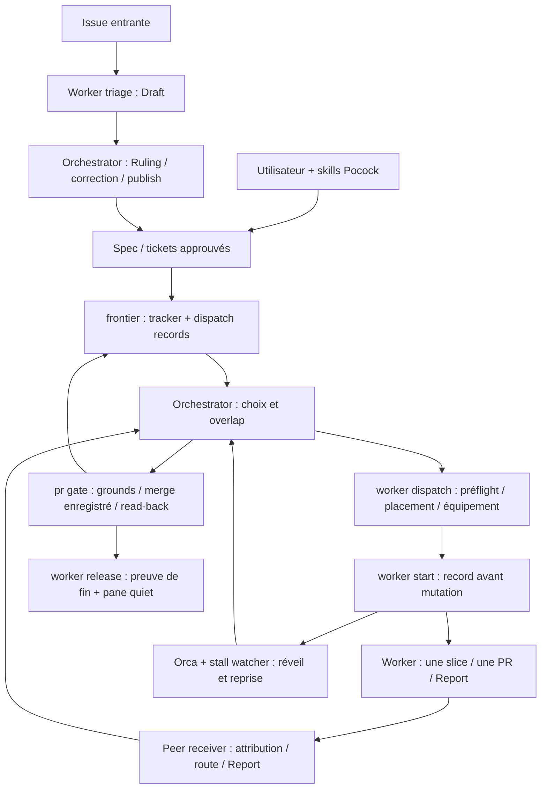

# AX : renforcer les preuves d’orchestration, pas remplacer la méthode

**AX doit rester la couche d’exécution des décisions produites avec les skills de Matt Pocock.**
Son avantage n’est ni le nombre de workers ni un ordonnanceur autonome : c’est de rendre un
travail décidé exécutable, attribuable, récupérable et fusionnable. Les améliorations prioritaires
sont des corrections aux endroits où une observation devient une autorisation — merge, release,
publication — puis une meilleure distinction entre frontier bloquée et travail terminé.

Trois conclusions modifient sensiblement l’[étude du 4 septembre](2026-09-04-orchestration-layer-competitors.md) :

1. **Le transport du Report n’est plus à construire.** Le chemin dérivé, la lecture à réception et
   la liaison aux completions locales sont livrés. La validation sémantique des critères reste une
   décision distincte ; aucune nouvelle vague réelle n’a été mesurée ici.
2. **Les concurrents sont moins simplistes que le premier tableau.** Gas City a des chemins de
   fusion exécutables dans ses packs. Issue-orchestrator peut placer une PR dans la merge queue
   GitHub. Son « marker assumed present » est un garde anti-doublon correct, pas un merge fail-open.
3. **« Absence is not zero » et « chaque ground sur le même SHA » ne sont pas des propriétés
   uniformes d’AX.** Des contre-exemples ont été exécutés hors ligne sur le gate et sur la preuve
   de release. Les tests existants passent : leurs coutures ne couvrent pas ces cas.

## 1. Périmètre, versions et niveau de preuve

Lecture des implementations et tests, avec les en-têtes des modules comme explication de leurs
invariants. Les README ne servent pas de preuve d’exécution. Les commandes de vérification n’ont
ni dispatché de vrai worker, ni publié sur GitHub, ni fusionné de PR, ni fermé de pane. Aucun code
produit n’a été modifié. Les fixtures temporaires des expériences ont été supprimées.

| Corpus | Révision locale examinée | Version déclarée |
|---|---|---|
| AX | `9ade53cdf1340cbecc25f1bc115b59467cfd64ec` | `0.23.0` |
| Curia | `5e6845c011eb88f411271faeceb5907c013e8f56` | `0.11.0` |
| Gas City | `6e4270047115405c6c3a85b1302b88352c83a68e` | source Go, `go.mod` demande Go `1.26.6` |
| issue-orchestrator | `26564aac4a02afc0989966ec2cd3e190884ba177` | `0.10.0` |
| mattpocock/skills | `6654f6b60cd9d5be8b54c6fafe44346dabeb3b76` | `1.2.3` |
| pocock-agents | `ca3c012e9d325025d586aa98f5e52aae06bedabd` | deux prompts, pas de moteur |
| Fork Orca, lecture complémentaire | `ee0cf466edd1496ff2126799a94d9100f94a0655` | source locale, pas un test du binaire |

Les concurrents sont ceux présents sous `/Users/flo/Code/research/ax-competitors`. Aucun
`fetch`, `pull` ou reset n’a changé ces snapshots. Leurs derniers commits précèdent la première
étude : **les corrections ci-dessous ne signifient donc pas qu’ils ont changé depuis hier**.
L’étude précédente ne consignait pas leurs SHA ; une identité stricte de snapshots historiques
n’est pas démontrable à partir de ce document seul. AX, lui, a évolué substantiellement.

La page officielle [aihero.dev/skills.md](https://www.aihero.dev/skills.md) a été lue. Elle renvoie
au dépôt Matt Pocock et à la chaîne de skills, mais conserve des liens `to-prd`/`to-issues` alors
que les fichiers locaux sont `to-spec`/`to-tickets`. Ses liens `the-main-flow-jnjkc.md` et
`the-main-flow-jnjkc` répondaient tous deux HTTP 404. Pour les procédures détaillées, les
`skills/engineering/**/SKILL.md` et `docs/engineering/*.md` locaux ont donc été utilisés séparément.

**Vocabulaire de preuve dans ce document :**

- **Exécuté** : fonction de production appelée, test lancé ou commande réellement observée ; la
  frontière simulée est précisée.
- **Code + tests lus** : mécanisme suivi et scénarios présents, sans prétendre avoir exécuté le
  runtime du concurrent.
- **Instruction** : rôle, skill ou playbook que le modèle doit suivre ; pas une interdiction
  technique.
- **Risque / hypothèse** : conséquence plausible, non mesurée en production.
- **Historique non remesuré** : incident rapporté dans l’étude initiale ou la documentation.

Les nombres de lignes du premier tableau ne mesuraient pas des périmètres comparables. Sur les
fichiers suivis par Git, lignes non vides **commentaires et tests compris**, la mesure actuelle donne :

| Périmètre mesuré | Lignes |
|---|---:|
| AX `.mjs` + `.ts`, tous répertoires | 65 430 |
| dont `src/` | 24 913 |
| dont `tests/` | 26 800 |
| dont `omp/`, implementation et tests ensemble | 13 327 |
| Curia `.js` + `.mjs` + `.cjs` | 132 315 |
| Gas City `.go` | 1 521 264 |
| issue-orchestrator `.py` | 484 886 |

`curia/daemon/src/dispatch.mjs` a bien 8 570 lignes physiques. `implement-spec/SKILL.md` en a
**35, dont 20 non vides**, et non 43. Ces tailles renseignent le coût de maintenance, pas la
qualité ni la fiabilité.

## 2. Ce que le socle Pocock décide — et ce qu’il ne fournit pas

### La méthode stable n’est pas `implement-spec`

| Skill | Décision ou artefact qu’il possède | Ce qu’AX doit préserver |
|---|---|---|
| `grill-with-docs`, `domain-modeling` | Clarifications, langage métier, décisions | Ne pas inventer une décision produit dans un worker |
| `to-spec` | Spec et seams de vérification discutées avec l’utilisateur | Une assignment décidée avant exécution |
| `to-tickets` | Découpage approuvé, critères, dépendances natives, `ready-for-agent` | Slices vérifiables ; frontier dérivée du tracker |
| `implement` | Implémenter le travail décidé, TDD aux seams, review, commit | Ne pas rouvrir le plan ; preuve du comportement |
| `code-review` | Deux axes : standards du dépôt et conformité à la spec | Une CI verte ne prouve pas que tous les critères sont satisfaits |
| `triage` | Vérifier une demande entrante et la rendre traitable | Une voie d’entrée, pas une réévaluation des tickets issus d’une spec |
| `wayfinder` | Explorer les décisions encore ouvertes via une map | Ne pas confondre une décision à prendre avec une slice à construire |
| `ask-matt` et `PHASE-BOUNDARIES.md` | Choisir la suite et la continuité du contexte | Garder le jugement de changement de phase hors d’un scheduler mécanique |

Sources : `skills/skills/engineering/{to-spec,to-tickets,implement,code-review,triage,wayfinder}/SKILL.md`,
`ask-matt/PHASE-BOUNDARIES.md` ; contrelecture dans `skills/docs/engineering/{implement,to-tickets,triage,wayfinder}.md`.
Les skills de diagnostic, recherche, prototype et wizard complètent cette chaîne ; ils ne
constituent pas un moteur durable de workers. `wizard`, par exemple, génère une procédure humaine
ponctuelle, pas une boucle d’orchestration d’agents.

Le `implement` stable tient en 15 lignes physiques. Il ne crée ni worktree, ni PR, ni record de
dispatch. Il se termine par un commit sur la branche courante. Sa documentation locale expose
explicitement l’absence de completion et d’auto-dispatch (`docs/engineering/implement.md:49–75`,
`to-tickets.md:79–80`). Elle signale aussi que la review avant le commit peut examiner un diff
vide : c’est une limite documentée de cette composition, pas un comportement démontré de tous les
modèles. Le skill lui-même est une instruction, pas un programme qui garantit son respect.

**AX remplit donc un espace laissé ouvert par la méthode ; il n’a pas à devenir une copie des
skills.** Les rôles AX chargent leurs playbooks internes `implementation` et `triage`, par le
bundle versionné. L’entry point d’un consommateur reste déclaré dans `dispatch.entry`, avec le
contrat optionnel du dépôt. Ce n’est pas une invocation automatique de la chaîne Pocock.
Sources AX : [chargement des rôles](../../omp/model/roles.ts), [activation réelle du bundle](../../omp/index.test.ts),
[playbook implementation](../../omp/playbooks/implementation.md), [schéma](../../ax.schema.json).

### Deux exceptions à traiter honnêtement

**Expand–contract est compatible avec AX si chaque ticket peut atterrir vert.**
`to-tickets/SKILL.md:40` autorise explicitement expand → migrations par lots → contract pour les
refactors larges. L’instruction AX « migrate every caller in the same change » ne doit pas faire
supprimer l’ancienne forme dans un ticket dont le livrable approuvé est précisément l’expansion.
La suppression propre s’applique au ticket contract et au périmètre décidé, pas arbitrairement à
tout le graphe. Une clarification de doctrine vaut mieux qu’un moteur de migration supplémentaire.

**La branche d’intégration exceptionnelle n’est pas le chemin ordinaire d’AX.** Le même skill
permet, si aucun lot ne reste vert seul, une branche commune et un dernier ticket
integrate-and-verify. AX privilégie une PR par ticket vers la branche par défaut ; le keyword ground
refuse une base où les mots de fermeture sont inertes. Dire que toutes les variantes Pocock sont
supportées serait faux. Pour cette exception : redécouper lorsque possible, sinon décision explicite
sur un mode d’intégration distinct. Ne pas assouplir silencieusement `pr gate` pour la faire passer.

### Pourquoi ne pas absorber `implement-spec`

Le fichier expérimental `skills/in-progress/implement-spec/SKILL.md` dit : une draft PR pour toute
la spec, une branche/worktree par implementer, un merger subagent, lancement de nouveaux
implementers quand la frontier avance, puis review globale. Il demande une communication sparse
par context pointers et une concurrence maximale sans plafond explicite ni passe d’overlap.

Cela est une **boucle dans une invocation**, pas un dispatch unique sans retour. En revanche,
aucun protocole durable de reprise, de réception ou de merge attesté n’y est défini. Les notes
externes prévues par l’étape 2 ne suffisent pas à reconstituer un état transactionnel. Les deux
commits du fichier, `84b5ee5` puis `5b15a47`, sont bien du 21 août.

La PR unique tient les fermetures natives de tickets en attente jusqu’au merge final : le modèle
doit donc distinguer progression interne et état du tracker. C’est transposable comme **usage
exceptionnel discuté**, pas comme remplacement du modèle AX. Les incidents cités auparavant
(`#936`, `#942`, `#988`, `#991`, `#1010`, etc.) n’ont pas été rejoués ici.

`pocock-agents` reste pertinent comme contraste historique : deux prompts, isolation par shell,
anciens noms de skills, worker invité à « Ask nothing ». Il ne prouve ni reprise durable ni
livraison. AX a raison de conserver une voie de question attribuée plutôt que cette interdiction.

## 3. Architecture réelle d’AX : qui décide, qui prouve, qui réveille



### Dispatch et création : une bonne base de récupération

`worker dispatch` résout le ticket et refuse notamment un ticket fermé, une instruction absente,
un override injustifié de l’assignment, un plafond atteint ou une adresse parent introuvable.
Il choisit ou réutilise le worktree, attend sa visibilité dans Orca, équipe l’enfant, compose le
texte de travail et passe par `worker start`. Le statut `DISPATCHED` inclut les preuves du rôle,
du modèle et de la réception attendue ; la présence d’un process seul ne suffit pas.

`record.mjs` écrit l’intention avant l’appel : request, identité, argv, phase et attempts. Le save
passe par fichier temporaire, fsync et rename atomique. `start` reprend le record avec le binaire
et l’argv enregistrés. Un résultat partiellement connu est `STRANDED`, pas une permission de
créer un autre enfant. `dispatch` peut reprendre ce même request avant de vérifier l’enfant.

La protection est **l’identité enregistrée**, pas une promesse universelle de traitement exactly-once
par tous les systèmes externes. Les identités de retry du runtime et la lecture des reçus font
partie du contrat. Sources : [record](../../src/worker/record.mjs), [start](../../src/worker/start.mjs),
[dispatch](../../src/worker/dispatch.mjs), [verify](../../src/worker/verify.mjs),
[tests start](../../tests/worker-start.test.mjs), [tests dispatch](../../tests/worker-dispatch.test.mjs).

**Limite importante : `frontier` est une lecture, pas une capability transmise à dispatch.**
La règle « dispatch seulement depuis `takeable` » est dans le rôle. `readyAssignmentRefusal` protège
le remplacement d’une assignment déjà labellisée ; ce n’est pas une validation des bloqueurs ou
du labeler. Un dispatch direct reste possible hors de cette lecture, notamment pour les modes
explicitement non GitHub. Il existe donc une fenêtre entre lecture et action, et une part de
respect du graphe reste confiée à l’orchestrator. Ce n’est pas une raison pour dupliquer tout le
classificateur dans chaque runner : un éventuel durcissement doit réutiliser la même décision.

### Frontier : classement robuste, diagnostic de blocage incomplet

`frontier` combine candidats GitHub, blockers, provenance, auteur du label, date d’édition et
records locaux. Les trois listes sont explicites : `takeable`, `excluded`, `cannot establish`.
Les blockers tronqués ou la pagination mal formée n’autorisent pas un ticket. Le cap de 200
candidats rempli refuse de prétendre avoir lu le tout. Un record settled sur un ticket encore
ouvert reste visible comme `attempt-ended-unmerged`.

Mais les cycles ne sont pas classés. Et `return 0` signifie « reçu produit », y compris avec une
liste `cannot establish` non vide — pas « tout est autorisé ». Un consommateur doit lire le reçu,
pas son exit code seulement. Le backend de ce verbe est actuellement GitHub ; la capacité de
`worker dispatch` à accepter Linear ne constitue pas une frontier Linear.
Sources : [frontier](../../src/frontier.mjs), [tests frontier](../../tests/frontier.test.mjs).

### Panes, capacité, reprise : un même fait, plusieurs dispositions

`paneVerdict` sépare `VIVANT`, `MORT`, `INCONNU`, avec preuve de couverture de l’hôte. Les plafonds
comptent les panes enregistrés plutôt que des dispatch rows : `dispatch.cap` par dépôt et
`dispatch.machineCap` optionnel. Un pane issu d’un dispatch échoué reste une consommation réelle.
Les derniers changements corrigent précisément ces joints.

La reprise est déjà plus guidée que dans l’étude : `continuationFor` lit la PR de la branche du
record. PR ouverte → proposer `--replace` ; merged → `release` ; aucune ou fermée sans merge →
`settle` ; ambiguïté → pas de continuation inventée. `--replace` hérite du placement enregistré
ou refuse. Pour un worktree distant, le module n’interroge pas un homonyme local.
Sources : [pane](../../src/worker/pane.mjs), [slots](../../src/worker/slots.mjs),
[capacity](../../src/worker/capacity.mjs), [continuation](../../src/worker/continuation.mjs),
[settle](../../src/worker/settle.mjs), [tests ls](../../tests/worker-ls.test.mjs),
[tests tail](../../tests/worker-tail.test.mjs).

La différence gate/settle est réelle et volontaire dans les branches du code : `gate` peut afficher
un hôte omis et rendre 0, là où `settle` refuse d’écrire une mort inconnue. **Volontaire ne signifie
pas que le conseil est sûr pour tout appelant.** `gate.mjs:25–30` annonce fail-closed, mais
`:218–246` classe aussi INCONNU comme down et imprime « Safe to re-dispatch ». La procédure
Get bearings lui attribue une preuve plus forte. Corriger ce contrat d’usage est pertinent ;
unifier tous les exit codes ou toutes les dispositions ne l’est pas.

### Communication et Report : transport, identité et vérité sont distincts

- L’extension possède la boucle de consommation ; l’orchestrator n’en lance pas une seconde.
- Les messages deviennent `role: custom`, non `user`. Une origine attribuée ne suffit pas à
  rendre une réponse possible : il faut une route prouvée.
- Les relais entre frères passent par le parent ; une origine non prouvée ne devient pas un pair
  fiable, et `forwardTo` est retiré au relais.
- Les ids injectés et l’ack du delivery permettent replay/déduplication. L’ack n’est émis qu’après
  la réussite du traitement prévu ; un échec d’injection ou d’ack entraîne backoff.
- La numérotation détecte des trous pour les envois qui portent cette séquence. Elle ne couvre pas
  tous les `orca orchestration send` ordinaires du préambule. Le diagnostic de canal existe, mais
  il n’est pas un ledger complet de non-livraison.

Sources : [receive](../../omp/peer/receive.ts), [send](../../omp/peer/send.ts),
[route](../../omp/peer/route.ts), [tests de séquence](../../omp/peer/sequence.test.ts), [health](../../omp/peer/health.ts),
[tests receive](../../omp/peer/receive.test.ts).

Le Report est dérivé en `<worktree>/.scratch/report/<request>.md`, pas lu depuis un chemin libre
fourni par le worker. À réception d’un `worker_done`, AX prouve le record et le pane lorsqu’il
s’agit de la forme locale witnessed, distingue la forme fédérée `dispatch:…`, puis contrôle le
realpath et injecte le Report après la Summary. Un fichier manquant, contradictoire ou distant
produit un finding. Une completion distante **n’apporte pas le fichier distant**.

Deux limites persistent :

1. Le cap de 16 KiB borne **l’injection**, pas l’entrée fichier : `readFileSync` lit tout avant
   redaction et découpage (`completion.ts:393–407`). La protection mémoire proposée par
   issue-orchestrator n’est donc pas déjà couverte par ce cap.
2. La conformité des critères reste une lecture du modèle. Un Report petit mais mal formé n’est
   pas transformé en refus mécanique de merge. L’[ADR 0002](../adr/0002-the-report-is-derived-by-ax-and-the-preamble-is-not-patched.md)
   diffère expressément ce contrôle jusqu’à une mesure de Reports mal formés. Respecter cette
   décision n’empêche pas de borner les octets avant lecture.

Sources : [Report côté CLI](../../src/worker/report.mjs), [receiver Report](../../omp/peer/completion.ts),
[tests de parité et containment](../../omp/peer/completion.test.ts), [Brief](../../src/worker/brief.mjs).

### Triage : un sous-système fort, absent de l’essentiel du premier comparatif

La séparation Draft → Ruling → publication est une application directe de la méthode : le worker
analyse, l’orchestrator décide et publie. Les questions sont liées au request et au hash du Draft ;
`answer` vérifie le message et l’appariement des Q-lines avant envoi. `askBegin`/`replyBegin`
enregistrent aussi les mutations de messagerie. Une réponse arrivée comme simple message n’est
pas présumée avoir débloqué la question.

`publish` valide les directives, lit l’état du tracker et refuse les doublons plutôt que composer
un autre résultat. L’ordre de publication dépend de l’effet : quand `ready-for-agent` est posé,
le commentaire doit arriver avant le label. Il ne ferme pas automatiquement une issue sur une
recommandation `Close: yes`. C’est une adaptation plus prudente que le skill de triage autonome.

Les failles restantes se situent aux joints entre ces règles, notamment publication ↔ provenance
et job/pass ↔ preuve de release (§5), pas dans un manque de rôles spécialisés.
Sources : [dispatch triage](../../src/triage/dispatch.mjs), [ask](../../src/triage/ask.mjs),
[answer](../../src/triage/answer.mjs), [rulings](../../src/triage/rulings.mjs),
[publish](../../src/triage/publish.mjs), [release triage](../../src/triage/release.mjs).

### Merge : une autorisation mécanique utile, pas une preuve totale du travail

Le gate lit les checks déclarés, les threads non résolus, la staleness par ancestry, les findings
résiduels, l’évolution des commits/descriptions, les canaux de fermeture et le ticket lié. Les
grounds contribuent au même verdict ; les préconditions peuvent arrêter avant eux et le ground
threads diffère sa lecture tant que la CI est indécise. « Tout s’exécute » ne signifie donc pas
« chaque API est appelée quel que soit son prérequis ».

Sur `--merge`, AX vérifie la déclaration committée, enregistre l’appel, sérialise le geste et passe
`--match-head-commit`. Il distingue un merge réellement observé d’un simple exit 0 de `gh`, puis
vérifie la fermeture du ticket lié. La réparation de staleness est bornée à un tour et attend un
SHA différent avant de réévaluer. Ce sont des capacités substantielles, absentes du skill stable.

Mais le SHA de CI, les refs utilisées par les grounds Git et les métadonnées mutables ne forment
pas une transaction atomique unique. Les contre-exemples suivants bornent la garantie. La
[documentation de `gh pr merge`](https://cli.github.com/manual/gh_pr_merge) confirme que
`--match-head-commit` protège le head, pas l’immutabilité simultanée de la base, du body et des
reviews. Une fermeture indue constatée après merge reste une détection, pas une prévention.
Sources : [gate](../../src/pr-gate.mjs), [grounds](../../src/pr-grounds.mjs),
[tests gate](../../tests/pr-gate.test.mjs), [tests grounds](../../tests/pr-grounds.test.mjs).

## 4. Comparaison des mécanismes, pas des promesses des README

### Curia : apprendre de la fin structurée, pas reprendre le control plane

**Confirmé par code et tests :** `ENDING` est une structure rendue à la fois dans le prompt et
le checklist du Stop hook (`daemon/src/lifecycle.mjs:9–23,61–107`). C’est une bonne prévention de
la dérive entre deux descriptions d’une même fin. Certaines étapes restent explicitement prose-only.
Les 17 tests du fichier lifecycle passent avec les 33 tests de frontier.

**À ne pas copier :** `filterTakeable` traite `issue_dependencies_summary` absent comme zéro
blocker (`github.mjs:279–284`), comportement que son test exige et que l’exécution confirme. La
fusion est demandée au worker par `gh pr merge --squash --delete-branch` après approbation, sans
`--match-head-commit` dans cette instruction. Le Stop hook exige l’état attendu ; il ne rend pas
cette commande SHA-bound.

**Plus nuancé que l’étude :** l’overseer possède onze verbes déclarés, sans verbe adressant
arbitrairement un worker ; le produit possède néanmoins `noteAgent`, queue par défaut et interrupt
explicite. Un interrupt refusé garde la note en queue (`index.mjs:1236–1264`). Ce n’est ni « aucune
communication », ni l’équivalent exact d’un `deliverAs` OMP. Curia a aussi un overseer LLM : ses
containers et son interface Discord ne s’expliquent pas par une absence d’orchestrator.

Le journal courant est `events.db` via SQLite, pas simplement un historique JSONL. La liveness
sweep continue avant le retour `auto_dispatch=false`. Le cross-check typé et ses réparations de
restart sont intéressants, mais n’équivalent pas à un ground de merge attesté ; l’historique
#223/#258/#421 explique précisément le risque d’un verdict arrivant après une autorisation.

Sources : `C/daemon/src/{lifecycle,github,journal,index,dispatch,overseerverbs,routing}.mjs` ;
`C/daemon/test/{frontier,lifecycle,crosscheck,overseerverbs,routing}.test.mjs` ;
`C/docs/adr/0010-the-cross-check.md`. C désigne le snapshot Curia de §1.

### Gas City : primitives utiles, plateforme et packs à ne pas importer

- **Cycles** : `internal/sling/cycle.go` fait réellement un DFS tricolore et restitue un chemin.
  Les dépendances purement informatives sont ignorées. Le contrôle n’est pas universel :
  `shouldCheckDepCycle` exclut notamment certaines formes et `--force`.
- **Observations partielles** : `MergeBackendListResults` distingue succès partiel et erreur
  totale ; les tests gardent les noms connus avec une `PartialListError`. C’est une information
  typée utile, pas une garantie que tous les appelants refusent les mutations.
- **Courrier** : le store de nudge expose pending/in-flight/dead et des compteurs persistants par
  motif de skip, lisibles depuis un autre process. C’est la transposition la plus nette vers un
  diagnostic AX, sans importer la queue entière.
- **Équipement** : les fingerprints `v5:` distinguent changement d’algorithme et dérive réelle.
  La rebaseline silencieuse évite de drainer une flotte lors d’un changement de hash. AX n’a pas
  aujourd’hui besoin de ce mécanisme de drain ; ne pas créer ce problème pour importer sa solution.
- **Merge** : le core `githubmonitor` classe ; les packs fournis peuvent fusionner. Le scénario
  lifecycle exécute `git merge`, `git push origin HEAD:main`, puis ferme le bead. Il sait aussi
  reconnaître certains replays par `branch_head` déjà ancêtre. Cela ne constitue pas le gate AX.
- **Nudge** : le carrier tmux transforme le contenu en touches. L’enveloppe peut porter une source
  dans la queue, mais la livraison clavier ne conserve pas une séparation `role: custom`.

`30s` est le défaut du patrol, pas l’unique source de réveil : un socket réveille aussi le nudge.
« Tous pollent parce que rien ne les réveille » est donc trop général. `evaluatePool` retourne
le minimum configuré **avec une erreur**, tandis que `evaluatePoolNewDemand` retourne zéro avec
l’erreur. Ne pas décrire les deux comme un unique fail-open caché. `githubmonitor` utilise bien
`mergeStateStatus=BEHIND` pour son classement ; ce n’est pas un contrôle d’ancestry.

Le quorum de review est plus solide que son absence du premier comparatif le suggère : `Finalize`
distingue attente, échec de contrat, mutation interdite, failure transitoire et findings. À reprendre
éventuellement comme forme de résultat d’une review opt-in, pas comme flotte de reviewers imposée.

Sources : `G/internal/{sling/cycle.go,runtime/provider_core.go,runtime/fingerprint.go,runtime/carrier.go,
nudgequeue/state.go,githubmonitor/monitor.go,reviewquorum/finalize.go}` ; `G/cmd/gc/{pool.go,nudge_dispatcher.go,cmd_nudge.go}` ;
`G/examples/lifecycle/packs/lifecycle/assets/scripts/lifecycle-refinery-merge.yaml`.
Tests lus : `cycle_test.go`, `provider_core_test.go`, `fingerprint_test.go`, `fingerprint_golden_test.go`,
`cmd_nudge_test.go:TestCmdNudgeStatusSurfacesDispatchSkips`, `pool_test.go`, `finalize_test.go`.
G désigne le snapshot Gas City de §1 ; aucun test Go n’a été exécuté, Go n’étant pas installé.

### Issue-orchestrator : bonne sémantique d’absence, pas « humain seul partout »

Le cycle Observe → Plan → Apply sépare observation et décision, puis application. La découverte
merge-queue produit des faits ; le client GitHub possède néanmoins `enqueue_pull_request`, qui
émet `enqueuePullRequest(input:{pullRequestId})` sans `expectedHeadOid` dans ce chemin. Le contrôle
GitHub reste l’autorité de merge. La distinction correcte est **pas de `gh pr merge` libre dans
le worker**, pas « le système ne peut jamais déclencher une fusion différée ».

La correction la plus importante du comparatif concerne `_comment_marker_present` : lorsque la
lecture échoue, répondre « présent » **supprime une écriture potentiellement en double**. Les tests
`test_a_failed_marker_read_suppresses_the_comment` et
`test_planning_emits_no_comment_action_when_the_marker_read_fails` documentent exactement cette
asymétrie. Le second teste la règle de consommation avec des doubles ; son nom ne suffit pas à
prétendre à une intégration complète. Rien dans ce booléen n’autorise une fusion.

`detect_cycles` classe les membres d’un cycle, pas tous les tickets qui y conduisent. Son identité
`DependencyTarget(issue_number, repository)` évite de confondre deux `#1` de dépôts différents.
Le module de production a été exécuté sans dépendance tierce : cycle mutuel, self-loop et absence
de faux cycle cross-repo vérifiés. Le calcul fait une recherche de retour à soi par nœud : reprendre
le contrat, pas nécessairement cet algorithme plutôt qu’un DFS/SCC linéaire.

`load_completion_record_result` borne le fichier à 2 MiB **avant** `json.load`. Cette protection
d’entrée est transposable au Report d’AX indépendamment de toute validation de critères.

L’isolation supprime des variables interdites et vérifie des capacités ; la source reconnaît la
limite du même uid pouvant lire des fichiers du process parent. « Aucun credential accessible aux
agents » serait plus fort que ce que ce mode garantit. L’absence de `session.send` dans le MCP est
réelle, mais ne prouve pas l’absence de toute communication interne.

Le préflight host actuel repose sur `top -l 1` CPU-idle et `ps`, pas `memory_pressure -Q` /
`sysctl vm.swapusage` dans ces deux modules. Son contrat est diagnostic, sans enforcement. Les
parseurs refusent un signal mal formé. C’est une meilleure séparation que « exit 0 = machine OK ».

Sources, sous `I/src/issue_orchestrator/` : `control/{orchestrator_support,merge_queue_coordinator,
stuck_sweep,completion_record_validation}.py`, `domain/{dependency_gates,dependencies}.py`,
`ports/repository_host.py`, `adapters/github/http_client.py:1751–1765`, `entrypoints/mcp_server.py`,
`entrypoints/cli_tools/host_load_preflight.py`, `execution/{host_load_probe,agent_runner_env,sandbox_verify}.py`.
Tests lus : `I/tests/unit/{test_merge_queue_coordinator,test_dependency_gates,test_host_load_preflight,
test_completion_record_result_support,test_mcp_server}.py`. I désigne le snapshot de §1.

## 5. Lacunes restantes, avec contre-exemples vérifiés

### P1 — Rendre la preuve du gate cohérente jusqu’à l’autorisation

**Lectures incomplètes acceptées.** `threadsGround` exige le conteneur `reviewThreads`, puis utilise
`Array.isArray(threads.nodes) ? threads.nodes : []` et `threads.pageInfo ?? {}`. L’absence de
`hasNextPage:true` termine la pagination (`pr-grounds.mjs:372–385`).

Expérience : un vrai dépôt Git temporaire, toutes les réponses `gh` injectées, appel à `gate()`
sans `--merge`. Les trois formes ci-dessous rendent **0 / PASS**, comme une page complète vide :

```text
reviewThreads = {pageInfo:{hasNextPage:false}}      → PASS
reviewThreads = {nodes:null,pageInfo:{hasNextPage:false}} → PASS
reviewThreads = {nodes:[]}                        → PASS
threads: page 1 — 0 thread(s), 0 unresolved
```

Portée : preuve de la réaction à ces formes d’entrée, **pas preuve que GitHub les a renvoyées en
production**. Un `gh` non-zéro est déjà refusé par `payload()`. Il ne faut donc pas prétendre que
toute erreur GraphQL partielle traverse automatiquement ce chemin. L’invariant documenté d’AX
reste violé par une forme non établie acceptée comme liste vide.

**Checks incomplets.** `ciGround` demande `per_page=100` une fois, sans prouver que tous les runs
pertinents ont été lus. Avec `total_count:101` et 100 rows dont le check déclaré vert, le gate rend
0 après une seule requête. La [documentation officielle](https://docs.github.com/en/rest/checks/runs#list-check-runs-for-a-git-reference)
confirme la pagination. Ce test prouve une lecture incomplète acceptée, pas qu’un 101e run précis
était rouge sur un vrai dépôt. Un check attendu hors page produit à l’inverse un faux refus.

**Ground Git non lié au SHA annoncé.** `gitGrounds` reçoit les noms de branches, pas `sha`
(`pr-gate.mjs:867–880`, `pr-grounds.mjs:418–503`). Contre-exemple exécuté sur le chemin local-only,
sans origin : le SHA annoncé par la PR est ancien ; la base a avancé ; la branche locale feature
a intégré cette base mais ce commit n’est pas le SHA annoncé. Le gate déclare pourtant :

```text
base_is_ancestor_of_validated_sha = false
staleness: feature carries main — the branch is current
PASS — research/fixture#7 is mergeable at <ancien SHA>.
```

Ce n’est pas un contournement de `--match-head-commit` : ce flag pourrait justement fusionner
l’ancien SHA validé à tort. Le scénario ordinaire où les refs distantes sont cohérentes n’a pas
été démontré vulnérable par cette expérience ; une course de refs plus générale reste un risque.

**Transposition recommandée :** mêmes obligations de complétude que frontier pour les données
requises ; fetch puis résolution d’une base observée et utilisation explicite du head SHA validé
pour les grounds Git. Ne pas promettre de snapshot atomique des métadonnées GitHub. Pas de
nouvelle review LLM nécessaire pour corriger ces décisions déterministes.

### P1 — Faire porter la release de triage sur le bon artefact

`triage/release` accepte plusieurs jobs et passes, puis délègue au worker release. Mais
`worker/release.mjs:623–629` reconnaît seulement `triage-`/`brief-` et prend le dernier segment
séparé par `-` comme numéro d’issue.

Expérience via **le vrai `release()`**, sans `--close`, runner Orca et commandes externes injectés :

| Request | Résultat affiché | Ce qui a été demandé au tracker |
|---|---|---|
| `triage-research-fixture-7` | `CLOSE · comment on #7 after dispatch` | une lecture des commentaires |
| `triage-research-fixture-7-p2` | `KEEP · the request names no issue` | aucune lecture des commentaires |
| `custom-research-fixture-7` | `CLOSE · PR #123 merged` | PR de la branche du checkout parent simulée |

Les passes ≥2 écrites par `requestFor` ne sont donc pas comprises par ce lecteur. `custom`
tombe sur la preuve implementation alors qu’il travaille dans le checkout courant et ne produit
pas de PR propre. Le `CLOSE` observé est une **décision dry-run**, aucune pane n’a été fermée.

Autre limite, confirmée par le même contrôle positif : `proveIssue` accepte seulement un
`createdAt` de commentaire postérieur, sans marqueur de publication, auteur ou correspondance au
Draft (`release.mjs:466–498`). Cela prouve une activité ultérieure sur l’issue, pas la publication
de ce pass. La règle est intentionnellement ainsi écrite ; elle est néanmoins plus faible que la
« preuve de l’artefact gouvernant » annoncée au niveau de la wave.

**Transposition recommandée :** interpréter le request avec la grammaire propriétaire et définir
la preuve par job/pass. `custom` doit avoir un ending explicite, ou refuser la preuve automatique,
pas hériter d’une PR voisine. Relier triage/brief à leur publication attestée plutôt qu’à n’importe
quel commentaire. Préserver la voie de dérogation humaine explicite, jamais la proposer comme
réparation systématique d’un parseur incomplet.

Les tests existants `triage-release.test.mjs` stubent `releaseFn` : ils vérifient le routage vers
le bon dispatch mais ne traversent pas ce joint. Les tests worker release n’ont pas ce request
suffixé. C’est un cas où un test d’intégration à cette seam vaut mieux que davantage de fixtures
sur les deux côtés isolés.

### P1 — Aligner les trois lecteurs de provenance

Le schéma, `triage dispatch` et `frontier` connaissent `spec`, `inbound`, `findings`.
`triage publish` ne compose que `spec` et `inbound` dans `declared` (`publish.mjs:196–197`).

Expérience : config déclarant `findings:['source:agent-found']`, issue portant ce label, Draft
ajoutant `source:report` déclaré inbound. **Le vrai `publish()` rend 0** et émet vers l’adapter
simulé `gh issue edit … --add-label source:report`, puis le commentaire. Le tracker simulé avait
conservé son label de naissance. Cette publication peut donc fabriquer la contradiction que
frontier refuse ensuite.

Portée : le dispatch triage normal refuse déjà un finding quand cette classe est déclarée. Le
chemin problématique est une publication de Draft déjà présent, une reclassification/configuration
changée, ou une invocation directe ; ce n’est pas la preuve qu’un nouveau finding traverserait
aujourd’hui tous les préflights normaux. Aucun label réel n’a été modifié.

**Correction pertinente :** compléter le lecteur existant et son test à la seam publication. Pas
un quatrième type de provenance, pas un nouveau workflow de triage.

### P2 — Distinguer frontier cyclique, attente externe et fin prouvée

Contre-exemple exécuté via `frontier()` : deux tickets ready, labels attribués et pages complètes,
chacun bloqué par l’autre, aucun record :

```text
takeable — 0
excluded — 2
  #10 Ticket 10 — blocked-by:#11
  #11 Ticket 11 — blocked-by:#10
cannot establish — 0
```

La classification est correcte comme refus, insuffisante comme diagnostic de progression. Le
commentaire de terminaison `frontier.mjs:22–26` peut alors se lire « terminé ». **Aucun
orchestrator AFK n’a été lancé pour observer cette interprétation** : elle reste un risque du
contrat de reprise. Le problème dépasse les cycles : une dépendance externe ouverte ou un ticket
ayant perdu son label ne doit pas faire disparaître la preuve de fin de la spec.

**Transposition recommandée :** détecter les cycles établis dans le sous-graphe effectivement lu,
les nommer dans `excluded`, et dériver la fin depuis les membres de la wave et leurs artefacts.
Un nœud hors corpus reste hors corpus ; une page tronquée reste inconnue. Ne pas conclure
« graphe global acyclique » depuis le seul sous-graphe des candidats. Pas de correction automatique
des arêtes ; cela réécrirait les décisions de `to-tickets`.

### P2 — Réduire le travail cognitif de reprise sans créer un second scheduler

Le besoin de bearings reste réel, mais la solution à six listes de l’étude n’est plus à appliquer
verbatim : `ls` et `continuationFor` ont absorbé une partie du travail. La première amélioration
est la cohérence du conseil de re-dispatch sur INCONNU et une lecture dérivée qui garde distincts :

- mort prouvée ; hôte non interrogé ; mutation dont l’issue reste inconnue ;
- PR ouverte à reprendre ; PR merged à libérer ; absence de PR à régler ;
- ticket exclu mais travail de wave toujours non terminé.

Un éventuel `bearings` est justifié s’il retire effectivement ces jointures au modèle, non s’il
réimprime quatre commandes. Il ne doit ni choisir un ticket, ni créer une identité, ni posséder un
second parseur de records. La probe C de reprise en session fraîche reste à faire avant de choisir
entre enrichir les lecteurs actuels et ajouter ce verbe.

### P2 — Fermer la frontière des Reports distants et de la lecture fichier

`--on` existe, le Report distant n’est pas lisible depuis le parent. C’est un trou nommé,
fail-closed, pas un succès partiel silencieux. Si le multi-host sert effectivement à produire des
PR, la récupération de ce Report a plus de valeur que du routing automatique supplémentaire.
L’hôte, le request et le worktree doivent venir du record, et la preuve realpath doit s’effectuer
**sur l’hôte détenteur** ; aucune tentative sur un homonyme local.

Indépendamment du remote : borner la lecture sur le descripteur ouvert avant décodage/redaction,
puis conserver le cap d’injection et le refus d’une liste de critères coupée. Copier le principe
d’issue-orchestrator, pas sa constante 2 MiB arbitrairement. Cette protection ne nécessite ni
`criteriaGround`, ni `ending.mjs`, ni modification du préambule Orca.

### P3 — Fluidité des messages, journal d’atterrissage, budgets locaux

**Classes de livraison.** Le `triggerTurn:true` uniforme est confirmé dans AX. Mais le watcher
utilise `status` pour `stall-watch:` et `card:` ; le déclasser ferait perdre des réveils indispensables,
cas défendu par `receive.test.ts`. Il faut distinguer faits informatifs et événements exigeant
une action, pas mapper aveuglément type → priorité.

La source OMP disponible est `18.1.8`, le `omp --version` installé répond `18.1.10`.
`referenceProblem()` valide seulement source installée contre son manifeste et répond null ;
ce n’est pas une preuve d’identité avec le binaire. Dans cette **source 18.1.8**, `sendCustomMessage`
utilise steer par défaut en streaming et connaît aussi `aside`. Cela corrige l’ancien inventaire
à trois modes, mais **ne ferme pas la probe B sur le build courant**. Aucun changement de mode
n’est recommandé avant cette mesure et les scénarios watcher/idle/streaming/restart.

**Non-livraison.** Reprendre de Gas City un diagnostic persistant par motif, au point qui connaît
le résultat réel. Distinguer gap de séquence, filtrage volontaire, injection refusée, route absente,
Report illisible et ack en attente. Un compteur seul n’est pas une garantie de livraison ; sans
couverture des sends ordinaires, le présenter comme taux global serait mensonger.

**Landed log et surfaces partagées.** AX possède déjà des wave notes passées par `--notes`, avec
scopes `durable:`, `wave:`, `ticket:` dans les Reports. Automatiser les faits d’atterrissage
(PR/SHA/surfaces changées) serait compatible ; les décisions de noms/interfaces doivent rester
celles de la spec et des rulings. Ne pas transformer les notes en deuxième tracker ni inventer un
système de locks de fichiers universel. Les collisions sémantiques ne se détectent pas seulement
par intersections de chemins.

**Charge locale.** Le pane cap ne mesure pas la RAM. Mais les floors Darwin de l’étude sont une
hypothèse, pas des seuils validés. Commencer par mesurer et utiliser le `machineCap` déjà présent.
Si un dépôt veut une admission locale stricte, la déclarer et injecter les sondes. Le remote actuel
est volontairement fail-open sur sondes illisibles (`hosts.mjs:10–18`) : ne pas annoncer que tous
les contrôles de capacité AX ont déjà la politique stricte proposée pour le local.

## 6. Relecture systématique de l’étude du 4 septembre

Les références détaillées et les preuves sont dans les sections précédentes. Les numéros B/T/P
ci-dessous reprennent respectivement Behind, Take et Probes de l’étude, pas des tickets à créer.

### Tableau initial et « Where ax is ahead »

| Ancien constat | Verdict actuel | Correction / preuve |
|---|---|---|
| AX 0.21.0 ; volumes source | Corrigé | AX 0.23.0 ; périmètres recomptés §1 |
| Curia 0.11, dispatch 8 570 lignes, daemon/containers | Confirmé, motivations nuancées | Code runtime ; un overseer existe aussi |
| Gas City SDK, tick 30s, pas de merge | Partiel | Défaut patrol + wake ; core classe, packs fusionnent |
| IO OPA, control API/MCP, merge humain seulement | Partiel | OPA réel ; enqueue GitHub exécutable ; isolation best-effort |
| implement-spec 43 lignes | Corrigé | 35 physiques / 20 non vides ; toujours expérimental |
| pocock-agents sans moteur | Confirmé | Deux prompts ; utile pour mesurer la dérive des procédures |
| F-028 réinventé ailleurs ; AX seul structurel | Exclusivité retirée | Primitives ailleurs ; dispositions dépendent du consommateur ; gate AX a des contre-exemples |
| IO suppose un marker présent sur scan incomplet | Fait confirmé, jugement inversé | Supprime une écriture incertaine : anti-doublon, pas merge |
| Curia absent blocker summary = unblocked | Confirmé, exécuté | Test frontier défend ce comportement |
| Gate AX : SHA, record, read-back, fermeture, ancestry | Confirmé avec limites | Mécaniques présentes ; mêmes SHA/refs non garantis partout §5 |
| Curia merge sans SHA ; Gas City BEHIND ; IO décide seulement | Partiel | Curia oui ; core Gas City oui ; IO dispose aussi de l’apply enqueue |
| Pair AX custom/relay/route prouvée | Confirmé | Code + tests receive ; ne signifie pas livraison exactly-once universelle |
| Curia overseer sans adresse worker ; IO supprime send ; gascity clavier | Confirmé au périmètre | Distinguer ce sous-système des autres canaux du produit |
| implement-spec one-shot | Reformulé | Une invocation avec boucle de retours, sans reprise durable définie |
| AX write-ahead seul chemin de création | Confirmé pour Task/worker enregistré | Ne pas étendre à toute mutation de provisioning/sonde distante |
| Une PR par ticket fait avancer le tracker | Confirmé comme modèle | Fermeture effectivement observée ; exception intégration Pocock non automatique |

### Les sept lacunes déclarées

| Ancien item | Verdict actuel | Suite pertinente |
|---|---|---|
| B1 Deux contrats et aucun transport CRITERIA | Résolu côté canal | ADR 0002, c1fbafc/087c3be/d5b6c90 puis 57c431d/644f91c ; pas de nouvelle vague mesurée |
| B2 Pas de classe cycle | Confirmé et reproduit | Cycle explicite + fin de wave prouvée, pas seulement quatre listes vides |
| B3 Bearings prose, gate/settle divergent | Partiellement résolu, risque restant | continuationFor nouveau ; corriger le conseil sur INCONNU avant un nouveau verbe |
| B4 Une classe de livraison | Confirmé | Ne pas démoter les alertes watcher ; runtime exact à mesurer |
| B5 Local aveugle aux ressources | Confirmé au-delà des caps | Mesure avant floors ; IO ne mesure pas actuellement les deux sondes mémoire citées |
| B6 Skips loggués, pas de ledger complet | Partiel | Séquences/gaps/dédup/backoff/health existent ; couverture des sends non universelle |
| B7 Base pas prouvée au dispatch AX | Confirmé | Guard Orca uniquement sur le chemin coordinator, pas worker-start ; pas de preuve que le cas est fréquent |

### Les neuf propositions « Take »

| Ancien item | Décision actualisée |
|---|---|
| T1-S Nommer puis lire le Report | Déjà livré ; chemin final `.scratch/report/<request>.md`, pas `.agent/report-…` |
| T1-M `ending.mjs`, `criteriaGround`, `ax worker report` | Toujours conditionnel selon ADR 0002 ; ne pas confondre transport, format et véracité des preuves |
| T2 Injection par type + compteurs | Dissocier les deux ; mesure du mode avant changement, diagnostic persistant plus directement transposable |
| T3 Cycle de dépendances | Retenu ; graphe lu seulement, pas réparation automatique ; completion de wave distincte |
| T4 `worker bearings` six listes | À réévaluer après continuationFor ; réutiliser les lectures, pas une nouvelle vérité |
| T5 `proveLocal` mem/swap | Conditionnel aux mesures et à une déclaration ; aucune valeur par défaut déduite du concurrent |
| T6 Landed log | Compatible comme faits dérivés ; wave notes existent déjà |
| T7 Shared-surface pinning | Compatible dans assignment/rulings ; pas de registre concurrent de décisions |
| T8 Fingerprint versionné | Bon pattern Gas City, pas besoin AX démontré d’un hash/drain d’équipement |
| T9 Cross-provider ground | Opt-in éventuel ; exigences de résultat typé et identité avant choix du nombre de reviewers |

### Les propositions « Leave »

| Ancien rejet | Verdict actualisé |
|---|---|
| Daemon/tick parce que rien ne réveille les concurrents | Rejet d’un daemon AX maintenu ; causalité générale retirée (wake Gas City, overseer Curia) |
| Store propre, car GitHub est le store | Rejeter une deuxième vérité de travail ; AX a légitimement ses records locaux et Orca sa base runtime |
| Docker/Discord/dashboard/HTCondor car aucun orchestrator | Surfaces non nécessaires à AX ; motivation générale fausse ou non prouvée |
| Worker qui merge après clic sans SHA | Maintenu pour le chemin Curia étudié |
| Absent=unblocked, BEHIND, marker assumed present | Deux premiers rejetés pour AX ; le troisième est au contraire un exemple de suppression sûre d’écriture |
| Scraping provider limits depuis TUI | Maintenu ; texte fragile et tests de motifs ne garantissent pas la couverture future |
| PR spec unique, max concurrency, merger inutile | Ne pas importer comme défaut ; exception d’intégration à décider, pas interdite par la méthode Pocock |
| Zero hardcoded roles comme objectif | Maintenu : AX assume ses rôles et playbooks internes |
| Pas de merge-base ground au dispatch pour l’instant | Maintenu comme priorité, sans prétendre que le gate tardif évite le coût d’un travail sur base ancienne |

### Mesures historiques et probes ouvertes

| Probe ancienne | État actualisé |
|---|---|
| A — CRITERIA reçu, 0/8 | Mesure historique conservée, non répétée ; canal corrigé et tests verts, vague post-fix encore non mesurée |
| B — status en streaming | Source de référence 18.1.8 examinée, binaire 18.1.10 ; mesure exacte toujours ouverte |
| C — mort orchestrator puis reprise mixte | Non réalisée sur runtime live ; scénarios records/liveness testés séparément |
| D — deux ready mutuellement bloqués | Classification AX reproduite hors ligne ; interprétation AFK non observée |
| E — charge sous trois enfants pendant une semaine | Non réalisée ; aucune recommandation chiffrée de floor |

Les autres nombres historiques — 17 sends, 34 sessions, six worker_done d’un même enfant,
77 commits de retard, incidents sur noms partagés et notes périmées — restent des observations
rapportées par leurs documents d’origine. Ils ne deviennent pas des mesures du code actuel par
simple recitation. L’étude initiale a été committée en `54170e8`, amendée en `f724c68` ; elle reste
inchangée pour conserver cette séparation temporelle.

## 7. Ordre de travail recommandé

| Rang | Travail | Pourquoi maintenant | Ce qu’il ne doit pas devenir |
|---|---|---|---|
| 1 | Complétude des lectures du gate et liaison des grounds Git au SHA | Contre-exemples déterministes au point d’autorisation de merge | Nouvelle flotte de review pour compenser un prédicat incorrect |
| 2 | Preuve de release par job/pass ; publication réellement identifiée | `-p2` refusé, `custom` peut être autorisé sur une PR voisine, commentaire quelconque trop faible | Usage normalisé de `--no-proof` |
| 3 | Cohérence `findings` dans la publication | Le writer peut produire un état que frontier refuse | Nouveau workflow de provenance |
| 4 | Cycles explicites + fin de wave prouvée | Évite de confondre absence de ticket prenable et fin | Scheduler ou correction automatique du graphe |
| 5 | Reprise INCONNU et Report distant/borné | Réduit les abandons silencieux et les conseils ambigus | Un deuxième store de tracker ou des paths fournis par l’enfant |
| 6 | Diagnostic de livraison, faits d’atterrissage, surfaces partagées | Réduit le travail répétitif du modèle sur une wave réelle | Copier toute la queue Gas City ou les notes comme autorité |
| Sur mesure | Type-aware delivery, floors locaux, quorum optionnel | Nécessitent une mesure du runtime/usage et un bénéfice observé | Valeurs par défaut ou automatisation du jugement produit |

Deux pistes ne méritent pas aujourd’hui un ticket de correction affirmatif : empêcher toute
publication pendant qu’un enfant de la passe courante vit, et imposer un `criteriaGround`.
Le premier peut contredire l’autorité de correction/publication de l’orchestrator et le fonctionnement
sans runtime ; le second est une décision expressément différée. Ce sont des scénarios à mesurer,
pas des défauts établis simplement parce qu’un automate plus strict est imaginable.

## 8. Vérifications effectuées et limites

### AX : tests existants

Toutes les commandes ci-dessous ont terminé avec succès. Les suites Node utilisent les seams
injectées du dépôt ; les fixtures Git sont réelles quand les tests l’exigent.

```bash
node --test --test-reporter=dot tests/pr-gate.test.mjs tests/pr-grounds.test.mjs

node --test --test-reporter=dot tests/frontier.test.mjs tests/worker-record.test.mjs tests/worker-dispatch.test.mjs tests/worker-start.test.mjs tests/worker-gate.test.mjs tests/worker-settle.test.mjs tests/worker-slots.test.mjs tests/worker-capacity.test.mjs tests/worker-release.test.mjs tests/worker-tail.test.mjs tests/worker-ls.test.mjs tests/worker-report.test.mjs

node --test --test-reporter=dot tests/triage-dispatch.test.mjs tests/triage-publish.test.mjs tests/triage-ask.test.mjs tests/triage-answer.test.mjs tests/worker-brief.test.mjs

bun test omp/peer omp/report omp/checkpoint omp/model
bun test omp/index.test.ts
```

Les deux commandes Bun donnent respectivement **341 tests passés / 0 échec** et **15 / 0**.
La suite release complète `pnpm test` n’a pas été exécutée : aucun comportement produit n’a été
changé et ce travail n’est pas une validation de release.

### Expériences supplémentaires

| Surface de production exercée | Frontière remplacée | Observation |
|---|---|---|
| `gate()` : threads incomplets | `gh`, dépôt Git temporaire réel | PASS sur nodes absent/null et pagination absente |
| `gate()` : 101 check-runs, première page 100 | `gh` | PASS, une seule requête de checks |
| `gate()` : head API ancien / branche locale plus récente | `gh`, Git réel sans origin | Ancien SHA stale pourtant déclaré mergeable |
| `frontier()` : cycle 10↔11 | Tracker et store isolés | Deux blocked-by ordinaires, aucune classe cycle |
| `release()` : pass1 / pass2 / custom | Orca, git, gh injectés ; pas `--close` | CLOSE sur commentaire ; KEEP sans numéro ; CLOSE sur PR parent simulée |
| `publish()` : findings + ajout inbound | Tracker simulé | Mutation d’ajout de seconde provenance émise, exit 0 |
| IO `detect_cycles()` import de production | Aucune I/O externe | Cycle mutuel, self-loop et identité cross-repo vérifiés |

Ces probes ne modifient ni les tests permanents ni la production. Elles prouvent les comportements
ci-dessus, pas leur fréquence réelle ni tous les chemins du produit.

### Concurrents

Dans `curia/daemon` :

```bash
node --test --test-reporter=spec test/frontier.test.mjs test/lifecycle.test.mjs
```

**50 tests passés, 0 échec**, dont `treats an absent issue_dependencies_summary as unblocked`.
Les tentatives sur `overseerverbs.test.mjs`, `routing.test.mjs` et `journal.test.mjs` ont rencontré
`ERR_MODULE_NOT_FOUND: zod` dans leur chaîne d’import. Ce sont des prérequis manquants, pas des
défauts de comportement constatés. Aucune installation n’a modifié le checkout.

Dans issue-orchestrator, la probe réussie utilise `PYTHONPATH=src`,
`PYTHONDONTWRITEBYTECODE=1` et les vrais `DependencyTarget(issue_number=…, repository=…)` /
`detect_cycles`. Les tests pytest des autres modules ont été lus, non lancés dans un environnement
projet installé. Les essais initiaux ont été corrigés après une erreur de chemin d’import puis une
mauvaise forme de constructeur ; seules les valeurs réellement exécutées figurent dans le résultat.

Gas City : code et tests examinés, **pas d’exécution Go**, toolchain absente. Les comportements
Orca sont lus dans son checkout, pas dans un `.asar`. OMP : source/binaire non alignés, limite
conservée pour la sémantique live. Aucun benchmark de coût, de latence de livraison ou de débit
de waves n’est déduit de ces lectures.

## Sources navigables

Les références `C/`, `G/`, `I/` correspondent aux racines immuables suivantes ; les suffixes cités
au fil du texte sont des fichiers de ces snapshots, pas les README des projets :

- [Curia, source au SHA étudié](https://github.com/alp82/curia/tree/5e6845c011eb88f411271faeceb5907c013e8f56)
- [Gas City, source au SHA étudié](https://github.com/gastownhall/gascity/tree/6e4270047115405c6c3a85b1302b88352c83a68e)
- [Issue-orchestrator, source au SHA étudié](https://github.com/issue-orchestrator/issue-orchestrator/tree/26564aac4a02afc0989966ec2cd3e190884ba177)
- [Skills Matt Pocock, source au SHA étudié](https://github.com/mattpocock/skills/tree/6654f6b60cd9d5be8b54c6fafe44346dabeb3b76)
- [Pocock-agents, prompts au SHA étudié](https://github.com/mcdays94/pocock-agents/tree/ca3c012e9d325025d586aa98f5e52aae06bedabd)
- [Index officiel AIhero](https://www.aihero.dev/skills.md)
- [Contrat officiel de merge CLI](https://cli.github.com/manual/gh_pr_merge)
- [Pagination officielle des check-runs](https://docs.github.com/en/rest/checks/runs#list-check-runs-for-a-git-reference)
- [Réponses GraphQL et données partielles](https://graphql.org/learn/response/)

**Décision finale : investir dans les joints de preuve et de reprise d’AX, pas dans une nouvelle
orchestration qui engloberait les skills.** Garder le jugement, les seams, le découpage et les
rulings au niveau prévu par Pocock ; retirer au modèle les jointures déterministes qu’il n’a
aucune raison de recalculer et aucune capacité fiable à garantir par simple prose.
